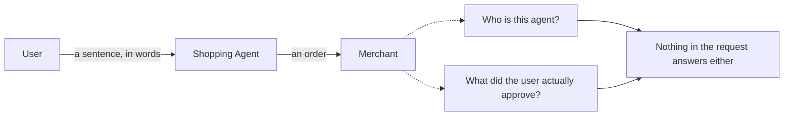
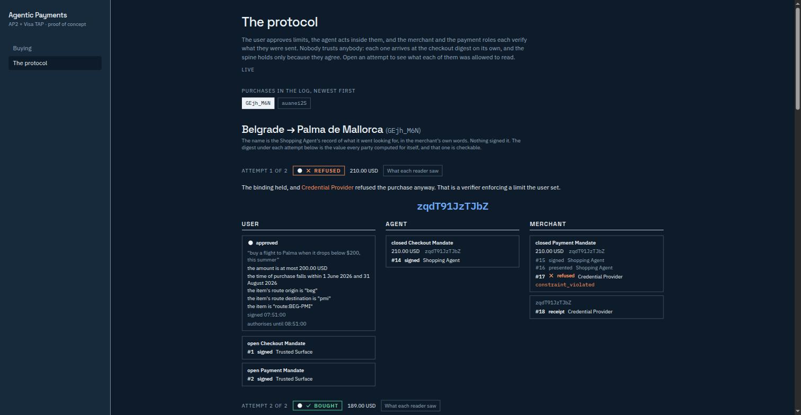
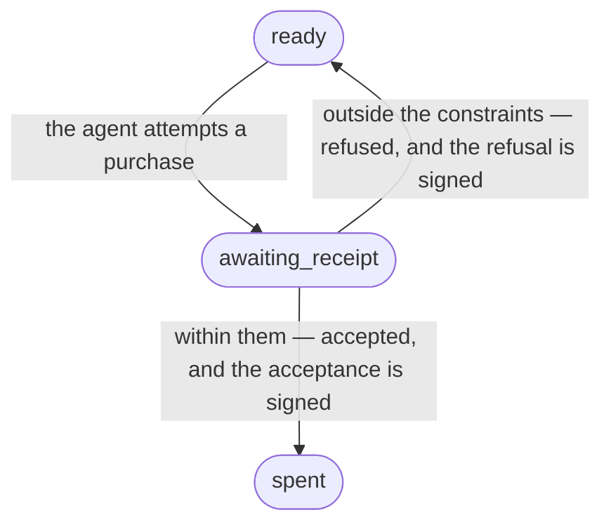
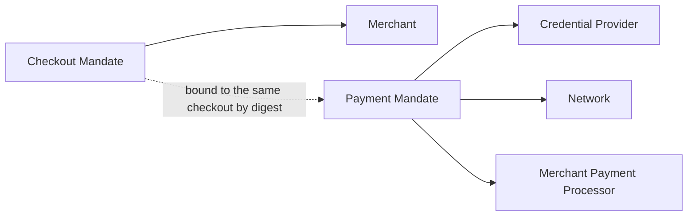
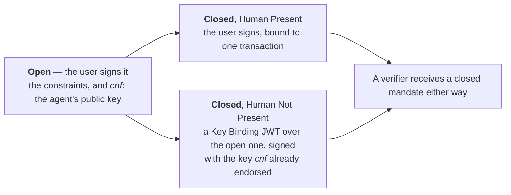
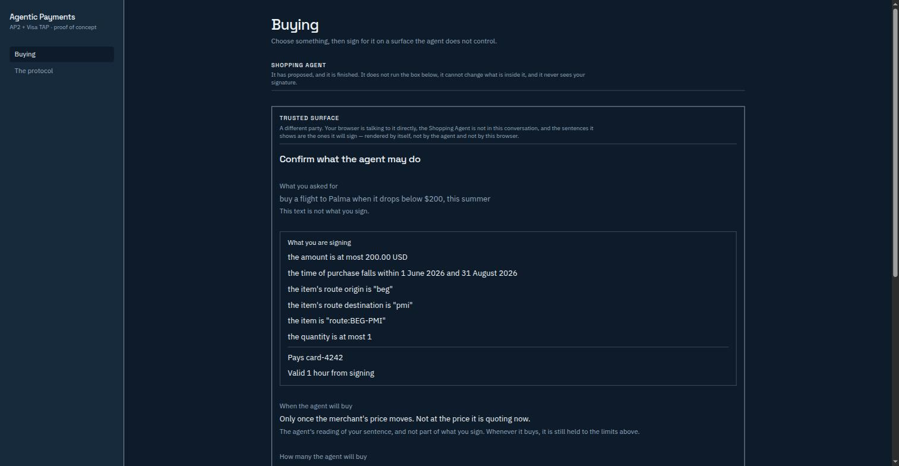
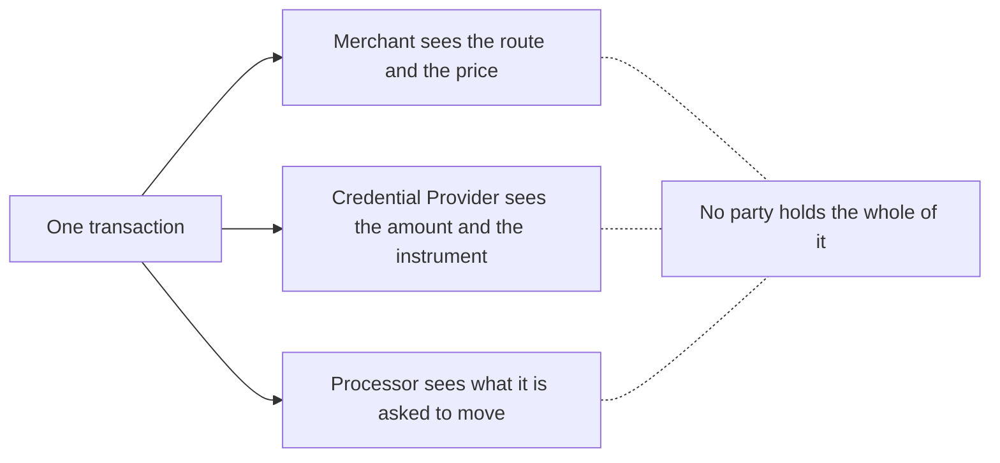
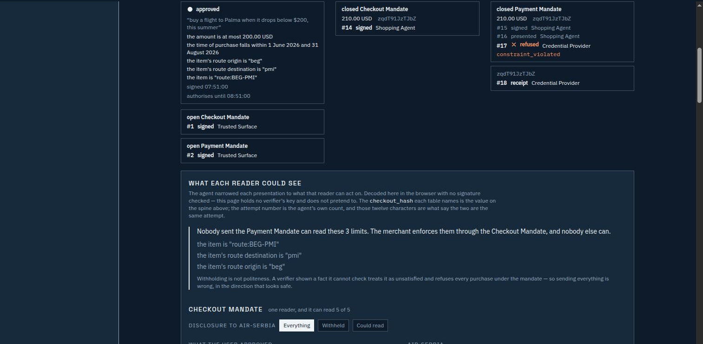
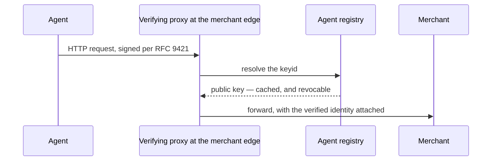
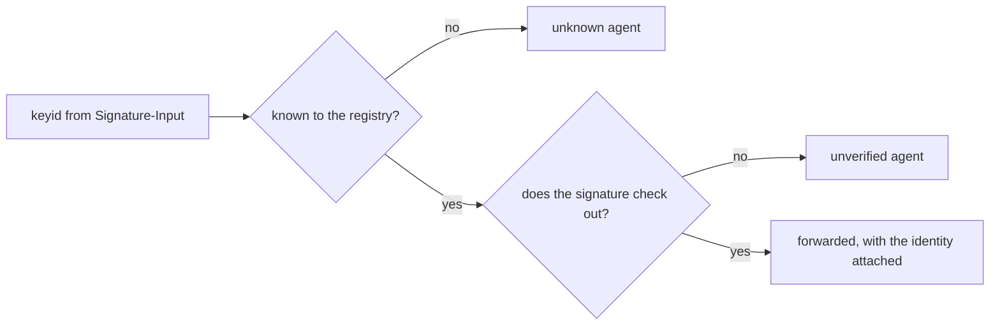

# agentic-payments

**A Go implementation of Google AP2 and Visa TAP behind a single,
protocol-neutral authorization model.**

[](LICENSE)
[](https://skylineplatform.github.io/agentic-payments/)

📖 **[Read the documentation](https://skylineplatform.github.io/agentic-payments/)** —
the problem, the two protocols, the architecture and the decisions behind it,
with the diagrams rendered. Published from [`docs/`](docs/) on every merge.

---

## What breaks when an agent buys

You tell an agent to buy you a flight when the price drops below a limit you
set. It goes away, and some hours later it buys something. Two parties now have
a question neither can answer.

**The merchant cannot tell whether it should be talking to this agent at all.**
The request arrives over HTTP like any other. Bot-mitigation layers have spent a
decade learning to treat automated traffic as hostile, and they are not wrong to
— but the agent you sent is not the traffic they were built to stop, and nothing
in the request distinguishes the two.

**You have nothing that shows what you approved.** You typed a sentence. The
agent read it, decided what it meant, and acted. If the purchase was wrong,
what exactly do you point at? A chat log is a record of what you typed, not a
record of what was authorised — and the party that wrote it down is the party
you would be disputing.



This repository answers the second question and shows the shape of the first.
Which is which, and how far along each is, is [section 3](#two-questions-two-protocols).

## How it looks when it works

The interesting moment is not the purchase. It is the one before it.

An agent has been told to buy below a cap. A price arrives that is above it, and
the agent tries anyway — agents are not always right, which is the entire reason
any of this exists. **A verifier refuses it, and signs a receipt for the
refusal.** Then a price arrives below the cap, and the same authorisation buys.

Both halves matter. A system where the agent decides whether its own purchase
was allowed has no guarantees in it at all; and a refusal nobody can prove
afterwards is a refusal you have to take somebody's word for.



*One run of `make demo`, on 13 August 2026. The amounts are whatever the
catalogue held that day; the shape is the point.*

The part nobody expects is what the refusal does to the authorisation. It does
not burn it.



A refused mandate returns to `ready`, and the rejection receipt is exactly what
the specification requires before the next attempt. A mandate that has bought
something reaches `spent` and stays there, because the alternative is one
authorisation buying twice.

## Two questions, two protocols

The common assumption is that AP2, Visa TAP and Mastercard's agentic tokens are
competing standards you would pick between. They are not. They answer different
questions, and a complete transaction uses more than one.

| Layer | The question it answers | Protocol | State in this tree |
|---|---|---|---|
| **Identity** | Who is this agent, and should the merchant talk to it at all? | Visa TAP | **Not built yet** — [#24–#33](https://github.com/SkylinePlatform/agentic-payments/milestone/2) |
| **Authorization** | What did the user approve, within what limits, and how is that proven in a dispute? | Google AP2 | **Built** |
| **Instrument** | What actually pays, and how is that credential scoped to the agent? | Mastercard Agentic Tokens, Visa Intelligent Commerce | **Modelled as an axis, not integrated** |

**That table is the only place this page says what is built.** Not a status
badge, not a banner, not a sentence in a paragraph four screens down. The
previous version of this README claimed a process count that had been wrong for
two milestones, a flow "arriving with" an issue that had already closed, and *in
progress* against two finished protocols — all three because the claim lived in
three places and nobody updates three places. One table means the next protocol
landing is one cell.

`internal/core/` models the three as independent axes, with an adapter per
protocol populating one of them and core never learning which protocol filled
it. [`docs/architecture/README.md`](docs/architecture/README.md) is how that is
held in place, including the eight dependency rules CI enforces as architecture
rather than as style.

## Authorization — Google AP2

**State:** built, in both flows.

### The mandate, and why there are two

A **mandate** is a signed statement about what an agent may do. AP2 v0.2 defines
exactly two.

- The **Checkout Mandate** proves the agent is authorised to purchase the
  checkout it assembled. The merchant verifies it.
- The **Payment Mandate** proves the agent is authorised to pay for *that
  specific checkout*. The Credential Provider, the network and the merchant's
  payment processor each verify it.



**There is no third mandate.** Nearly every article written about AP2 describes
an Intent Mandate alongside those two. That was v0.1, from the September 2025
announcement, and it is obsolete — as is the claim that mandates are W3C
Verifiable Credentials. v0.2, current since April 2026, uses SD-JWT. If you have
read about AP2 anywhere else, this is the paragraph most likely to contradict
it.

### Open and closed

The "intent" the third mandate was supposed to carry did not disappear. It
became a distinction between two states of the same mandate.

An **open** mandate is signed by the user. It carries the constraints — at most
this much, this route, within these dates — and it carries the agent's public
key in the `cnf` claim. It is not yet attached to any transaction.

A **closed** mandate is bound to exactly one. Under **Human Present** the user
signs it, because the user is there. Under **Human Not Present** the *agent*
signs it, with the key the open mandate already endorsed — as a Key Binding JWT
built over the open one, not as a second, separately issued document that a
verifier then compares against `cnf` by hand.



Verifiers always receive closed mandates. Only the path by which one was
produced differs — which is what lets an agent act while you sleep without ever
holding an authorisation wider than the one you signed.

### What the user signs

Not the prompt.

An LLM turns free text into typed constraints. That is the only place a model
appears anywhere in this repository, and it appears before anything is signed.
From there the Trusted Surface — a separate party, which the protocol requires
to be non-agentic — renders those constraints as sentences and takes the
signature over *them*.



Note what the screen says about itself. The agent "has proposed, and it is
finished"; the surface is "a different party", talking to your browser
directly; and the sentence you typed is labelled **this text is not what you
sign**. The rendering comes from the surface's own renderer, reached through
`/authorise/preview`, precisely so that the sentence you read is the sentence
the signature covers.

### Who sees what

The merchant is shown the route and the price. The Credential Provider is shown
the amount and the instrument. Neither is shown the whole transaction, and that
is what SD-JWT's selective disclosure is for.





The panel is worth reading closely, because it states the trap. **Withholding is
not politeness.** A verifier shown a fact it cannot check treats that fact as
unsatisfied and refuses every purchase under the mandate — so disclosing
everything to everybody is not the safe default it looks like. It is a way of
breaking the transaction while appearing generous.

What survives afterwards is a signed receipt on both sides, referencing the same
closed-mandate digests. A dispute has an artefact to point at rather than a log
entry somebody could have edited.

The full treatment — the five roles, both flows, the binding, the disclosure
rules — is in [`docs/protocols/ap2.md`](docs/protocols/ap2.md). This section is
the argument; that document is the specification reading.

## Identity — Visa TAP

**State:** not built in this tree — issues
[#24–#33](https://github.com/SkylinePlatform/agentic-payments/milestone/2). What
follows is the shape it will take, not a description of running code. Two of the
binaries `make demo` starts print `not implemented yet` and say which issue
builds them.

### The handshake at the merchant edge

The problem TAP solves is the first half of [section 1](#what-breaks-when-an-agent-buys):
merchants have historically classified agent traffic as bots and blocked it, and
that blocks the legitimate commerce agents this project is about. TAP gives the
edge a way to tell the two apart before the request reaches the storefront.

**TAP is not a Visa-rails protocol**, and this is the correction worth carrying
away. Verification happens at the *merchant edge* — Visa's own reference
architecture places a CDN proxy in front of the merchant. Visa operates the
production trusted-agent directory, but a directory is not a settlement rail,
and being listed in TAP's identity layer says nothing about which rails a
payment later travels over. That reading of the topology is this project's own,
held on the grounds [`docs/protocols/tap.md`](docs/protocols/tap.md) sets out;
the published developer page describes the roles and the blocking problem
without stating it in those terms.



### An unknown agent is not an unverified agent



A `keyid` the registry has never heard of and a `keyid` it knows whose signature
does not check out are **different findings**. A proxy that collapses them into
one generic rejection throws away a distinction a caller — or a dispute — may
need later. And the merchant backend never verifies a signature itself: that is
the proxy's job alone, so that every path into the merchant has been through the
same check.

Being listed in Visa's production directory requires a commercial relationship.
TAP's own reference implementation ships a local registry instead, which is the
single reason this milestone is feasible here at no cost and with no Visa
account.

There is no screenshot in this section because there is nothing to photograph
yet. [#32](https://github.com/SkylinePlatform/agentic-payments/issues/32) builds
the screen.

## What is real and what is mocked

Full protocol semantics, mocked trust anchors. Everything in the left column is
implemented properly and exercised end to end; everything in the right is stood
in for, and the reason is given rather than implied.

| Real | Mocked, and why |
|---|---|
| SD-JWT issuance, disclosure and verification | **Credential Provider** — no public sandbox lets a non-PSP enrol a real card. An ecosystem constraint, not a shortcut |
| ECDSA and Ed25519 signing and verification | **Merchant** and **Merchant Payment Processor** — a real storefront and processor integration are not what the protocol semantics need exercised |
| Constraint evaluation, by the verifier and never the agent | **Agent registry** — TAP's production directory is Visa's; the milestone stands up a local one, exactly as Visa's own sample does |
| Mandate binding, receipts, and the event log behind the screens above | **Settlement** — nothing moves money |

One gap is worth stating plainly rather than leaving to be discovered.
**Dispute evidence assembly is built for the Human Present flow only.** A Human
Not Present purchase produces delegation chains rather than two closed mandates,
and `internal/agent/chain.go` deliberately has no `Evidence` method for one:
filling the bundle's two fields with chains would produce something that looks
assembled and verifies nowhere. The artefacts exist, verify and are collected;
nothing yet assembles them into a bundle for that flow.

**Mastercard Agent Pay is not implementable here.** Agentic Tokens are issued by
issuing banks through MDES and there is no self-serve developer path. Note also
that the "Mastercard Agent Toolkit" is an MCP server for reading API
documentation — it is not an Agent Pay SDK.

Nothing here is PCI-compliant and nothing moves real money.
[`docs/business/what-this-proves.md`](docs/business/what-this-proves.md) is the
longer version of what may and may not be concluded from this, and the *may
not* half is the longer one.

## Running it

```bash
make demo
```

Builds every binary and brings the stack up under one process. **Ctrl-C stops
all of it**, the frontend's dev server included. It prints one line per process,
marks the ones that are still stubs and names the issue that will build each —
so this page does not have to keep a list that goes stale.

| | |
|---|---|
| Frontend | <http://localhost:5173> |
| Collector | <http://localhost:8085> |

You need **Go 1.26+** and **Node 22.13+**. Older Go toolchains download the
right one themselves. Nothing else — no Docker, no database, no accounts, no
keys.

The event stream behind the screens above is readable directly:

```bash
curl -N http://127.0.0.1:8085/events
```

### The live variant

```bash
make demo-live
```

The same stack, reading free text against a catalogue fetched from a public test
shop at start-up. It is the one target that needs a network, and the one that
takes a real model when `GEMINI_API_KEY` is set — in the environment or in
`.env`, which the target reads on your behalf.

The two go together on purpose: free text against a catalogue written down in
this repository proves nothing a lookup table could not, and a wider shop nobody
can address in their own words is just a longer table.

### Working on it

```bash
make setup   # generated code, git hooks and go.work — the first command on a clone
make check   # the gate before any change is done — needs only Go
```

Nothing generated is committed — the canonical model's Go types and every
`mocks_test.go` are both gitignored — so a fresh clone has neither and an editor
opened before `make setup` reports undefined symbols in code that is correct.

[CONTRIBUTING.md](CONTRIBUTING.md) has the rest, including which Node and why.
[AGENTS.md](AGENTS.md) has the rules that bind code rather than prose: the
dependency rules CI enforces, the boundary an LLM may not cross, and the
protocol corrections most published material gets wrong.

## License

Apache License 2.0 — see [LICENSE](LICENSE) and [NOTICE](NOTICE).

Apache 2.0 was chosen over MIT specifically for its patent grant. In a domain
where the major participants hold significant patent portfolios, a license
without a patent clause is a meaningful gap.

**On Visa TAP:** Visa's sample implementation is not open source and is governed
by the Visa Developer Center Terms of Use. No Visa code is copied or derived
here. See [NOTICE](NOTICE) and [CONTRIBUTING.md](CONTRIBUTING.md).

## Disclaimer

Not affiliated with, endorsed by, or sponsored by Visa Inc., Mastercard
International Incorporated, or Google LLC. This is research and demonstration
software. Do not use it to move real money.
