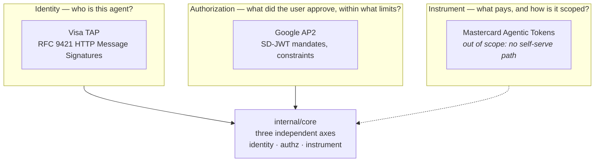

# Architecture

**This document answers:** how we build the system.
**It does not contain:** re-explanations of AP2 or TAP — see `../protocols/`.

## The three-layer model

AP2 and TAP are not competing alternatives. They answer different questions,
and a complete transaction uses both.

Adapters populate the axes; `core` never learns which protocol filled one.
