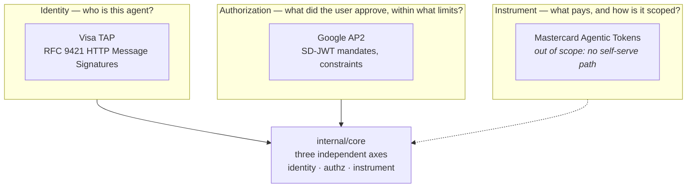
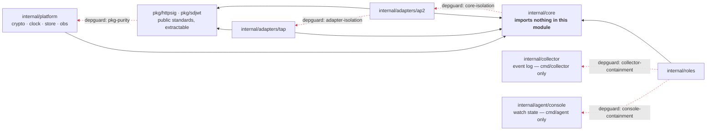
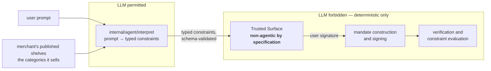

# Architecture

**This document answers:** how we build the system.
**It does not contain:** re-explanations of AP2 or TAP — see `../protocols/`.

## The three-layer model

AP2 and TAP are not competing alternatives. They answer different questions,
and a complete transaction uses both.



Adapters populate the axes; `core` never learns which protocol filled one.

## Module dependencies

The three-layer model above only holds if the code cannot route around it.
Eight `depguard` rules in `backend/.golangci.yml` enforce it: `make lint` runs
them locally and CI runs them again on every pull request, and AGENTS.md's own
framing is that a failure against any of them is an architecture violation
rather than a style nit, so the fix is never a suppressing comment — the rule
is the design. The enforcement is `golangci-lint`, not the Go compiler:
`go build ./...` succeeds on code that violates every one of these rules, and
`golangci-lint run` is the only thing that catches it.



The dashed red edges are forbidden and enforced in CI, not merely discouraged
in review.

| Rule | Property it protects |
|---|---|
| `core-isolation` | `internal/core/**` imports nothing else in this module — core does not know which protocols exist, does not depend on `platform`, `roles` or `agent`, and stays protocol-neutral with respect to `pkg/httpsig` and `pkg/sdjwt` |
| `adapter-isolation-ap2` | `internal/adapters/ap2` cannot import `internal/adapters/tap` — protocol adapters must not depend on each other |
| `adapter-isolation-tap` | `internal/adapters/tap` cannot import `internal/adapters/ap2` — the same rule, enforced from the other side |
| `pkg-purity` | `pkg/**` cannot import `internal/**` — `pkg/` implements public standards and must remain extractable, liftable out of this repository unchanged |
| `key-material-containment` | `crypto/ecdsa`, `crypto/ed25519`, `crypto/rsa`, `crypto/ecdh` and `crypto/x509` are importable only from `internal/platform/crypto` — everywhere else holds an `authz.Signer` or a `KeyRef` (a kid and an algorithm name), never a type a private key would arrive in |
| `no-weak-randomness` | `math/rand` and `math/rand/v2` are banned everywhere — randomness in this codebase reaches nonces and keys, and there is no call site where a weak source would be benign |
| `collector-containment` | `internal/collector` is importable only from `cmd/collector` — the event log is observability and never evidence, so a dispute path cannot reach a log entry even by accident |
| `console-containment` | `internal/agent/console` is importable only from `cmd/agent` — the same argument one party along: a merchant able to import it would read the buyer's own bookkeeping as fact, where AP2 gives it a signed receipt to read instead |

`adapter-isolation-ap2` and `adapter-isolation-tap` are the same rule applied
from both sides: deliberate duplication between the two adapters is accepted
until a third protocol reveals the real seam, and neither is allowed to
shortcut that by reaching into the other.

## The agentic boundary

An LLM may appear in exactly one package: `internal/agent/interpret/`.
Mandate construction and signing, verification, constraint evaluation, and
the Trusted Surface itself are all deterministic code, regardless of whether
the role calling them is agentic. This is a specification requirement, not an
implementation preference — the Trusted Surface must be non-agentic by
construction. `../protocols/ap2.md` covers the specification's own reasoning;
this document only states where the boundary sits in the module layout.



The shelves are the second arrow in, and they are data rather than a judgement:
`GET /shelves` on the merchant answers with the categories it sells, the agent
fetches it once per authorisation, and the interpreter is told what the shop
calls things instead of guessing. Issue #254 is why — a model read *"buy a
flight to Palma when it drops below $200"* into `item.category eq "flight"` at a
shop whose shelf is called `flights`, which is a perfect reading of the sentence
and matches nothing. Telling it the vocabulary makes the right answer likely
rather than certain, so the same list is used a second time on the way back: a
category the merchant does not sell is not proposed as a constraint at all.
Both uses sit inside the box above, before the surface is reached and before
anything is signed, which is what makes them a proposer's business and never a
verifier's. Only the *closed* half of the vocabulary travels — a shop has about
as many shelves as it has aisles, while the values under `item.attr.<name>` are
bounded by the stock, so publishing those would grow with the catalogue.
`../specs/2026-08-12-publishing-the-shops-vocabulary.md` is the decision in
full.

The interpreter runs once, before anything is signed. After that the system is
deterministic, and stronger than "no model call": the agent compares no money at
all. It watches the `step` index on the merchant's own quote and attempts a
purchase when that moves, so the bound the user set is read only by the
verifiers. `price < 20000` is the line `internal/agent/watch.go` is built not to
contain — a watch that made that comparison would filter out the $210 candidate
the Credential Provider has to be shown refusing. It is that role and not the
merchant, because the merchant initiates payment and so cannot be reached until
the purchase has been funded; `../protocols/ap2.md`'s Human Not Present section
argues it.

## What is mocked

This is a proof of concept with full protocol semantics and mocked trust
anchors — the protocols themselves are implemented in full; the surrounding
ecosystem they would normally run against is not.

Mocked, and why:

- **Credential Provider** — no public sandbox lets a non-PSP enrol a real
  card, so no real card is ever enrolled. This is an ecosystem constraint,
  not a shortcut taken for convenience.
- **Merchant** — AGENTS.md's Scope section names the Merchant as mocked but
  states no reason for it. Inferred here, not sourced: standing up a real
  storefront and payment integration is not what the protocol semantics need
  exercised, so a mock keeps the proof of concept aimed at mandates and
  signatures rather than at commerce infrastructure.
- **Merchant Payment Processor** — the same gap in AGENTS.md, and the same
  kind of inference: a real processor integration is not under test either,
  and mocking it completes the pairing with the Merchant above.
- **Agent registry** — TAP's production directory requires a commercial
  relationship with Visa, so the TAP milestone stands up a local one instead,
  which is why it needs no Visa account. `cmd/registry` is a stub until then,
  and `deploy/demo.json` marks it `"implemented": false`.
- **Settlement** — AGENTS.md states, elsewhere in the same section, that
  nothing here moves real money. Read against settlement's place on this
  list, that appears to be the reason, though the Scope section never states
  it as one — so treat this one as inferred too.

Not mocked: SD-JWT, signing and verification, constraint evaluation, mandate
binding, receipts, dispute evidence. These are exactly the protocol
mechanics this repository exists to prove, so mocking any of them would
mock the point of the exercise.

Nothing here is PCI-compliant. Nothing moves real money.

## The collector is not a role

`cmd/collector` is an eighth binary, and it is neither one of AP2's five roles
— Shopping Agent, Credential Provider, Merchant, Merchant Payment Processor,
Trusted Surface — nor a TAP identity party. It exists so the three-lane view
has something to show, and the screenshots from that view are what carry the
article series.

The distinction needs stating because everything about it invites the opposite
conclusion. It runs on the same HTTP transport as every participant, every role
that emits does so into it — the five AP2 ones today, `registry` and `proxy`
being stubs until the TAP milestone — and it is the one component in the system
that sees every transaction end to end. That is exactly the shape of a protocol
participant, and it is none of one.

What follows from that is the rule worth remembering: **the event log is
observability, never evidence.** Dispute resolution reads closed mandates and
receipts and recomputes digests against them; not one of its steps reads
anything the collector holds. An event is data a role's process wrote over a
wire, editable by anyone with access to the store or the path it travelled. A
receipt is a signed statement whose reference is checked independently. A
dispute settled from the event log would be a dispute settled by reading the
loser's own log.

This is enforced rather than documented: the `collector-containment` depguard
rule stops any package except `cmd/collector` from importing
`internal/collector`, so a dispute path cannot reach a log entry even by
accident. ADR 0003 has the full reasoning, including why deriving evidence from
the log was rejected as a security error rather than a convenience trade-off.

## Module layout

`go.mod` sits in `backend/`, not at the repository root. A module whose
`go.mod` is not at the repository root cannot claim the root import path —
`go get` would not resolve it — so every internal import carries a `backend`
segment:

```
github.com/SkylinePlatform/agentic-payments/backend/internal/core/authz
github.com/SkylinePlatform/agentic-payments/backend/pkg/httpsig
```

That split has a cost for an editor opened at the repository root: `gopls`
anchors on the directory the editor opened, finds no `go.mod` there, and
falls back to a GOPATH view, reporting every intra-module import as
unresolvable. `make workspace` writes the fix — an untracked `go.work`
listing both `backend/` and `contracts/tools`. It stays untracked on
purpose: a committed workspace would unify the two modules' build lists, and
`contracts/tools` pins its own generator version specifically to stay out of
`backend/go.mod`, so a committed `go.work` would let `backend/` compile
against modules CI never provides. `make` always runs with `GOWORK=off`, so
whether that file exists never changes what `make check` builds — the
workspace is for the editor, and for nothing else. `make setup` is that plus
the generated code the workspace file does not contain, and the git hooks that
keep it level after a checkout; AGENTS.md has the reasoning.

The directory tree itself lives in AGENTS.md's Layout section and is not
repeated here. A listing kept in two places disagrees with itself the first time
one of them gains an entry, and this was the copy that went stale — nothing in
the code reads it, whereas every agent reads the other before touching a file.
