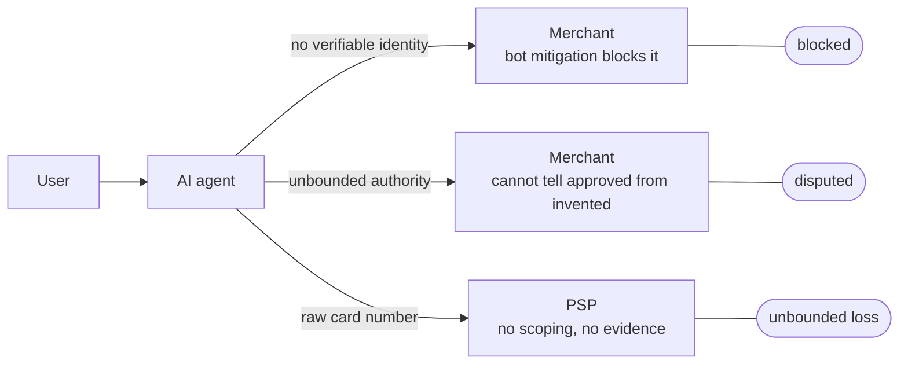

# Problem Statement

**This document answers:** why fragmentation matters, and to whom.
**It does not contain:** the fix — which protocol closes which gap, and where
each one is verified, belongs to `../architecture/README.md`. Naming a
mechanism here is allowed only where naming it is what makes a gap concrete.

## Fragmentation predates AI

Card rails, bank transfer, wallets and stablecoins each solve payment with
incompatible identity, authorisation and instrument models. A card network
verifies a cardholder through the issuer, a bank transfer verifies an account
holder through the bank, a wallet verifies whatever the wallet provider
decided at enrolment, and a stablecoin verifies nothing about the person
holding it, only the key controlling it — four different answers to who is
paying. Each rail also authorises a payment differently: a single yes/no from
the issuer, the bank's own confirmation at the point of transfer, rules the
wallet provider set at enrolment, a signature from the key itself. And each
rail is its own instrument, not an interchangeable stand-in for the others —
a card number, a bank account number, a wallet balance and a private key do
not compose, so accepting one does not get a merchant halfway to accepting
the next — a split that carries downstream into settlement, where each rail
has its own timescale, its own intermediaries and its own process for what
happens when something goes wrong.

This is not a new problem, and it is not caused by AI. A merchant that wants
to accept cards, bank transfer and a wallet integrates three identity models,
three authorisation models and three instrument models — not one payment
system, three times over. That has been the cost of accepting more than one
rail for as long as there has been more than one rail. Agents inherit this
cost before they add anything of their own.

## Agents make it acute, in three specific ways

An agent acting on someone's behalf does not fit the identity, authorisation
or instrument assumptions any of those rails were built on, and it fails at
three separate points, not one.

It has no identity a merchant can verify. Every rail above authenticates a
device, a card or a login session; none of them authenticate "this software
is acting for this person, with their knowledge." A merchant's only defence
against automated traffic — bot mitigation — cannot tell the two apart, so it
blocks both.

It has no bounded authority. "Buy me a flight to Palma, under $200" and
"empty my account" look identical from the far side of an API call: both are
a request to move money, and nothing downstream records where the user
actually drew the line. Without that boundary, every agent transaction is
either trusted on faith or refused on principle.

It has no scoped instrument. Handing an agent a card number does not scope it
to one purchase; it hands over every future purchase that number can make,
wherever a copy of it ends up. The number carries no merchant, no amount and
no expiry tied to the task at hand, so whatever the agent does next happens
with the same authority as the first purchase.

## Three gaps, three protocols

Identity, authorisation and instrument are not three symptoms of one problem —
they are three separate problems, and none of them shares a fix with the
others. Verifying that a request came from a known agent is a question about
signing. Bounding what a user approved is a question about delegation and
consent. Scoping what an instrument can pay for is a question about token
issuance. A protocol built to answer one of these does not, by construction,
answer the other two, which is why this project treats them as three
independent layers rather than reaching for one payments API to cover all
three. `../architecture/README.md` sets out how those three layers map onto
three separate protocols, and where each is verified.

## What breaks today

Put against one purchase, concretely: a merchant cannot tell an agent from a
scraper, so bot mitigation blocks the agent along with the scraper it exists
to stop. A user cannot bound what an agent may spend, so a merchant that lets
the agent through has no way to tell an approved purchase from an invented
one, and the dispute lands on the merchant regardless of which it was. A
payment service provider (PSP) cannot tell, after the fact, whether a human
ever approved the transaction it settled — so when the charge is disputed,
there is nothing to point to, and the loss is unbounded because nothing in
the chain proves consent.

Each outcome traces back to one of the three gaps above. Each of the three
protocols named in `../architecture/README.md` exists to close exactly one of
them.
