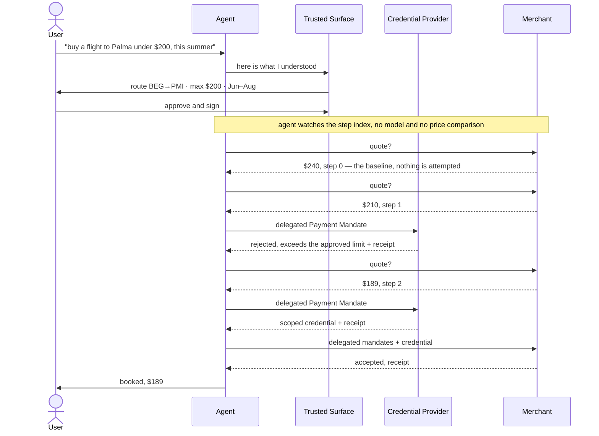
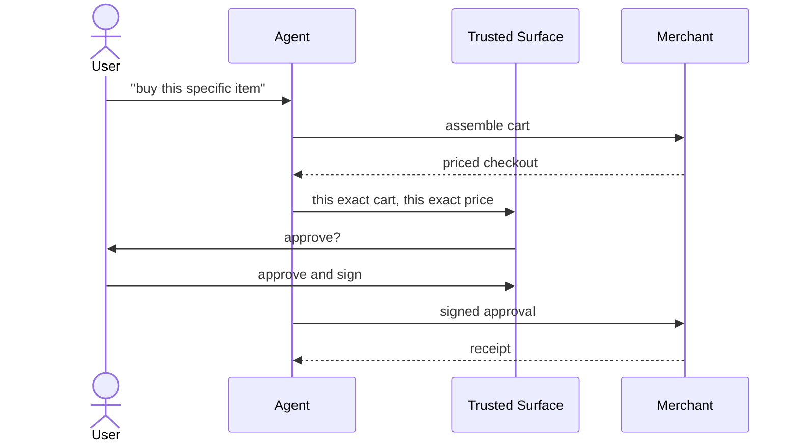
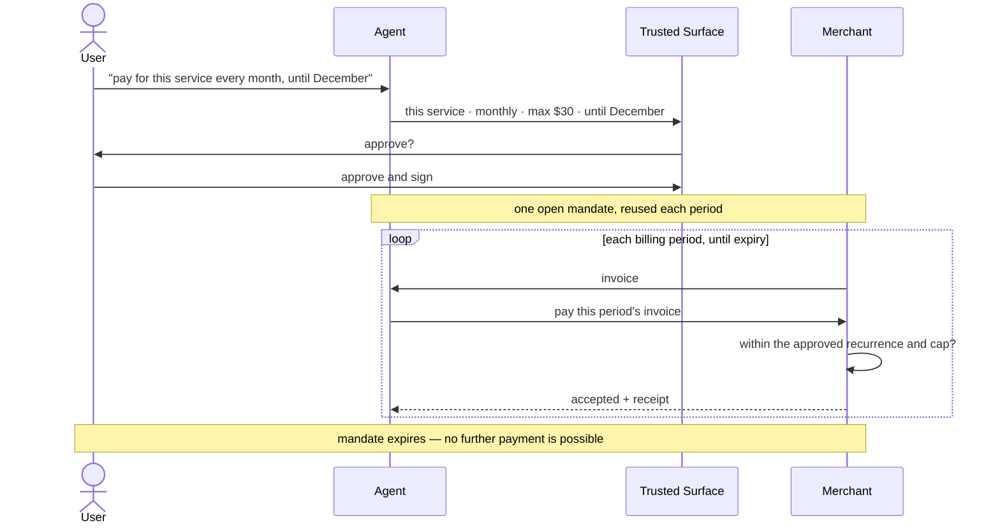
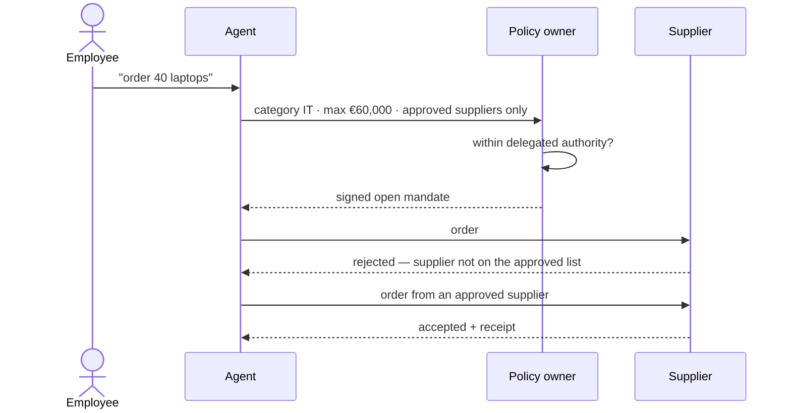

# Use Cases

**This document answers:** what the system does — one scenario built end to
end, three more described.
**It does not contain:** how any beat works underneath, or what the finished
system may be claimed to establish — `../protocols/` covers the first,
`what-this-proves.md` the second. A beat here says what it demonstrates; a
mechanism is named only where the name is what makes the demonstration legible.

## The built scenario

One scenario is built end to end, and every later diagram in this
documentation set that shows a real transaction reuses it, so the exact
numbers matter more than they look: a flight from Belgrade to Palma de
Mallorca, route **BEG→PMI**; a price cap of **USD 20000** in minor units —
**$200**; a booking window of **2026-06-01 to 2026-08-31**; and a merchant
whose price for that route moves during the window — **$240 → $210 → $189**
— because a flat price cannot tell this story.

It breaks into ten beats, each one a screenshot. Nine of them run today; the
tenth arrives with the Visa TAP milestone.

| # | Beat | What it proves |
|---|---|---|
| 1 | User types "buy a flight to Palma when it drops below $200, this summer" | entry point |
| 2 | Interpreted **once** into a typed constraint expression — an amount bound, a booking window, the route | the model translates, it does not execute |
| 3 | Trusted Surface shows the **interpretation, not the prompt**; the user signs | where a misread "summer" is caught |
| 4 | Agent watches the price deterministically — $240, no model call | after signing there is no model |
| 5 | A candidate at $210; the agent assembles mandates and **the verifier rejects** | the verifier rejects, not the agent |
| 6 | Price falls to $189; the agent signs closed mandates with **its own** key | the core of Human Not Present |
| 7 | CP verifies the delegated Payment Mandate and returns a scoped token; the merchant then checks `checkout_hash` and constraints | the agent never sees a PAN |
| 8 | Inspector: the merchant is shown all four constraints, the CP the price cap and the booking window and never the route | the most valuable screenshot |
| 9 | Both receipts signed, references matching the closed mandate hashes | non-repudiation |
| 10 | The same flow with every HTTP call carrying an RFC 9421 signature verified at the proxy — the TAP milestone, `cmd/proxy` a stub until it | the three-layer thesis on one transaction |

Beats 5, 8 and 10 are the ones that carry the article series; the rest is
context that gets the story from one end to the other. Beat 5 proves that the
**verifier** rejects, not the agent — an agent that could wave through its own
mistake would make every other guarantee here decorative. Beat 8 makes
selective disclosure visible, and it is one-sided on purpose: the merchant
issued the checkout, so there is no fact in the constraint vocabulary it cannot
state and nothing is withheld from it, while the Credential Provider is shown
the price cap and the booking window and never learns where the user is flying.
Withholding the route from the one party that could not have evaluated it is the
most concrete evidence that the system works as designed rather than on trust —
`../protocols/ap2.md` has why that is correctness as much as privacy. Beat 10
shows both protocol layers holding on **one** transaction — identity and
authorisation enforced together, not as two separate demos that never touch the
same booking.

The mock merchant needs inventory whose price moves over time —
**$240 → $210 → $189** — because beats 4, 5 and 6 have nothing to show against
a static price: there is nothing for the agent to watch, no candidate for the
verifier to reject, and no moment where the price actually crosses into the
range the user approved.

Two things in that diagram are easy to read past and are the whole of why the
scenario is built this way. **The agent never compares a price**: it asks for a
quote and acts when the merchant's own `step` index moves, so the $200 bound is
read by verifiers and by nobody else. And **the refusal at $210 is the Credential
Provider's**, because the merchant initiates payment and so cannot be reached
until the purchase has been funded — the merchant refuses plenty under this flow,
but never an amount bound, because that one is answered upstream of it.

## Described, not built

None of the three below is implemented. Each is worked as far as one paragraph
and one sequence diagram and no further, which shows the model was designed
with these cases in mind — not that it handles them. They are here because a
model that only ever fits the scenario it was designed against has not been
tested by anything.

Their amounts are written in major units. The minor-unit convention belongs to
the built scenario above, where the exact integers are what a screenshot has to
match.

### Human Present retail purchase

The user approves one specific cart. The specification's own observation is
that this case can often be replaced by an ordinary e-commerce checkout —
nothing about it strictly requires an agent. It is included anyway because it
is the closed-mandate backbone the autonomous flow above builds on, not
because it is the interesting demo.

### Subscription

One open mandate, carrying a temporal recurrence constraint, is reused across
billing periods until it expires. The interesting property is the expiry:
authority ends on its own, without anyone having to revoke it.

### B2B procurement

An agent acts inside a corporate approval limit, where the constraint set
encodes company policy rather than personal preference. The diagram shows a
constraint failing for a reason that is not price — the supplier is not on
the approved list.

