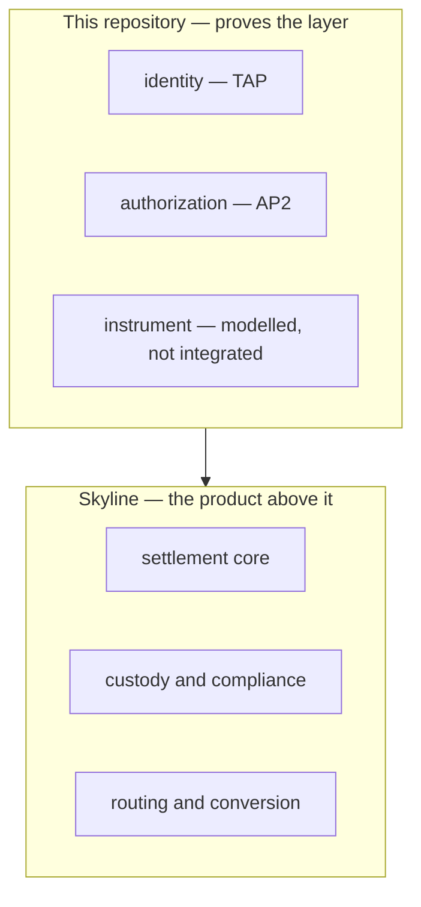

# What This Proves

**This document answers:** what a reader may conclude from this proof of
concept once it is built, and what they may not.
**It does not contain:** the product story — that belongs to the article
series being written separately; repeating it here would create a second copy
that drifts the moment the article changes.

## What this proves

Four issues are closed at the time of writing, and all four sit below the
protocol layer: module scaffolding, the canonical model in `contracts/`, the
signing and key infrastructure, and the SD-JWT implementation. The Google AP2
and Visa TAP milestones — which carry mandate construction, the two adapters
and the role binaries — are both still open, as is Foundations, which holds
the cross-cutting work the architecture decision records specify.
`backend/internal/adapters/ap2/` and
`backend/internal/adapters/tap/` each hold nothing but a `doc.go`, and every
binary under `backend/cmd/` exits printing `not implemented yet`. Nothing
below this paragraph describes what runs today. It describes what the
finished proof of concept is designed to establish.

Once implemented, walking the built scenario from `use-cases.md` end to end
is designed to show:

- that a signature over an HTTP request — RFC 9421, the mechanism TAP
  specifies — is verified at the merchant edge and rejected when it does not
  check out, binding the request to one registered agent rather than to a
  device or a browser session;
- that a Checkout Mandate and a Payment Mandate, both SD-JWT and both
  selectively disclosed, are constructed, signed and verified against
  constraints the user set before any purchase existed, and that in Human Not
  Present mode the agent's own signature on the closed mandate is checked
  against those constraints rather than trusted because the agent produced
  it;
- that the **verifier**, not the agent, is what rejects a mandate outside its
  constraints — beat 5 of the built scenario turns on exactly this: an agent
  that could wave through its own mistake would make every other guarantee
  here decorative;
- that the merchant and the Credential Provider each see a different slice of
  the same transaction — route and price to one, amount and instrument to the
  other — and that neither sees the whole of it;
- that both sides of a completed transaction hold a signed receipt
  referencing the same closed-mandate hashes, so a dispute has a signed
  artefact to point to, not a log entry someone could have edited;
- that identity and authorisation — TAP and AP2 — hold together on one
  transaction, enforced by two different verifiers at two different points,
  rather than as two demonstrations that never touch the same booking.

That is the whole of what it proves: protocol mechanics — signing,
verification, constraint evaluation, selective disclosure, mandate binding —
working end to end on one transaction. It is not proof of a product, a
market, or a business.

## What it does not prove

This is the longer half. A proof of concept built on mocked trust anchors
invites overreading more easily than underreading, so each claim below is
specific — not a general disclaimer.

It does not prove that a real issuer, acquirer, processor or registry
operator would accept these mandates or signatures. Every one of those
parties is stood in for by a mock, so what the finished repository proves is
that the protocol mechanics behave correctly against a stand-in — not that
any one of them, played for real, would behave the same way.
`../architecture/README.md`'s section on what is mocked lists which components
are stood in for and why each one has to be.

It does not prove anything about Visa's payment infrastructure. TAP is an
identity layer verified at the merchant edge, so a verified request says
nothing about which rails the payment afterwards travels over —
`../protocols/tap.md` sets out that topology and how firmly it is sourced.

It does not prove anything about stablecoin or other digital-token rails.
AP2 is payment-method agnostic, and stablecoin funding instruments — USDC and
similar — shipped with the specification as first-class Payment Mandate
instruments. This repository does not build that path: `contracts/instrument/amount.json`
narrows amounts to ISO 4217 fiat in integer minor units, on purpose, and
records what widening it would cost. What is proved here is the card-style
fiat path only.

It does not prove that the instrument layer interoperates with a real token
scheme. Mastercard Agentic Tokens are issued by issuing banks through MDES,
and there is no self-serve developer path for a project outside one — that is
why `internal/core/instrument` is modelled as an independent axis without ever
being wired to a live scheme the way the identity and authorisation axes are.
The instrument type exists and composes architecturally with the other two;
it is not exercised end to end the way they are.

It does not prove that the model generalises beyond the one built scenario.
The three further cases in `use-cases.md` are described and not implemented:
they show the model was designed with them in mind, which is not evidence
that it handles them.

Nothing here is PCI-compliant, and nothing here moves real money. No card
data is handled, no real settlement occurs, and no part of this repository
carries or implies any compliance certification.

## Where Skyline begins

Skyline is the product built on top of the layer this repository proves.
Settlement, custody and routing are Skyline's questions, not this
repository's — `../architecture/README.md` sets out how the three-layer model
composes, and Skyline is what gets built above `core`, not inside it.

The join between the two is the mocked Credential Provider: past this proof
of concept, that mock is the party a real product would have to become.

