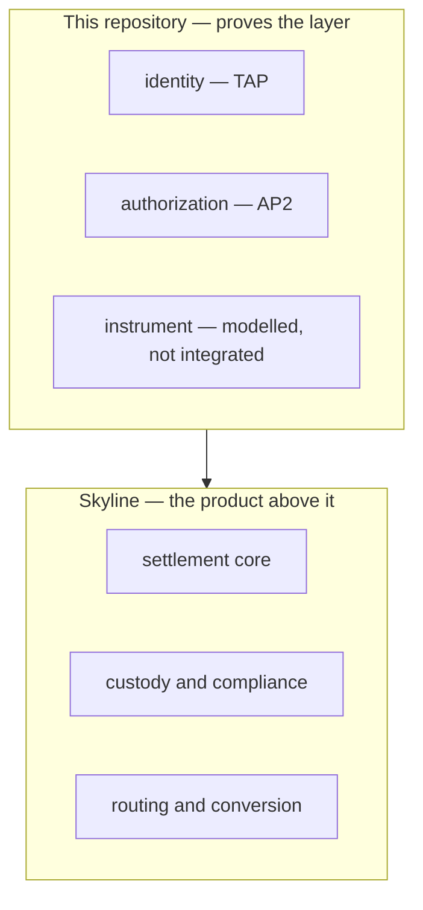

# Where Skyline Sits

**This document answers:** where this repository's boundary sits, and where
Skyline, the product built on it, begins.
**It does not contain:** the product story — that belongs to the article
series being written separately; repeating it here would create a second copy
that drifts the moment the article changes.

## The boundary

This repository proves that the layers set out in `../architecture/README.md`
— identity, authorisation, instrument — interoperate: a real TAP signature
verified at the merchant edge, a real AP2 mandate constructed, signed and
verified, both enforced against the one transaction walked through in
`use-cases.md`. That is the whole of what it proves. The instrument layer is
modelled alongside the other two but not integrated into that proof, for the
reason `../../AGENTS.md`'s Scope section gives: Mastercard Agentic Tokens have
no self-serve path for a project outside an issuing bank.

Skyline is the product built on top of that layer. Settlement, custody and
routing are Skyline's questions, not this repository's, and this document
goes no further than naming them. The join between the two sits at the
mocked Credential Provider: it stands in here for the party that, past this
proof of concept, a product would have to be.

