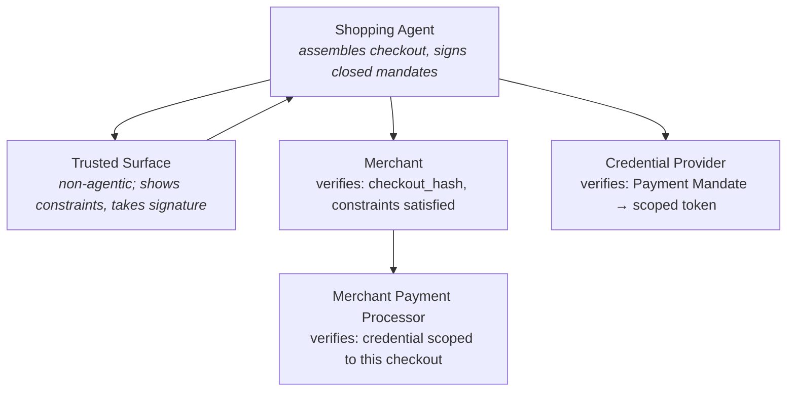
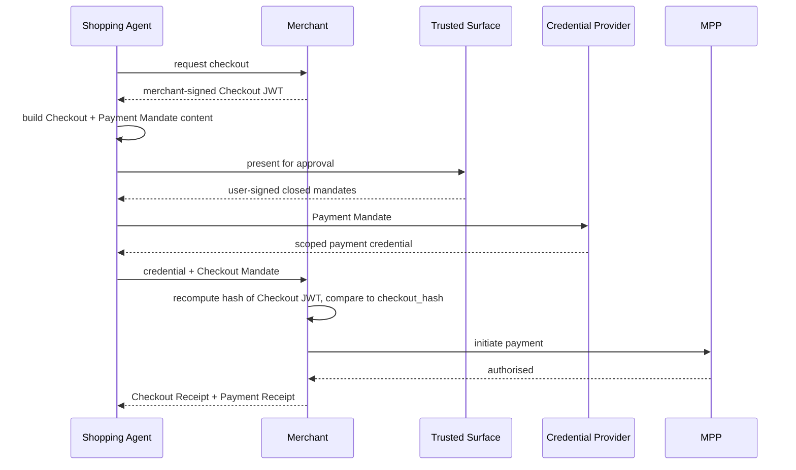
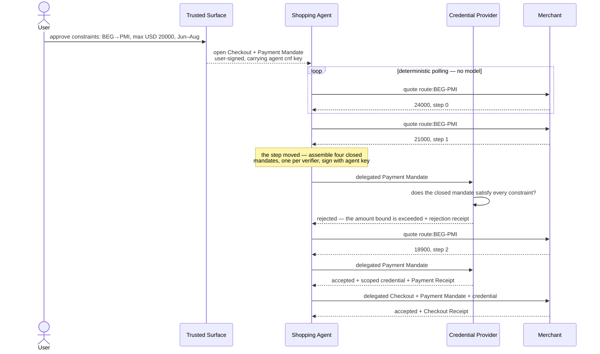
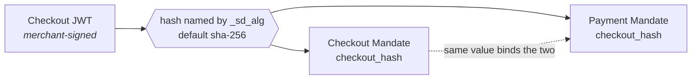
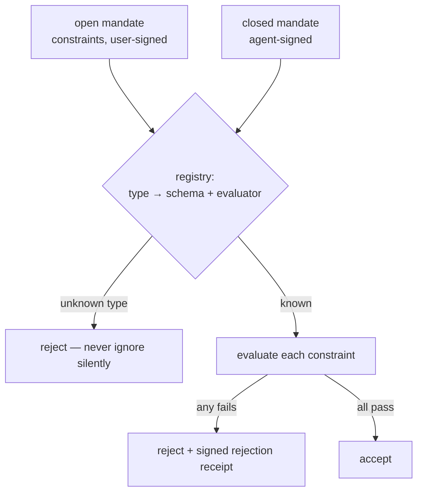
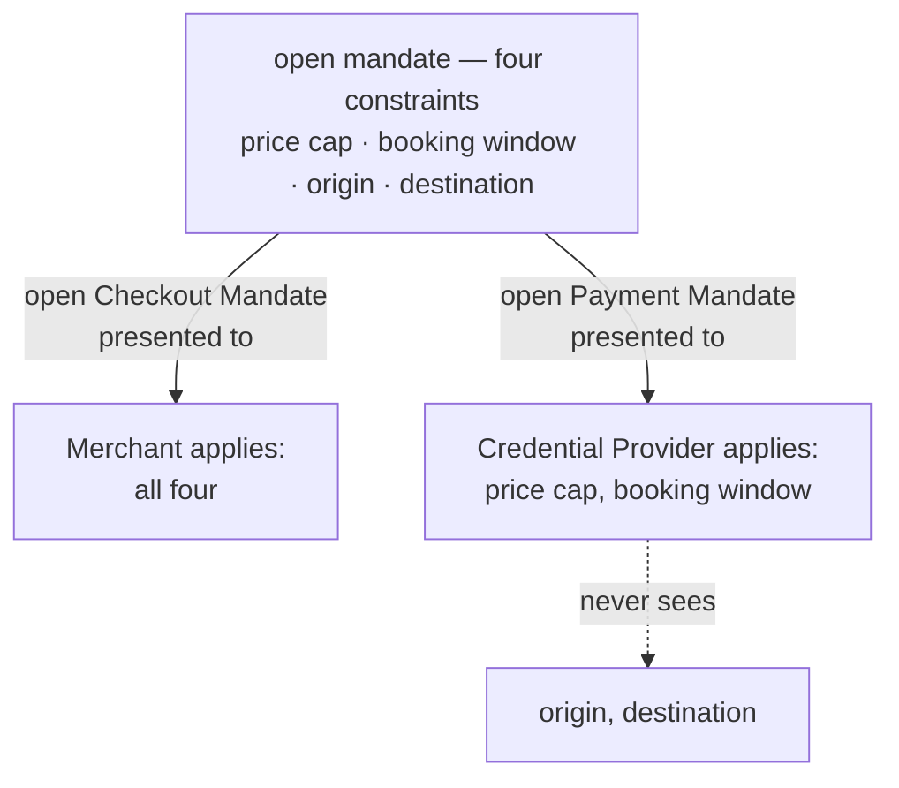

# Google AP2

**This document answers:** what the AP2 specification says.
**It does not contain:** our implementation decisions — those live in
`../architecture/README.md` and `../architecture/adr/`, and the canonical
model's own boundary is recorded in `../../contracts/README.md`.

## Read the version number first

AP2 v0.1 was announced in September 2025. AP2 v0.2 was released in April 2026
and is the current specification. Almost every article, blog post and tutorial
published about AP2 describes v0.1, and the two versions disagree on the two
things a reader most needs to get right: **how many mandate types there are**,
and **what secures them**.

| | v0.1 — obsolete | v0.2 — current |
|---|---|---|
| Mandates | Intent, Cart, Payment | Checkout, Payment |
| Securing format | W3C Verifiable Credentials | SD-JWT |

`AGENTS.md` states the consequence for anyone writing code here: if you find
yourself writing `IntentMandate` or `CartMandate`, that is training data, not
the specification. This document exists so that the correct version is written
down once, in full, and the warning list in `AGENTS.md` can stay short.

Primary sources, in the order of authority `AGENTS.md` gives them:

1. <https://ap2-protocol.org/ap2/specification/>
2. <https://github.com/google-agentic-commerce/AP2> (Apache 2.0)

## Contents

- [Two mandate types](#two-mandate-types)
- [Open and closed](#open-and-closed)
  - [The `vct` trap](#the-vct-trap)
- [The five roles](#the-five-roles)
- [Human Present](#human-present)
- [Human Not Present](#human-not-present)
  - [The delegation mechanism](#the-delegation-mechanism)
  - [The rejection-receipt rule](#the-rejection-receipt-rule)
- [Binding: `checkout_hash`](#binding-checkout_hash)
  - [What the binding does not cover](#what-the-binding-does-not-cover)
- [Constraints](#constraints)
  - [The known open problem](#the-known-open-problem)
- [Selective disclosure](#selective-disclosure)
- [Receipts](#receipts)
- [Traps, collected](#traps-collected)

## Two mandate types

| Mandate | Proves | Provided by | Verified by |
|---|---|---|---|
| **Checkout Mandate** | the Shopping Agent is authorised to purchase the checkout it assembled | the Shopping Agent | the Merchant |
| **Payment Mandate** | the agent is authorised to pay for that specific checkout | the Shopping Agent | the Credential Provider, the Network and the Merchant Payment Processor |

They are two objects rather than one because they have different audiences.
The merchant needs to know that the thing being bought was authorised; the
parties that touch money need to know that this payment, for this checkout, was
authorised. Splitting them is what lets each audience be handed the mandate it
verifies and not the other one — which is the whole precondition for the
selective disclosure section below.

**The Network is not one of the five roles, and it is still a verifier the
specification names in its own words.** Both halves matter, and an earlier
version of this paragraph conceded the first and then guessed at the second.
The Payment Mandate is *"provided by the Shopping Agent and verified by the
Credential Provider, Network, and Merchant Payment Processor"*, and the
verification chapter gives the Network a heading it shares with the Credential
Provider, under one rule set: *"The Credential Provider and, if applicable, the
Network MUST receive an appropriate Payment Mandate from the Shopping Agent
before returning a payment credential."*

So the Network is reached on the **Credential Provider's** leg, from the
Shopping Agent, and holds exactly what a Credential Provider holds. Reading it
instead as a party the Merchant Payment Processor reaches was this file's own
inference, it is contradicted by the sentence above, and it is corrected here
rather than left standing because
`internal/adapters/ap2`'s `ForPayment` row is a claim about what all of these
verifiers may see. What remains genuinely unstated is only whether a Network is
a sixth role or a deployment detail of the payment rails; nothing in this
implementation turns on the answer, since no binary here plays one.

There is no third mandate. The dimension that a third one would have carried —
what the user meant, before any specific purchase existed — is carried by the
open/closed distinction instead.

## Open and closed

An **open** mandate is signed by the *user*. It carries the constraints the
user approved and the agent's public key, and it is not yet bound to any
transaction. Because it is not bound to a transaction, it must be bound to an
agent: the public key is what stops a stolen open mandate being usable by a
different agent, and issue #12 states plainly that this is not optional.

A **closed** mandate is bound to one specific transaction. Who signs it is the
only thing that differs between the two operating modes:

| | Human Present | Human Not Present |
|---|---|---|
| Signs the closed mandate | the user | the agent, with its own key |
| Open mandate needed | no | yes — it endorses the agent key and carries the constraints |
| Verifier's extra step | none | check the closed mandate against the open mandate's constraints |

**Verifiers always receive closed mandates, in both modes. Only the
verification path differs.** A verifier is never handed an open mandate as the
thing it authorises against; the open mandate arrives alongside, as the
evidence that the agent's own signature counts for anything.

Crossing the two mandate types with the two states gives four objects, and
`contracts/authz/` holds one schema for each: `checkout_mandate.json`,
`checkout_mandate_open.json`, `payment_mandate.json`,
`payment_mandate_open.json`.

**An open mandate is not the Intent Mandate renamed.** The Intent Mandate was a
mandate *type* in v0.1, a third object standing beside Cart and Payment. Open
and closed are not types at all — they are states that each of the two v0.2
types occupies, which is why crossing them yields the four schemas above rather
than a third file. A reader carrying the v0.1 model forward goes looking for an
object and has to find a state instead: a different mechanism, not a new name
for the same one.

Two further points the specification makes about open mandates:

- Expiry should be the smallest value that lets the agent complete the task it
  was given (issue #12). An open mandate is a standing authorisation, so its
  lifetime is its blast radius.
- An open Payment Mandate may **pin** parts of the payment outright rather than
  constrain them. A user who says pay this merchant, from this card, up to 50
  EUR has fixed the payee and the instrument and constrained only the amount. A
  pinned field is not a constraint the verifier evaluates; it is a value the
  closed mandate must reproduce unchanged.

### The `vct` trap

Mandates are SD-JWTs, and the SD-JWT credential type claim `vct` carries a
**version suffix**. There are four values, and all four are worth writing down
together, because the shape of the set is where the trap is:

| Mandate | `vct` |
|---|---|
| Checkout, closed | `mandate.checkout.1` |
| Checkout, open | `mandate.checkout.open.1` |
| Payment, closed | `mandate.payment.1` |
| Payment, open | `mandate.payment.open.1` |

The specification's overview page prints exactly two of them as examples —
`mandate.payment.1` and `mandate.checkout.open.1` — and those two happen to be
a *closed* Payment Mandate and an *open* Checkout Mandate. A reader
generalising from that pair infers the wrong rule for the two it does not
print, and the mistake is invisible until a verifier rejects a mandate that was
built correctly. The per-mandate specification pages state each of the four as
a MUST; the overview page is not a source for any of them.

Implementations must match the exact string including the suffix, and issue #5
requires that a wrong `vct` version is rejected rather than tolerated. It is an
easy claim to compare loosely and an easy one to get wrong from memory. A
prefix comparison accepts `mandate.checkout.2`, which is the version this
verifier has been told it does not implement.

`vct` is an AP2 encoding detail and does not appear in the canonical model —
`../../contracts/README.md` records why, along with `cnf`, `iat`/`exp` and the
SD-JWT serialisation characters.

## The five roles

AP2 defines five roles:

- **Shopping Agent** — assembles the checkout, holds the mandates, and in Human
  Not Present mode signs the closed ones with its own key.
- **Trusted Surface** — shows the user what is about to be authorised and takes
  the user's signature. **It must be non-agentic.** No LLM in it, ever.
- **Merchant** — issues the signed checkout and verifies the Checkout Mandate
  against it.
- **Credential Provider** — verifies the Payment Mandate and returns a payment
  credential scoped to it. The agent never sees a PAN.
- **Merchant Payment Processor** — verifies that the payment credential it is
  given is correctly scoped to this checkout.



Two things the diagram cannot show. **One entity may play several roles** — the
five are responsibilities, not deployments, and a merchant that runs its own
processor is one participant answering to two rule sets. And **a role may
delegate its verification to another party**; issue #8 requires that the
implementation allow this, because the specification does.

Anything else in a deployment is not an AP2 role. This project adds exactly one
such component, and `../architecture/adr/0003-correlation-and-event-log.md`
labels it as demo infrastructure for that reason.

Verification is deterministic code in every one of these roles, whether or not
the role is itself agentic. That is a specification requirement rather than a
local preference, and it is the reason the Trusted Surface — the one place a
human decision is taken — is the role the specification puts the hardest
constraint on.

## Human Present

The user approves one specific checkout, at the moment of purchase.



No open mandate appears anywhere in that sequence. The user signs the closed
mandates directly, so there is nothing for a verifier to evaluate constraints
against — the constraint machinery below is inert in this mode.

The specification's own observation is that, because the user approves the
closed checkout directly, this flow can often be replaced by a traditional
e-commerce journey: nothing about it strictly requires an agent. It matters
anyway, because it is the closed-mandate backbone the autonomous flow is built
on.

## Human Not Present

The user is not there when the purchase happens. This is the flow AP2 exists
for, and the one where the open mandate does real work.

The sequence below uses the values of the built scenario in
`../business/use-cases.md`, so the two documents tell one story rather than two:
route **BEG→PMI**, a cap of **USD 20000** in minor units, a booking window of
**2026-06-01 to 2026-08-31**, and a merchant price that moves through
**24000 → 21000 → 18900** minor units. Amounts are integer minor units
throughout the canonical model, so 20000 is $200 and 18900 is $189.



The one hop left out is the merchant presenting the payment side to the
Merchant Payment Processor, which the Human Present diagram above already
shows: AP2 gives that leg to the merchant, so the agent has no part in it in
either mode.

**Everything else about the payment leg does differ under Human Not Present**,
and the fourth difference is why the refusal above is drawn where it is:

- What is presented is a **delegation chain** — the open mandate the user
  signed with the agent's Key Binding JWT over it — rather than a closed
  mandate the user signed directly. It reaches a different verification entry
  point, `AuthorisePaymentChain` rather than `VerifyPayment`.
- **One chain per verifier.** `aud` is signed and compared, so the Payment
  Mandate the Credential Provider reads, the one the merchant reads and the one
  the processor reads are three different documents bound to three different
  challenges.
- The merchant **forwards the processor's chain and the processor's challenge
  unread**, because it is the audience of neither.
- The user's constraints are **evaluated on this leg**. Under Human Present a
  payment-side verifier compares nothing — the user signed this exact purchase.
  Here the open mandate's surviving constraints are evaluated by whichever
  verifier reads the chain.

**The rejection at 21000 comes from a verifier rather than from the agent, and
the verifier is the Credential Provider.** The merchant initiates payment, so
the agent must be funded before it can present anything to the merchant at all;
and the user's cap constrains the amount, which is one of the three facts a
payment-side verifier can state (see the disclosure section). So the Credential
Provider reads it first, refuses, and the merchant is never asked. The merchant
refuses plenty under this mode — an `item.id` violation, a price that does not
match its own offer, a chain addressed elsewhere — it simply cannot get to an
amount constraint first.

An agent that skipped its own check, or one whose model hallucinated that 21000
was under the cap, would fail at exactly the same point and in exactly the same
way. That is the property that makes a hallucinating model harmless here, and
it only holds because the constraint evaluation sits with the verifier — see
the constraint section below.

The loop is labelled deterministic on purpose. The user's sentence is
interpreted into typed constraints **once**, before anything is signed; after
the signature the agent is watching the merchant's own quote move to a new
`step` of the merchant's own schedule. **It compares no money at all** — not to
the cap, not to the previous price — which is what makes "the verifier evaluates
the constraint" structural here rather than a matter of discipline, and it is
why the $210 candidate is presented rather than filtered out.
`internal/agent/watch.go` argues it; `../architecture/README.md` shows where the
boundary sits in the module layout.

### The delegation mechanism

`A->>A: assemble closed mandates, sign with agent key`, in the diagram above,
names one step and stays silent on how — and how is where the costliest
mistake on this issue was found (the full account is
`../specs/2026-08-06-open-mandates-and-the-delegation-chain.md`). The obvious
reading is that the agent issues a **second, separate SD-JWT**, signs it with
its own key, and a verifier resolves that key from somewhere and compares it
against the open mandate's `cnf` by hand. That reading compiles, has tests
that pass, and is not what the specification says.

A closed mandate under Human Not Present **is** a Key Binding JWT
(RFC 9901 §4.3) built over the open one, using the key the open mandate
already endorsed in `cnf` — there is no second issuance to sign. The open
mandate and the Key Binding JWT travel together as a single `~~`-joined
Delegate SD-JWT chain (`draft-gco-oauth-delegate-sd-jwt-00`):

```
<open SD-JWT>~~<KB-JWT>~<disclosure>~…~
```

There is exactly **one** key resolution in the whole exchange, not two
independent ones to remember to compare. The obvious reading needed a verifier
to resolve the signing key of the second SD-JWT *and* resolve `cnf`, then
check the two agree — two lookups and a hand-written comparison, any of which
can be skipped. Under the chain, `cnf` is read once, resolved once, to the one
verifier the KB-JWT's signature is ever checked with — so there is no second
key for that comparison to be *about*, and the class of bug where somebody
forgets to write it is closed off structurally rather than by review.

**That resolution is still a real lookup, and it is still the caller's to
get right.** `pkg/sdjwt` holds no key material by design (`pkg-purity`), so it
cannot verify that whatever a resolver hands back for a given `cnf` actually
corresponds to the JWK bytes inside it — turning `cnf` into a `Verifier` is
`ChainOptions.AgentKey` / `sdjwt.ChainOptions.DelegateKey`, supplied by
whichever role is verifying, on the same split RFC 9901 key binding already
draws for a standalone presentation's `HolderKey`. What the chain removes is
the *second*, independent key and the comparison against it — not the
resolution itself, which was never a place this package could stand in.

### The rejection-receipt rule

The retry after the rejection is not merely good manners. Issue #13 records the
specification requirement, which is one sentence in the specification and is
easy to miss entirely: a Shopping Agent MUST NOT present a subsequent open
Payment or Checkout Mandate without first receiving a rejection receipt for the
previous one.

Without it, one user authorisation can be spent several times — an agent could
hold a single open mandate against several different checkouts at once and take
whichever came back accepted. It is a real security property, not bookkeeping,
and it is the reason the rejection at 21000 must produce a signed receipt
before the attempt at 18900 is allowed to exist.

The rule is a sequence, so it is written as a state machine:
`authz.MandateState` in `backend/internal/core/authz/lifecycle.go`, one value
per open mandate. A mandate is *ready*; beginning a purchase attempt on it makes
it *awaiting receipt*, from which beginning another is refused; a rejection
receipt returns it to *ready*, which is the retry above; and a successful
receipt makes it *spent*, which is terminal. Both refusals carry
`open_mandate_outstanding`.

**The unit is a purchase attempt, not a verifier hop**, and that distinction is
load-bearing rather than pedantic. A single attempt puts the same Payment
Mandate in front of **three** verifiers: the Credential Provider, which funds it;
the merchant, which verifies it in its own right at settlement; and the Merchant
Payment Processor, which verifies it before deciding whether the credential is
scoped to the purchase. A machine stepped once per verifier would call the
mandate spent as soon as the Credential Provider answered, then refuse
settlement — killing the purchase after the payment credential had been issued
and before the merchant was ever asked. An attempt is outstanding until some
verifier in it answers, is rejected if any of them refuses, and is accepted when
the purchase goes through.

One caller steps the machine: `internal/agent`'s `Tracker`, which holds one
state per open mandate and steps both together, and which the autonomous watch
loop drives once per attempt. The unit remains an obligation on the caller
rather than a property of the type — `MandateState` sees no verifiers and counts
calls, so an agent stepping it per hop gets the bug above silently. What closes
it is that caller's own test,
`TestTheCredentialProvidersReceiptDoesNotSpendTheMandate`, which drives one
attempt across both hops and asserts that the Credential Provider's receipt
leaves the mandate awaiting a receipt rather than spent.

Single use is this implementation's reading of AP2's own answer, which is scope
reduction — "the agent reduces the scope of the open mandate based on the
receipt, often preventing future presentations entirely", on the specification's
agent authorization page — taken to its degenerate case, because the narrowing
the specification describes is agent-side and so is the one check no other party
ever sees. The word doing the work there is *often*: the Subscription in
`../business/use-cases.md`, one open mandate reused across billing periods until
it expires, is the not-often case, and a terminal *spent* makes it
unrepresentable. Widening that is a source change, not a setting.

**Be exact about who enforces it, because the rule sounds stronger than it is.**
The agent does, and nothing else can: a rule set holds no state, and a verifier
is shown one presentation carrying no record of any other. So what the machine
buys is an honest agent no longer able to spend one authorisation against two
checkouts by accident, which is the common failure. It is not a defence against
a dishonest agent — that one is replaying, and a replay is refused by the
verifier-side nonce store of issue #27. *Awaiting receipt* is the state a screen
has to draw as waiting rather than as stalled, for as long as an answer can
still arrive: the rule makes attempts sequential on purpose. There is no exit
from it but a receipt — no timeout and no abandon, because "no answer came, so I
may try again" is the rule's own bypass — so a dropped response leaves the
mandate there until it expires, and the recourse is re-delivering the same
presentation under the same idempotency key rather than starting a new attempt.

## Binding: `checkout_hash`

The merchant provides a merchant-signed JWT containing the checkout. Both
mandates carry the digest of that JWT, and the fact that they carry the *same*
digest is what cryptographically links authorisation to buy with authorisation
to pay.



Four traps sit on this one value.

**The algorithm is not fixed, and the input is a string.** `checkout_hash` is
the base64url digest **of the value of `checkout_jwt`** — the compact
serialisation as it travels, not the bytes it decodes to and not the checkout
object inside it, which is what removes any need to canonicalise the merchant's
JSON. The algorithm MUST be the one the SD-JWT's own `_sd_alg` claim names,
defaulting to `sha-256` when that claim is absent. Hardcoding `sha-256`
produces a verifier that works until somebody issues with a wider digest and
then reports a **hash mismatch** — which reads as tampering rather than as the
bug it is. The output carries no algorithm prefix: it is bare base64url, never
`sha-256:…`.

**Recompute, never trust.** Verification must recompute the hash of the
Checkout JWT it holds and compare the result to the `checkout_hash` claim as
presented. A verifier that reads the claim and believes it, has verified nothing
at all: the claim is written by the party being checked. Issue #5 states the
rule directly, and issue #18 repeats it as step 2 of dispute-time verification,
where the recomputation is independent by construction.

That rule collides with a second one, and the collision is the interesting
part. `checkout_jwt` is **selectively disclosable** while `checkout_hash` is
not, so a verifier can legitimately receive a mandate carrying the hash but not
the document it hashes — and `checkout_mandate.json` says as much, because a
verifier that already holds the checkout does not need to be sent it again.
Neither rule says what happens when the presentation withholds the document and
the verifier holds no copy either.

This implementation refuses it, with `disclosure_insufficient`. A hash nobody
can recompute asserts only that whoever signed the mandate wrote a hash into
it, which is precisely the assertion the recompute rule exists to distrust — so
the binding is checked against the disclosed document or against one the
verifier already holds, and a mandate with neither does not pass. Where both
are present they must be the same document: preferring one silently would
decide, without saying so, whether the mandate being checked is the one that
was presented or the one that was expected.

**The Checkout JWT must be signed with a non-deterministic scheme**, such as
ECDSA — never a deterministic one such as Ed25519. A deterministic signature
over a low-entropy checkout makes `checkout_hash` predictable, and a rainbow
table over plausible checkouts becomes worth building. Note the contrast with
TAP, which *does* use Ed25519: different threat model, different requirement.
`tap.md`, alongside this document, covers that side of it.

**AP2 names the claim `transaction_id` on the Payment Mandate** while defining
it as the hash of the checkout — the same value the Checkout Mandate calls
`checkout_hash`. Two names, one fact. The canonical model keeps one name and
the adapter maps it; `../../contracts/README.md` records the choice.

A Payment Mandate bound to a different checkout must be rejected. That is the
binding doing its job, and issue #6 makes it a test.

**A fifth trap sits underneath the first one: `_sd_alg` is often absent.**
RFC 9901 §4.1.1 makes the claim optional and defines its absence as `sha-256`,
and an SD-JWT implementation writes it only when the payload actually carries
digests — correctly, because a payload with no digests says nothing about how
digests are computed.

That is invisible until something puts a digest in a payload for a reason
unrelated to selective disclosure, and `checkout_hash` is exactly that. A
Checkout Mandate never notices, because `checkout_jwt` is withholdable and the
document is required at issuance, so the mandate always blinds something. A
closed Payment Mandate notices immediately: nothing in it has to be withheld, so
the ordinary mandate blinds nothing and publishes no `_sd_alg`.

An issuer that hashed under its own configured algorithm anyway produces a
mandate that fails its own binding check — hashed with `sha-384`, recomputed by
the verifier under the `sha-256` default, refused as `checkout_hash_mismatch`.
The rejection says the agent substituted the purchase. The truth is that the two
sides disagreed about a default. **Compute `checkout_hash` under the algorithm a
verifier will observe**, which is the issuer's only when the payload will carry
digests at all.

### What the binding does not cover

The binding proves the two mandates name **one purchase**. It proves nothing
about whether they agree on the price, and the obvious reading of "bound to the
same checkout" is that it covers the number.

AP2 defines `transaction_id` as the *"base64url-encoded hash of the
`checkout_jwt` field value, uniquely identifying the checkout associated with
this"* — a digest of a document, and that is the whole of it. No language in the
specification requires any verifier to compare the Payment Mandate's
`payment_amount` against what that checkout costs, none describes what happens
when the two differ, and no role is assigned the comparison. AP2 does state
amount rules, and every one of them measures the mandate against itself or its
own history rather than against the document it references: `payment.amount_range`
bounds `payment_amount` between a `min` and a `max` carried by the open mandate
and requires the currency to match that constraint's, and `payment.budget` —
which the specification scopes to mandates using the `payment.agent_recurrence`
constraint — requires the requested amount plus the sum of previously closed
Payment Mandates to stay within a `max`. A user can therefore cap what an agent spends. Nothing
ties any of it to what the merchant is charging.

So a Payment Mandate saying **pay 1 USD**, correctly bound by hash to a checkout
priced at **189 USD**, is a *conforming* mandate. Both carry the same digest,
every signature verifies, and nothing in the protocol stops it settling.

**Only the merchant is positioned to close that gap, and the reason is the
opacity above.** The binding hashes the Checkout JWT's compact serialisation as
a string, which is precisely what removes any need to canonicalise the
merchant's JSON — so nothing in the protocol reads inside the document, and a
verifier cannot in general learn what a checkout costs. A closed Payment Mandate
carries `transaction_id` and never the document, so a Credential Provider or a
Merchant Payment Processor sent only that mandate holds a digest with no price
to compare it against. The merchant is the exception because the document is its
own — it issued the offer, so whether it kept a copy or checks its own signature
over one presented back to it, the price it reads is a price it committed to.

**This implementation checks it at the merchant anyway, and that is a
divergence from the specification rather than a requirement of it.** A purchase
whose Payment Mandate pays something other than what the checkout costs is
refused as `payment_amount_mismatch`, before payment is initiated and with a
signed receipt naming why. That code is ours: it is the one entry in
`../../contracts/evidence/error_code.json` that no protocol rule produces, and
the file marks it as such. `backend/internal/adapters/ap2/amount.go` is where
the comparison and the argument for it live. Issue #88 is the finding and the
decision.

**The half AP2 does require is checked in the same place, and until #88 it was
not checked anywhere.** The merchant recomputes the Payment Mandate's
`transaction_id` against the offer it holds and refuses a mismatch as
`payment_binding_mismatch`, before comparing any amount — paying for a different
purchase and paying the wrong price for the right one are different findings,
and the first is the more fundamental. The adapter had carried `Binding.Covers`
and `Binding.Same` since #6 with tests behind them and **no production caller**,
so two genuine mandates from two different purchases would settle against each
other. That is a plain gap rather than a divergence, and it is named here
because the paragraph above would otherwise claim more care about the binding
than the code took.

Two limits on that, both worth stating because a reader who assumed either
would be wrong. It is the *merchant's* check and nobody else's — the Credential
Provider and the processor are sent no checkout, so nothing about them changes.
And it is a check on agreement, not on fairness: a merchant that quotes a
different price to every caller is doing something this says nothing about.

## Constraints

Constraints are an AP2 **extension point**. The specification does not define a
vocabulary; it defines what defining one requires. Per issue #11, three things:
a unique `type` identifier, a schema saying which fields are selectively
disclosable, and an **evaluation algorithm**.



**Evaluation is performed by the verifier, never by the agent.** This is the
single most important sentence in the document. The agent may propose anything
it likes — that is what a language model does — and the deterministic gate on
the other side decides. An agent that could wave through its own mistake would
make every other guarantee here decorative.

**An unknown constraint type is rejected, never silently ignored.** Silently
ignoring one converts a limit the user set into a limit nobody enforces, which
is the worst available outcome: the transaction proceeds and the user's
approval is misrepresented. This is why the canonical model deliberately leaves
the type identifier as an open string rather than an enumeration — an unknown
type has to be *representable* in order to be rejected explicitly and named in
a receipt, where a parse failure could be neither.

The vocabulary itself is ours, not AP2's; AP2 merely transports it. Where it
lives, and why it does not live in the AP2 adapter, is an implementation
decision recorded in `../../contracts/README.md` and in issue #11 —
`backend/internal/core/authz/constraint/` is the package, and it holds the
registry, the per-type parameter schemas and the evaluators.

### The known open problem

This extension point has a consequence the specification does not solve.

Because every implementer defines their own constraint vocabulary, and the
verifier must understand it to evaluate it, two AP2 implementations with
different constraint types cannot interoperate. An agent that expresses a
booking window with a `within` comparison on `at` and a merchant that only knows
`validity.period` have no path to agreement: the merchant is required to reject
what it cannot evaluate, and it is correct to do so.

Fragmentation therefore reappears one layer inside the protocol built to solve
it. This is an unresolved problem, not a solved one, and nothing in this
repository fixes it — a shared registry, a profile mechanism or a negotiation
step would each be a genuine addition to the protocol rather than an
implementation detail. It is recorded here because it is the kind of thing that
is obvious in hindsight and invisible until an implementation hits it.

Two things the implementation does about it, neither of which is a fix. It can
list the fields and operators it understands, which is the raw material a
profile or negotiation step would need and costs nothing to expose. And a
rejection for an unknown field or operator carries `constraint_type_unknown`
rather than `constraint_violated`, so the two failures stay distinguishable all
the way out to the receipt: one says the verifier could not form a view, the
other says it formed one and the answer was no. Collapsing them would tell a
user their limit was exceeded when in fact nobody could read it — which is how a
fragmentation problem gets misfiled as a policy decision, once per transaction,
invisibly.

Moving to an expression tree made this worse rather than better, and that is
worth stating plainly. Two implementations now have to agree on a *language* —
the operators, how they compose, what nesting means — and not merely on a list
of constraint names. A richer vocabulary buys expressiveness at the cost of a
larger surface over which two parties must already agree before they can talk,
and nothing about the protocol helps them get there.

## Selective disclosure

Mandates are secured with **SD-JWT** (RFC 9901), not with W3C Verifiable
Credentials — that was v0.1. SD-JWT lets the issuer mark fields as
withholdable, and lets the holder present a subset of them to each verifier
while the signature still verifies over what remains.

That capability is not decoration on AP2; it is what makes the five-role split
tolerable. Every role in the flow would otherwise see the whole transaction.



The Merchant's side of that diagram used to read *"Merchant sees: route, price
cap"*, with an instrument and a passenger it never sees. That was illustrative
of AP2 in general and it is not true of this implementation, so it is gone
rather than left to mislead: **a Merchant issued the checkout, so there is no
fact in our constraint vocabulary it cannot state, and minimising an open
Checkout Mandate withholds nothing.** An instrument and a passenger are not
things a constraint can read here at all. Everything the diagram now claims is
`TestEveryFactIsPlacedWithAVerifier`.

The specification makes minimisation an obligation, not an option. Issue #14
records it as: Shopping Agents MUST present only those disclosures from the
open mandates that are required to evaluate the closed mandates. Constraints
not relevant to the closed mandate are not shared.

**The trap is that the naive implementation sends every disclosure.** It works.
Every verifier accepts it, every signature verifies, every test passes — and it
silently defeats the entire point of using SD-JWT. Nothing fails. There is no
error, no warning and no receipt recording it, because from the protocol's
point of view an over-disclosed presentation is a valid presentation. The only
way this is caught is a test asserting that irrelevant disclosures are
**absent**, which is what issue #14 requires.

The canonical model marks disclosable fields at the domain level rather than as
SD-JWT instructions, so the two annotations are `x-disclosable` and
`x-disclosable-items` in `contracts/`; the second one marks each *element* of a
constraint array as independently withholdable, which is what minimisation over
a constraint list needs.

**Which constraints are "relevant" is decided by which facts the receiving
verifier can state.** A Merchant issued the checkout and can state every fact
the constraint vocabulary knows; a Credential Provider is sent the Payment
Mandate and nothing else, so it holds an amount, a payee and its own clock and
can say nothing about an item. A constraint reading a fact its verifier cannot
state is not enforced by presenting it — `constraint.Evaluate` reports the fact
as unstated and refuses, on every transaction — so withholding it is
correctness as much as privacy. The full argument, the field-by-verifier table
and the two spec sentences it rests on are in
[the minimisation spec](../specs/2026-08-08-selective-disclosure-minimisation.md).

**And the trap on the other side, which the issue does not name.** Withholding
too much means a verifier cannot enforce a limit the user set, and the purchase
proceeds while misrepresenting what was approved — the same outcome as silently
skipping an unknown constraint type, reached by a different route.

Be precise about what a verifier can do here, because the two halves point
opposite ways.

- **Which constraint was withheld, and what it said, are unrecoverable.** RFC
  9901 makes an undisclosed digest opaque by design, and §7.1 step 3.d removes
  the element from the processed array rather than leaving a hole.
- **That some were withheld is computable.** The signed payload commits to one
  digest per constraint whether or not a disclosure accompanies it, so counting
  the digests and subtracting the disclosures gives the number exactly. Decoys
  do not muddy it: this implementation adds them to `_sd` arrays only and never
  to arrays of values, precisely so that an application counting elements is not
  reading a number the issuer invented.

Both are used. The count settles the one case that needs no policy — *the
mandate committed to constraints and disclosed none of them*, which is not the
same thing as a mandate that set no limits, and is refused outright. Beyond that
a count says nothing about whether the missing one mattered, so a verifier names
the facts it will not proceed without having seen constrained and refuses a
presentation that names none of them. Both refusals are
`disclosure_insufficient`.

## Receipts

A receipt is a verifier's signed answer to a closed mandate. Issue #7 states
the rule that most implementations get wrong: receipts are mandatory in **both**
directions. On rejection the verifier MUST still return a receipt carrying the
appropriate error — a silent failure is a protocol violation, because it leaves
nothing to reason about in a dispute.

Two properties follow:

- The receipt's `reference` must match the hash of the closed mandate it
  answers, computed the same way `sd_hash` would be. That is what ties one
  receipt to exactly one mandate.
- The Payment Receipt goes to the Shopping Agent, the Credential Provider and,
  where applicable, the Network — not only to the agent that asked.

At dispute time the Checkout Mandate and its receipt, plus the Payment Mandate
and its receipt, together form a non-repudiable picture of the transaction.
Issue #18 sets out the five verification steps, each of which reads a signed
artefact and recomputes a digest against it. Nothing else is evidence;
`../architecture/adr/0003-correlation-and-event-log.md` states why the event
log in particular is not.

## Traps, collected

Every one of these is stated in full above. The list is here because it is the
part worth re-reading before writing code.

| Trap | Where |
|---|---|
| Intent Mandate and Cart Mandate are v0.1 and do not exist in v0.2 | Two mandate types |
| Open mandates are not a rename of the Intent Mandate; they are a different mechanism | Open and closed |
| `vct` carries a version suffix and must be matched exactly | The `vct` trap |
| The agent key in the open mandate is what stops a stolen mandate being reused; not optional | Open and closed |
| A closed mandate under Human Not Present is a Key Binding JWT over the open one, not a second SD-JWT compared to `cnf` by hand | The delegation mechanism |
| `checkout_hash` must be recomputed, never trusted as presented | Binding |
| The Checkout JWT must use a non-deterministic signature scheme | Binding |
| `transaction_id` and `checkout_hash` are the same value under two names | Binding |
| "Bound to the same checkout" does not mean "agreed on the price" — no AP2 rule compares `payment_amount` to what the checkout costs, and no role is assigned it | What the binding does not cover |
| An unknown constraint type must be rejected, never silently ignored | Constraints |
| Constraints are evaluated by the verifier, never by the agent | Constraints |
| Presenting every disclosure passes every test and defeats SD-JWT entirely | Selective disclosure |
| Withholding too much leaves a limit nobody enforces; *which* constraint went is unrecoverable, but *that* some went is a count the signed payload gives you | Selective disclosure |
| Disclosure granularity is the top-level constraint, so one `all` group is all-or-nothing to a verifier that cannot state every fact in it | Selective disclosure |
| A rejection must still produce a signed receipt | Receipts |
| A second open mandate may not be presented before a rejection receipt arrives | The rejection-receipt rule |
| The Trusted Surface must be non-agentic | The five roles |
