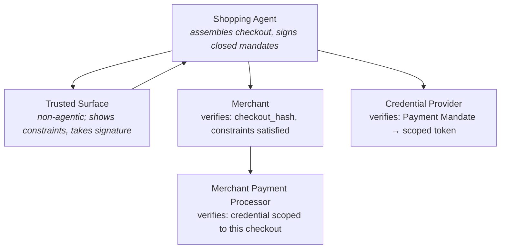
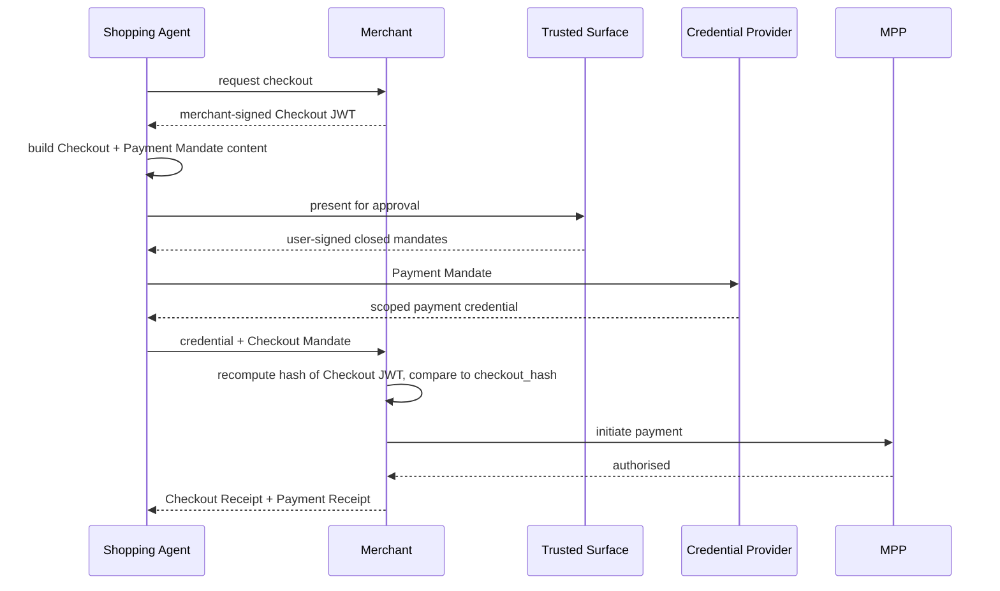
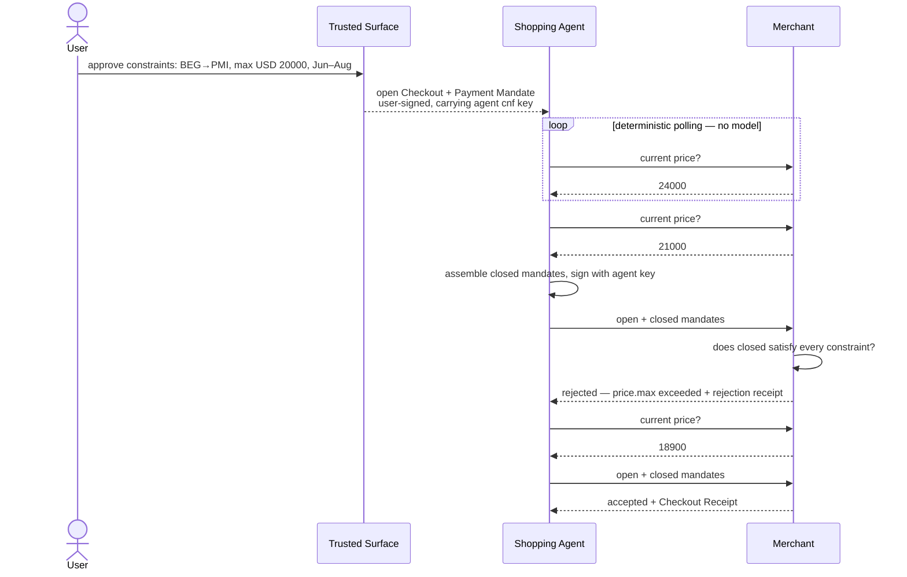
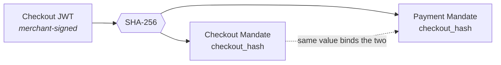
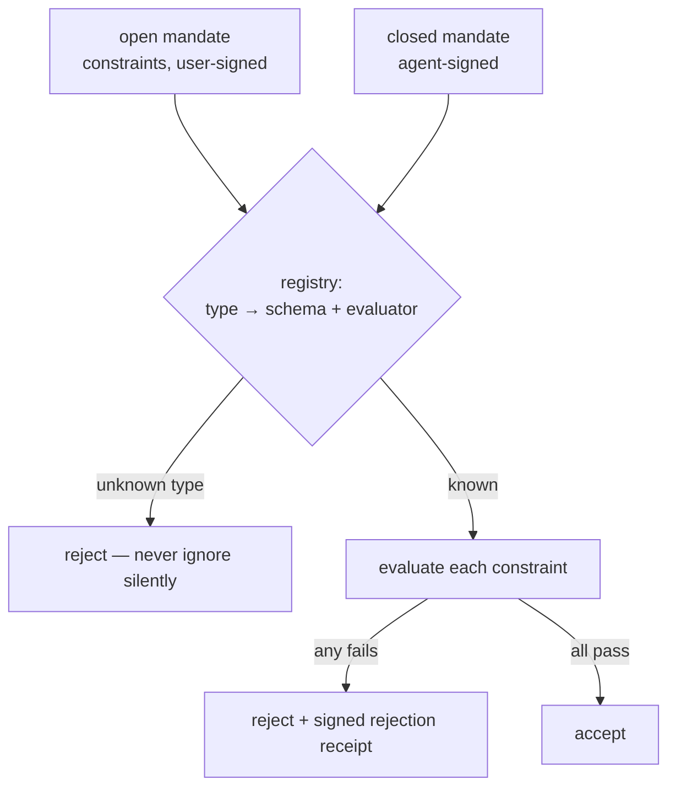
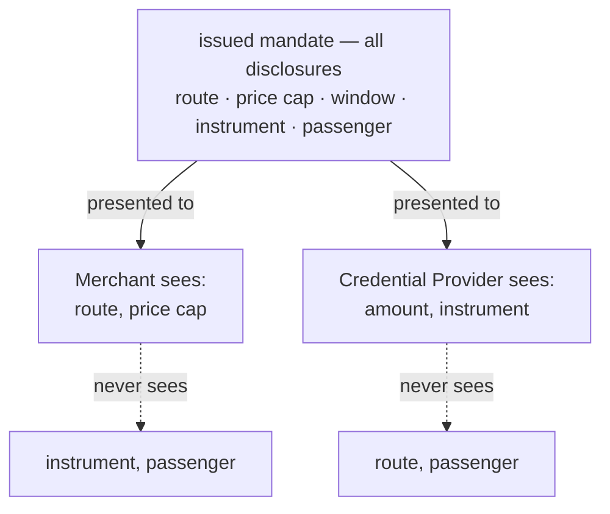

# Google AP2

**This document answers:** what the AP2 specification says.
**It does not contain:** our implementation decisions — those live in
`../architecture/README.md` and `../architecture/adr/`, and the canonical
model's own boundary is recorded in `../../contracts/README.md`.

## Read the version number first

AP2 v0.1 was announced in September 2025. AP2 v0.2 was released in April 2026
and is the current specification. Almost every article, blog post and tutorial
published about AP2 describes v0.1, and the two versions disagree on the two
things a reader most needs to get right: **how many mandate types there are**,
and **what secures them**.

| | v0.1 — obsolete | v0.2 — current |
|---|---|---|
| Mandates | Intent, Cart, Payment | Checkout, Payment |
| Securing format | W3C Verifiable Credentials | SD-JWT |

`AGENTS.md` states the consequence for anyone writing code here: if you find
yourself writing `IntentMandate` or `CartMandate`, that is training data, not
the specification. This document exists so that the correct version is written
down once, in full, and the warning list in `AGENTS.md` can stay short.

Primary sources, in the order of authority `AGENTS.md` gives them:

1. <https://ap2-protocol.org/ap2/specification/>
2. <https://github.com/google-agentic-commerce/AP2> (Apache 2.0)

## Two mandate types

| Mandate | Proves | Provided by | Verified by |
|---|---|---|---|
| **Checkout Mandate** | the Shopping Agent is authorised to purchase the checkout it assembled | the Shopping Agent | the Merchant |
| **Payment Mandate** | the agent is authorised to pay for that specific checkout | the Shopping Agent | the Credential Provider, the Network and the Merchant Payment Processor |

They are two objects rather than one because they have different audiences.
The merchant needs to know that the thing being bought was authorised; the
parties that touch money need to know that this payment, for this checkout, was
authorised. Splitting them is what lets each audience be handed the mandate it
verifies and not the other one — which is the whole precondition for the
selective disclosure section below.

The Network appears in the Payment Mandate's verification audience in both
`AGENTS.md` and issue #6, and it is not one of the five roles the specification
names. Reading it as a party the Merchant Payment Processor reaches, rather
than as a sixth role, is an inference and is flagged here as one.

There is no third mandate. The dimension that a third one would have carried —
what the user meant, before any specific purchase existed — is carried by the
open/closed distinction instead.

## Open and closed

An **open** mandate is signed by the *user*. It carries the constraints the
user approved and the agent's public key, and it is not yet bound to any
transaction. Because it is not bound to a transaction, it must be bound to an
agent: the public key is what stops a stolen open mandate being usable by a
different agent, and issue #12 states plainly that this is not optional.

A **closed** mandate is bound to one specific transaction. Who signs it is the
only thing that differs between the two operating modes:

| | Human Present | Human Not Present |
|---|---|---|
| Signs the closed mandate | the user | the agent, with its own key |
| Open mandate needed | no | yes — it endorses the agent key and carries the constraints |
| Verifier's extra step | none | check the closed mandate against the open mandate's constraints |

**Verifiers always receive closed mandates, in both modes. Only the
verification path differs.** A verifier is never handed an open mandate as the
thing it authorises against; the open mandate arrives alongside, as the
evidence that the agent's own signature counts for anything.

Crossing the two mandate types with the two states gives four objects, and
`contracts/authz/` holds one schema for each: `checkout_mandate.json`,
`checkout_mandate_open.json`, `payment_mandate.json`,
`payment_mandate_open.json`.

**An open mandate is not the Intent Mandate renamed.** The Intent Mandate was a
mandate *type* in v0.1, a third object standing beside Cart and Payment. Open
and closed are not types at all — they are states that each of the two v0.2
types occupies, which is why crossing them yields the four schemas above rather
than a third file. A reader carrying the v0.1 model forward goes looking for an
object and has to find a state instead: a different mechanism, not a new name
for the same one.

Two further points the specification makes about open mandates:

- Expiry should be the smallest value that lets the agent complete the task it
  was given (issue #12). An open mandate is a standing authorisation, so its
  lifetime is its blast radius.
- An open Payment Mandate may **pin** parts of the payment outright rather than
  constrain them. A user who says pay this merchant, from this card, up to 50
  EUR has fixed the payee and the instrument and constrained only the amount. A
  pinned field is not a constraint the verifier evaluates; it is a value the
  closed mandate must reproduce unchanged.

### The `vct` trap

Mandates are SD-JWTs, and the SD-JWT credential type claim `vct` carries a
**version suffix**: `mandate.payment.1`, `mandate.checkout.open.1`.
Implementations must match the exact string including the suffix, and issue #5
requires that a wrong `vct` version is rejected rather than tolerated. It is an
easy claim to compare loosely and an easy one to get wrong from memory.

`vct` is an AP2 encoding detail and does not appear in the canonical model —
`../../contracts/README.md` records why, along with `cnf`, `iat`/`exp` and the
SD-JWT serialisation characters.

## The five roles

AP2 defines five roles:

- **Shopping Agent** — assembles the checkout, holds the mandates, and in Human
  Not Present mode signs the closed ones with its own key.
- **Trusted Surface** — shows the user what is about to be authorised and takes
  the user's signature. **It must be non-agentic.** No LLM in it, ever.
- **Merchant** — issues the signed checkout and verifies the Checkout Mandate
  against it.
- **Credential Provider** — verifies the Payment Mandate and returns a payment
  credential scoped to it. The agent never sees a PAN.
- **Merchant Payment Processor** — verifies that the payment credential it is
  given is correctly scoped to this checkout.

Two things the diagram cannot show. **One entity may play several roles** — the
five are responsibilities, not deployments, and a merchant that runs its own
processor is one participant answering to two rule sets. And **a role may
delegate its verification to another party**; issue #8 requires that the
implementation allow this, because the specification does.

Anything else in a deployment is not an AP2 role. This project adds exactly one
such component, and `../architecture/adr/0003-correlation-and-event-log.md`
labels it as demo infrastructure for that reason.

Verification is deterministic code in every one of these roles, whether or not
the role is itself agentic. That is a specification requirement rather than a
local preference, and it is the reason the Trusted Surface — the one place a
human decision is taken — is the role the specification puts the hardest
constraint on.

## Human Present

The user approves one specific checkout, at the moment of purchase.

No open mandate appears anywhere in that sequence. The user signs the closed
mandates directly, so there is nothing for a verifier to evaluate constraints
against — the constraint machinery below is inert in this mode.

The specification's own observation is that, because the user approves the
closed checkout directly, this flow can often be replaced by a traditional
e-commerce journey: nothing about it strictly requires an agent. It matters
anyway, because it is the closed-mandate backbone the autonomous flow is built
on.

## Human Not Present

The user is not there when the purchase happens. This is the flow AP2 exists
for, and the one where the open mandate does real work.

The sequence below uses the values of the built scenario in
`../business/use-cases.md`, so the two documents tell one story rather than two:
route **BEG→PMI**, a cap of **USD 20000** in minor units, a booking window of
**2026-06-01 to 2026-08-31**, and a merchant price that moves through
**24000 → 21000 → 18900** minor units. Amounts are integer minor units
throughout the canonical model, so 20000 is $200 and 18900 is $189.

That sequence is the **authorisation leg only**, and stops where the open
mandate's distinctive work is done. The payment leg is not different in this
mode: from the Payment Mandate onward — Credential Provider, scoped
credential, MPP, Payment Receipt — it is identical to the Human Present
diagram above, and is left out here rather than drawn a second time. The
built scenario in `../business/use-cases.md` runs to the end, which is why its
beat 7 has the Credential Provider returning a scoped token and its beat 9 has
both receipts signed.

**The rejection at 21000 is refused by the merchant, not by the agent.** An
agent that skipped its own check, or one whose model hallucinated that 21000
was under the cap, would fail at exactly the same point and in exactly the same
way. That is the property that makes a hallucinating model harmless here, and
it only holds because the constraint evaluation sits with the verifier — see
the constraint section below.

The loop is labelled deterministic on purpose. The user's sentence is
interpreted into typed constraints **once**, before anything is signed; after
the signature, watching a price is an integer comparison and not a model call.
`../architecture/README.md` shows where that boundary sits in the module
layout.

### The rejection-receipt rule

The retry after the rejection is not merely good manners. Issue #13 records the
specification requirement, which is one sentence in the specification and is
easy to miss entirely: a Shopping Agent MUST NOT present a subsequent open
Payment or Checkout Mandate without first receiving a rejection receipt for the
previous one.

Without it, one user authorisation can be spent several times — an agent could
hold a single open mandate against several different checkouts at once and take
whichever came back accepted. It is a real security property, not bookkeeping,
and it is the reason the rejection at 21000 must produce a signed receipt
before the attempt at 18900 is allowed to exist.

## Binding: `checkout_hash`

The merchant provides a merchant-signed JWT containing the checkout. Both
mandates carry the digest of that JWT, and the fact that they carry the *same*
digest is what cryptographically links authorisation to buy with authorisation
to pay.

Three traps sit on this one value.

**Recompute, never trust.** Verification must recompute the hash of the
Checkout JWT it holds and compare the result to the `checkout_hash` claim as
presented. A verifier that reads the claim and believes it, has verified nothing
at all: the claim is written by the party being checked. Issue #5 states the
rule directly, and issue #18 repeats it as step 2 of dispute-time verification,
where the recomputation is independent by construction.

**The Checkout JWT must be signed with a non-deterministic scheme**, such as
ECDSA — never a deterministic one such as Ed25519. A deterministic signature
over a low-entropy checkout makes `checkout_hash` predictable, and a rainbow
table over plausible checkouts becomes worth building. Note the contrast with
TAP, which *does* use Ed25519: different threat model, different requirement.
`tap.md`, alongside this document, covers that side of it.

**AP2 names the claim `transaction_id` on the Payment Mandate** while defining
it as the hash of the checkout — the same value the Checkout Mandate calls
`checkout_hash`. Two names, one fact. The canonical model keeps one name and
the adapter maps it; `../../contracts/README.md` records the choice.

A Payment Mandate bound to a different checkout must be rejected. That is the
binding doing its job, and issue #6 makes it a test.

## Constraints

Constraints are an AP2 **extension point**. The specification does not define a
vocabulary; it defines what defining one requires. Per issue #11, three things:
a unique `type` identifier, a schema saying which fields are selectively
disclosable, and an **evaluation algorithm**.

**Evaluation is performed by the verifier, never by the agent.** This is the
single most important sentence in the document. The agent may propose anything
it likes — that is what a language model does — and the deterministic gate on
the other side decides. An agent that could wave through its own mistake would
make every other guarantee here decorative.

**An unknown constraint type is rejected, never silently ignored.** Silently
ignoring one converts a limit the user set into a limit nobody enforces, which
is the worst available outcome: the transaction proceeds and the user's
approval is misrepresented. This is why the canonical model deliberately leaves
the type identifier as an open string rather than an enumeration — an unknown
type has to be *representable* in order to be rejected explicitly and named in
a receipt, where a parse failure could be neither.

The vocabulary itself is ours, not AP2's; AP2 merely transports it. Where it
lives, and why it does not live in the AP2 adapter, is an implementation
decision recorded in `../../contracts/README.md` and in issue #11 —
`backend/internal/core/authz/constraint/` is the package, and it holds the
registry, the per-type parameter schemas and the evaluators.

### The known open problem

This extension point has a consequence the specification does not solve.

Because every implementer defines their own constraint vocabulary, and the
verifier must understand it to evaluate it, two AP2 implementations with
different constraint types cannot interoperate. An agent that expresses a
booking window as `temporal.window` and a merchant that only knows
`validity.period` have no path to agreement: the merchant is required to reject
what it cannot evaluate, and it is correct to do so.

Fragmentation therefore reappears one layer inside the protocol built to solve
it. This is an unresolved problem, not a solved one, and nothing in this
repository fixes it — a shared registry, a profile mechanism or a negotiation
step would each be a genuine addition to the protocol rather than an
implementation detail. It is recorded here because it is the kind of thing that
is obvious in hindsight and invisible until an implementation hits it.

## Selective disclosure

Mandates are secured with **SD-JWT** (RFC 9901), not with W3C Verifiable
Credentials — that was v0.1. SD-JWT lets the issuer mark fields as
withholdable, and lets the holder present a subset of them to each verifier
while the signature still verifies over what remains.

That capability is not decoration on AP2; it is what makes the five-role split
tolerable. Every role in the flow would otherwise see the whole transaction.

The specification makes minimisation an obligation, not an option. Issue #14
records it as: Shopping Agents MUST present only those disclosures from the
open mandates that are required to evaluate the closed mandates. Constraints
not relevant to the closed mandate are not shared.

**The trap is that the naive implementation sends every disclosure.** It works.
Every verifier accepts it, every signature verifies, every test passes — and it
silently defeats the entire point of using SD-JWT. Nothing fails. There is no
error, no warning and no receipt recording it, because from the protocol's
point of view an over-disclosed presentation is a valid presentation. The only
way this is caught is a test asserting that irrelevant disclosures are
**absent**, which is what issue #14 requires.

The canonical model marks disclosable fields at the domain level rather than as
SD-JWT instructions, so the two annotations are `x-disclosable` and
`x-disclosable-items` in `contracts/`; the second one marks each *element* of a
constraint array as independently withholdable, which is what minimisation over
a constraint list needs.

## Receipts

A receipt is a verifier's signed answer to a closed mandate. Issue #7 states
the rule that most implementations get wrong: receipts are mandatory in **both**
directions. On rejection the verifier MUST still return a receipt carrying the
appropriate error — a silent failure is a protocol violation, because it leaves
nothing to reason about in a dispute.

Two properties follow:

- The receipt's `reference` must match the hash of the closed mandate it
  answers, computed the same way `sd_hash` would be. That is what ties one
  receipt to exactly one mandate.
- The Payment Receipt goes to the Shopping Agent, the Credential Provider and,
  where applicable, the Network — not only to the agent that asked.

At dispute time the Checkout Mandate and its receipt, plus the Payment Mandate
and its receipt, together form a non-repudiable picture of the transaction.
Issue #18 sets out the five verification steps, each of which reads a signed
artefact and recomputes a digest against it. Nothing else is evidence;
`../architecture/adr/0003-correlation-and-event-log.md` states why the event
log in particular is not.

## Traps, collected

Every one of these is stated in full above. The list is here because it is the
part worth re-reading before writing code.

| Trap | Where |
|---|---|
| Intent Mandate and Cart Mandate are v0.1 and do not exist in v0.2 | Two mandate types |
| Open mandates are not a rename of the Intent Mandate; they are a different mechanism | Open and closed |
| `vct` carries a version suffix and must be matched exactly | The `vct` trap |
| The agent key in the open mandate is what stops a stolen mandate being reused; not optional | Open and closed |
| `checkout_hash` must be recomputed, never trusted as presented | Binding |
| The Checkout JWT must use a non-deterministic signature scheme | Binding |
| `transaction_id` and `checkout_hash` are the same value under two names | Binding |
| An unknown constraint type must be rejected, never silently ignored | Constraints |
| Constraints are evaluated by the verifier, never by the agent | Constraints |
| Presenting every disclosure passes every test and defeats SD-JWT entirely | Selective disclosure |
| A rejection must still produce a signed receipt | Receipts |
| A second open mandate may not be presented before a rejection receipt arrives | The rejection-receipt rule |
| The Trusted Surface must be non-agentic | The five roles |
