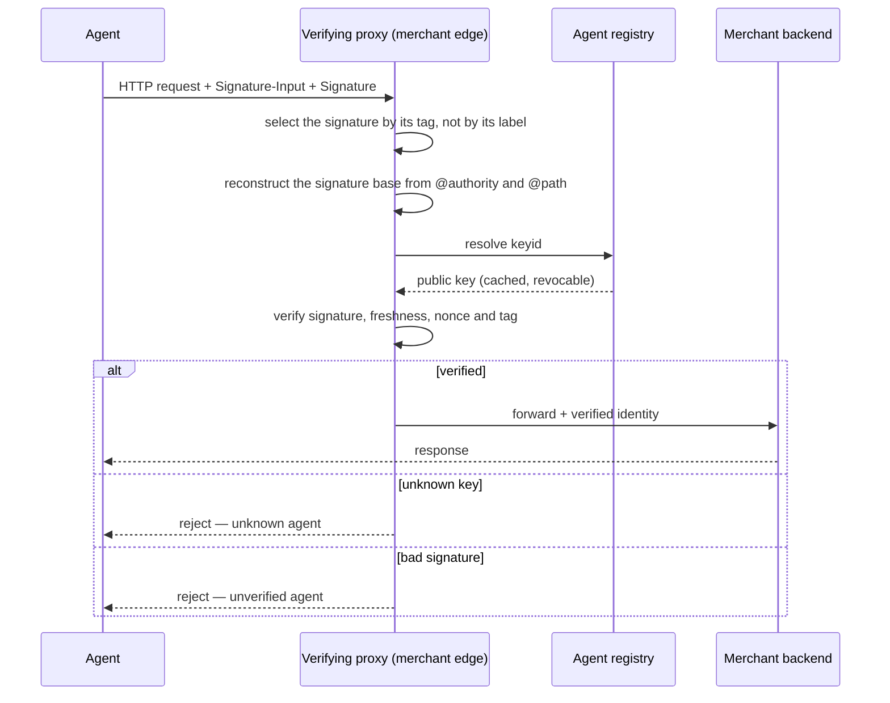
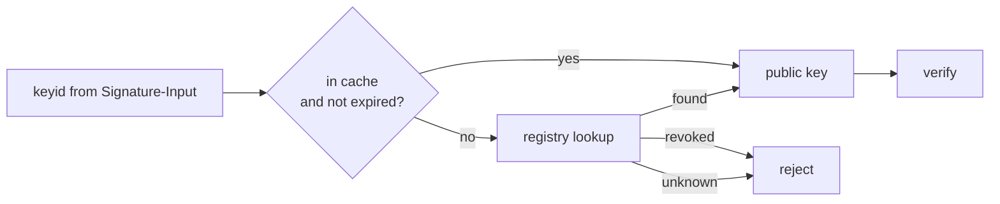
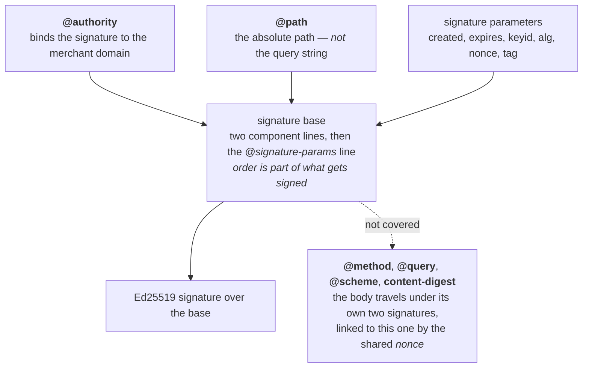

# Visa Trusted Agent Protocol (TAP)

**This document answers:** what the TAP specification says.
**It does not contain:** our implementation decisions — those live in
`../architecture/README.md`, `../architecture/adr/` and
`../specs/2026-08-13-tap-implementation-decisions.md`, and the canonical
model's own boundary is recorded in `../../contracts/README.md`.

**Every claim below is marked for how firmly it is held.** Four grades, and the
distinction is this document's whole discipline: the published Visa *Merchant
Specifications* page; RFC 9421 or RFC 8941; the sample code Visa publishes
beside the specification, which is an illustration rather than a rule; and this
project's own reading. A claim held on the last of those is not weaker, but it
is ours to defend and must never be quoted as though the specification required
it. Several claims in earlier drafts of this document moved between grades when
the specification was read against them, and each move is recorded where it
happened rather than quietly applied.

## Not a Visa-rails protocol

State this first, because it is the most common misreading. **TAP is not a
Visa-rails protocol.** Verification happens at the *merchant edge*, and the
specification names the component that performs it: it defines **Site
Protection Providers** as "a layer sitting in front of a Merchant's website"
which "are typically CDNs (Content Delivery Networks), trust management
systems, or other such proxies", and it addresses the whole document to
"Merchants and Site Protection Providers". Visa operates the production
trusted-agent directory, but a directory is not a settlement rail, and being
listed in TAP's identity layer says nothing about which rails a payment later
travels over.

**That topology is now sourced, and it was not.** Earlier drafts of this
section held the CDN-proxy-at-the-merchant-edge reading on `AGENTS.md`'s
authority, because the public capability page describes TAP's roles without
spelling the topology out in those terms. The *Merchant Specifications* page
does spell it out, in the definition quoted above, and the claim has been
promoted from this project's reading to the specification's own words.

The problem this solves is stated on the same page: merchants "(or their Site
Protection Providers) will/could confuse these Agent interactions with bots
(web crawlers, etc.) or nefarious actors", and the protocol exists so that
they can tell the two apart before the request reaches the storefront. Issue
#30 states the same architectural claim in this project's own issue tracker. It
was never an independent source — it and `AGENTS.md` trace to one in-repo
reading — and it no longer has to be one.

The specification is also explicit that it is not Visa's alone: it "defines the
framework for a generic protocol and references Visa's implementation
specifications", and "where examples are provided, we label them explicitly as
part of the Visa implementation to distinguish them from the broader Trusted
Agent Protocol". Everything about `mcp.visa.com`, the ID Token and Visa
Intelligent Commerce is labelled that way on the page itself; the framework
around it is not. **One claim from earlier drafts does not survive this.**
That "the working group behind it spans multiple processors" is nowhere on the
published material, which says nothing at all about who wrote it. The
generic-framework wording above is what carries the point instead, and it
carries it better, because it is a sentence somebody can go and read.

TAP answers a different question from the protocol in the sibling document.
`../architecture/README.md`'s three-layer model puts them on separate axes for
exactly this reason: the **Identity** layer — *"who is this agent?"* — is TAP's
question, and the **Authorization** layer — *"what did the user approve, within
what limits?"* — is AP2's. Neither is an alternative to the other; a complete
transaction in this project uses both, with TAP's verified identity travelling
alongside, not instead of, an AP2 mandate.

Primary sources, in the order of authority `AGENTS.md` gives them. Each entry
is noted against what it actually states, so that a claim held on this
project's reading is never mistaken for one this list confirms:

1. Visa, **Trusted Agent Protocol — Merchant Specifications**, reached from the
   capability page below and read on 13 August 2026. This is the normative
   source for every claim marked as the specification's. It is governed by the
   Visa Trusted Agent Protocol Product Terms, which is why this document
   paraphrases it and quotes only short fragments, and why no code from it is
   reproduced here — `AGENTS.md`'s third hard rule and `CONTRIBUTING.md` set
   out where that line falls.
2. <https://developer.visa.com/capabilities/trusted-agent-protocol> — the
   public capability page, which states TAP's roles and the traffic-blocking
   problem. It is the way in to (1) rather than a second account of it, and it
   does not on its own carry the detail the sections below depend on.
3. IETF RFC 9421 (HTTP Message Signatures) — states the signature-base
   mechanics used directly in "Signature base construction" below; fetched
   and checked against its own text for this document, not recalled from
   memory.
4. IETF RFC 8941 (Structured Field Values for HTTP) — RFC 9421 defines
   `Signature-Input` and `Signature` by reference to it, and two of the
   defects recorded in "Where the published material and RFC 9421 disagree"
   are RFC 8941 parse failures rather than signature failures. Also fetched
   and checked.
5. The **"Sample Code to Create Signature Base"** published on (1). Listed
   separately from (1) on purpose: it is an illustration, it is not normative,
   and it disagrees with (3). A claim marked as the sample's is a claim about
   what Visa's demonstration does, not about what TAP requires.

## The handshake

An agent's HTTP request carries `Signature-Input` and `Signature` headers. The
verifying proxy sitting at the merchant edge reconstructs the signature base
from the request, resolves the signer's key from the registry, and only then
decides whether the request reaches the merchant backend at all.

The two rejection branches are deliberately not one branch. An **unknown
agent** — a `keyid` the registry has never heard of — and an **unverified
agent** — a `keyid` the registry knows, but whose signature does not check out
— are different findings, and a proxy that collapses them into a single
generic rejection throws away a distinction a caller, or a dispute, might need
later.

**The proxy is not the only party the specification allows to verify, and an
earlier draft of this section said it was.** The published material puts it the
other way round: the validation processes "can be performed independently by
the Merchant or by a Site Protection Provider on behalf of the Merchant" —
either, and it does not say only one. This project chose the proxy alone, so
that every path into the merchant has already been through the same check and
there is no second implementation to keep in step with the first.
`../specs/2026-08-13-tap-implementation-decisions.md` records that as decision
2, together with what it costs: the agent has to sign even the requests AP2 key
resolution makes, because there is no allow-list to exempt them. It is a good
decision. It is ours, and quoting it as TAP's would be wrong.

## Registry resolution

Being listed in Visa's production trusted-agent directory requires a
commercial relationship. TAP's own reference implementation ships a local
registry instead — issue #26 names this as the single reason a TAP milestone
is feasible without a Visa account or any cost at all — and a `keyid` resolves
against whichever registry the verifying proxy is configured to trust, local
or otherwise; the protocol itself does not care which.

The federated-directory point is better sourced than an earlier draft of this
section claimed. It attributed the future federated model to issue #26, as this
project's reading. The specification states the goal itself: of the well-known
key location it says "For Visa's implementation, Visa will host a well-known
URL. **The goal would be to have a shared approach across Payment Schemes.**"
Visa's operational role in running the production registry is therefore not
presented as permanent even by Visa, and a single hard-coded registry endpoint
would be a narrower reading of the protocol than the protocol itself takes.

### What is actually at the live directory

**Measured on 13 August 2026**, and dated because it is a snapshot of a running
service rather than a property of the protocol. `https://mcp.visa.com/.well-known/jwks`
— the location the specification names — returns exactly one key. It is a
2048-bit RSA key whose `kid` is a UUID, and it carries neither `use` nor `alg`,
both of which the specification's own response table lists as fields the
service returns. The response has `Cache-Control: public, max-age=3600` and no
`ETag`. `GET /keys`, the operation the specification documents with a `keyID`
parameter, answers `302` to the Visa Intelligent Commerce marketing page.

**There is no Ed25519 key there at all**, and the specification's own examples
sign with Ed25519. So there is nothing at the published directory that an
agent's message signature could be verified against. That is why `cmd/registry`
exists as a local registry, and the reason is stronger than the one issue #26
gives: not that a local registry avoids needing a Visa account, but that there
is currently nothing else to resolve a `keyid` against.

### Revocation, and what the material gives a verifier to do it with

The trap sits in the cache branch, not the lookup branch: a cached public key
must still be revocable. Caching a `keyid`'s public key indefinitely, or
without re-checking revocation, turns a directory that can withdraw trust into
one that cannot — the whole point of a registry, rather than a bare
self-signed key, is that trust can be taken back.

**The published material provides nothing to do that with, and this is sharper
than it first looks.** There is no revocation list. The documented response
schema has six members — `kty`, `kid`, `use`, `alg`, `n` and `e` — and none of
them is `exp` or `nbf`, so a key has no way to say when it stops being valid,
even though the verification steps reach for an expired public key three times —
once to block the message outright, and twice, for the Agentic Consumer
Recognition Object and the Agentic Payment Container, to say only that the
content "may be inaccurate". There is no `ETag` on the live response and
therefore no conditional request a verifier could make cheaply enough to make
often. The only lifecycle signal that exists is the `Cache-Control: max-age` on
that response, and a staleness hint is not a statement about trust.

One qualification, because the live response carries something the documented
schema does not: an `x5c` chain. The certificate in it is issued by a "Visa
Sandbox Issuing CA", names `vic-oauth-jwe.visa.com`, is valid from 11 July 2025
to 29 September 2027, and lists two CRL distribution points — so a lifecycle
signal does exist there. It is not one to build on: it is undocumented, the
specification's response table does not mention `x5c`, and the certificate's
extended key usage is TLS Web Client Authentication rather than message
signing. A verifier relying on it would be relying on a member the
specification never promised, for a purpose the certificate does not claim.

## Signature base construction

The signature base is built from a set of **covered components**, combined
with **signature parameters**, per RFC 9421. Covered components come in two
kinds: derived components, each named with a leading `@` and computed from the
request rather than read off a header, and ordinary header fields referenced by
name. Signature parameters travel alongside the covered components as metadata
describing the signature itself, rather than content the signature is
protecting.

**TAP's required covered components are `@authority` and `@path`, and nothing
else.** The specification's "Required Message Signature Fields" table has eight
rows, and only those two are covered components; the other six — `created`,
`expires`, `keyid`, `alg`, `nonce` and `tag` — are signature parameters. Both
worked examples on the page, the browsing one and the checkout one, sign
`("@authority" "@path")` and stop there.

`@method`, `@target-uri`, `@query`, `@scheme` and `content-digest` appear
nowhere in the specification — not in the required-fields table, not in either
example, not in the sample code. **An earlier draft of this section listed the
first, second and last of those, and its diagram fed all three into the base.**
That was RFC 9421's own worked example being described as though it were TAP's
profile of it. Three things follow, and none of them should be softened:

- **The method is not signed.** A signature lifted from a `GET` verifies
  unchanged on a `POST` to the same authority and path.
- **The query string is not signed.** `@path` is "the absolute path portion of
  the target URI" — the part before the `?` — and `@target-uri` and `@query`,
  either of which would have covered the rest, are not among the covered
  components. One signature is therefore valid for that path under every query
  string it can be given.
- **The body is not signed by the message signature.** There is no
  `content-digest` in the base, so nothing the signature commits to depends on
  a single byte of the request body.

The third needs qualifying rather than repeating, because TAP does protect the
body — just not here. Its trust model has three signatures, not one: the
message signature in the header, and two object-level signatures carried in the
request body, the **Agentic Consumer Recognition Object** and the **Agentic
Payment Container**. Each of those is signed, the specification says, with the
same private key as the message signature, and each carries the same `nonce`,
which is what links it to the message signature it arrived with. So "the body
is unprotected" would be wrong; "the message signature does not cover the body"
is right, and a verifier that checks the message signature and then reads the
body without checking those two objects has verified nothing about what it
read.

The same-key claim cannot be taken at face value. The specification's object
examples reuse the header examples' `kid` while writing `"alg" : "PS256"`, where
the message signature is `alg="Ed25519"` — one key identifier under two
incompatible algorithms, which one key cannot do. Nor does it say how the
objects are canonicalised beyond "a canonical representation of all fields in
the object in the order received", which names no scheme, so two independent
implementations will not agree. Both are unresolvable from public material;
`../specs/2026-08-13-tap-implementation-decisions.md` records that #29 has to
choose rather than transcribe.

One loose end sits in the verification steps rather than in the tables. Their
prose describes the base as "a canonical representation of critical request
attributes—such as the authority, path, **signature agent**, timestamps, key
identifier, nonce, and tag". No signature agent appears in the required-fields
table, in either worked example, or in the sample code, so there is nothing to
implement from it. The specification does say its agent recognition signature
is "aligned with web-bot-auth", and web-bot-auth defines a `Signature-Agent`
header, which is the likely origin. That connection is this project's
inference twice over: the material never draws it, and the web-bot-auth draft
was not fetched and checked for this document the way RFC 9421 and RFC 8941
were.

**Order is part of what gets signed, and parameter order counts as much as
component order.** A verifier that reconstructs the base in a different order
than the signer used recomputes a different string entirely, and the signature
fails even though every individual value matched. Issue #25 names this as where
most interop failures between a TAP signer and a TAP verifier live, rather than
in the cryptography. With only two covered components there is little room to
get *their* order wrong; the six parameters are where it bites, and RFC 9421
§4.1 is explicit that the `Signature-Input` field "MUST contain the same
serialized value used in generating the signature base's `@signature-params`
value", with "list order and parameter order" preserved. The specification's own
material does not manage this — see below.

**TAP uses Ed25519** — a deterministic signature scheme. This is a direct
contrast with the sibling document: `ap2.md`'s binding section
states that the Checkout JWT must use a *non-deterministic* scheme such as
ECDSA, precisely because a deterministic signature over a low-entropy checkout
would make `checkout_hash` predictable enough for a rainbow-table attack.
Nothing analogous applies here — a TAP signature base is an authority, a path,
a timestamp pair, a key identifier, a tag and a nonce, and the nonce alone
makes it a per-request string rather than the low-entropy, replayable content a
rainbow table profits from — so Ed25519's determinism, and the smaller keys and
faster verification that come with it, is the better fit for a check a proxy
performs on every request at the merchant edge. Two protocols, two threat
models, opposite requirements on the same axis: neither choice generalises to
the other's problem.

## Freshness: the eight-minute window and the nonce

Two of the six signature parameters carry the anti-replay rule, and the
specification puts a number on it. `created` must be in the past and `expires`
in the future, both against current GMT, and **the interval between them must
not be more than eight minutes**. A message whose window is wider "should be
blocked" — the same verdict a bad signature gets — so a signer issuing a
generous hour-long signature is not being lenient, it is producing something a
conforming verifier refuses outright.

The nonce rule is stated conditionally, and reading it carefully is the point:
"If maintaining a record of all nonces received in the last 8 minutes, if the
nonce received matches a recorded nonce, the message should be blocked."
Keeping the record is not required; blocking a repeat is required of anyone who
keeps one. Eight minutes is therefore both the widest window a signature may
claim and the shortest span a seen-set has to remember, which is not a
coincidence — a verifier that remembers every nonce for the maximum lifetime of
a signature can never be shown one twice while the first is still valid.

The nonce is **signer-chosen**, not verifier-issued. That is a different
mechanism from a challenge–response nonce wearing the same field name, and it
is the difference between needing a seen-set and needing a challenge endpoint;
`../specs/2026-08-13-tap-implementation-decisions.md` records that this
repository's existing `crypto.Challenger` is the second kind and so does not
answer TAP's requirement.

## Domain and operation binding

A TAP signature binds to the merchant's domain **and** to the exact operation
being performed, and the specification supplies a mechanism for each. Domain
binding is `@authority`. Operation binding is the `tag` signature parameter,
which "will contain the value of `agent-browser-auth` or `agent-payer-auth`
based on the type of interaction" — browsing and payment, the two interactions
the whole protocol is scoped to. Both are inside the signature base, so neither
can be changed in flight without breaking the signature. A signature valid for
browsing one merchant's site is not valid for browsing a different one, let
alone for paying either of them.

`tag` is the first thing the specification has a verifier look at, before the
required-fields check and before any cryptography: if the header carries no
message signature whose tag is one of those two values, "the message has not
been signed by a trusted agent", and every later step is conditional on that
one passing.

**Select the signature by its `tag`, never by its label.** RFC 9421 §7.2.5 is
unambiguous about why: labels "are chosen only when attaching the signature
values to the message and are not accounted for during the signing process. An
intermediary is allowed to relabel an existing signature when processing the
message." It concludes that "applications should not rely on specific labels
being present, and applications should not put semantic meaning on the labels
themselves", and names the `tag` parameter as the thing to use instead. Every
example in the specification labels its signature `sig2`, which is exactly the
kind of constant that gets hard-coded; a verifier that finds its signature by
looking up the key `sig2` in the `Signature-Input` dictionary has built the
dependency the RFC forbids, and it will work perfectly right up until something
in the path relabels — which, given that TAP's own architecture puts a proxy
between the agent and the verifier, is not a remote hazard.

The trap is that domain binding and operation binding are two separate checks,
and it is easy to implement one carefully and let the other be implied rather
than enforced. Testing only same-domain-same-operation and
different-domain-different-operation misses exactly the cases that matter:
right domain, wrong operation, and right operation, wrong domain. Both cross
products have to be rejected for the binding to mean anything.

## Consumer and payment identifiers

Beyond proving which agent is speaking, TAP lets a verified agent pass the
merchant additional identifiers, in the two body-borne objects named above.
The **Agentic Consumer Recognition Object** carries an ID Token — a signed JWT,
which in Visa's implementation carries obfuscated phone number and email
claims, so a merchant has to keep its own mapping table to match one to an
account — along with a `contextualData` object holding country, postal code, IP
address and device data. Identifiers such as a loyalty number may travel there
too. The **Agentic Payment Container** is the other one, and it is where a
Payment Account Reference for a card already on file appears, in its card
metadata.

**"Consent" is not in the specification.** An earlier draft of this section
said these identifiers cross "subject to the consumer's consent". The word does
not appear anywhere on the published material — the check is a `grep` over the
page, and it returns nothing — and the phrase is understood to come from Visa's
sample README and marketing prose rather than from any normative rule, though
only the first half of that was verified for this document. What the
specification describes is mechanical, and in one place it points the other
way: it tells a merchant that "it is at the discretion of the Merchant to
determine whether the content of the object is usable even if verification is
not successful", and that the data may be used "even if the validation was not
successful". There is no consent gate anywhere in it.

Building one on top is reasonable, and it would be **this project's design** —
held on the same footing as the proxy-only decision above, with issue #29 the
place it gets decided and recorded. It must not be quoted as something TAP
supplies.

This is the one point where TAP's identity layer touches the instrument axis
of `../architecture/README.md`'s three-layer model, and it is worth being
precise about the shape of that contact: TAP carries a *reference* to an
instrument — a PAR, a loyalty number — rather than issuing a payment
credential itself. That keeps it distinct from AP2's Payment Mandate, which
authorises payment, and from the instrument layer's own token, which scopes
it; TAP only ever says which agent is asking, and which existing identifiers
that agent is presenting on the consumer's behalf.

## Where the published material and RFC 9421 disagree

This is the most useful section in the document, so it is stated precisely and
no further.

The specification publishes a **"Sample Code to Create Signature Base"** — a
short Python function — as an illustration of the string a verifier hashes. It
is not reproduced here: the material is governed by the Visa Trusted Agent
Protocol Product Terms, and `AGENTS.md`'s third hard rule keeps this
repository's implementations derived from published specifications rather than
from Visa's code. Describing what it does is enough, and there are three
things.

| What the sample builds | What RFC 9421 requires | Where |
|---|---|---|
| Component names bare, as `@authority: example.com` | The component name is an `sf-string` — "the serialization of the component name itself is encased in double quotes", so `"@authority": example.com` | §2.5 |
| The signature label inside the parameters line, as `"@signature-params": sig2=("@authority" "@path");…` | The value is the Inner List alone. "Note that this does not include the signature's label from the Signature-Input field." | §3.2 step 7, and the `signature-params-line` ABNF in §2.5 |
| `alg` absent from the base while present in the header, so the two are not the same serialised value — once `alg` is removed, the sample's base and both Sample Request headers agree exactly | The `Signature-Input` value "MUST contain the same serialized value used in generating the signature base's `@signature-params` value", with "list order and parameter order … preserved" | §4.1 |

Only the two component lines are affected by the first row; the
`"@signature-params"` line in the sample *is* correctly quoted, which is part of
what makes the mistake easy to read past.

**Visa ships both sides of that sample**, so the demonstration is internally
consistent. A signer built from that code and a verifier built from that code
agree with each other, and the example signatures on the page verify between
them. The consequence is the part that matters: an implementation that follows
RFC 9421 and an implementation that follows the sample compute different bases
from the same request, and therefore do not interoperate. The failure surfaces
as a bad signature, which is the least informative thing it could possibly look
like — nothing in it points at canonicalisation.

**This project implements RFC 9421 and documents the divergence rather than
reproducing it.** `../specs/2026-08-13-tap-implementation-decisions.md` records
that as decision 4. Reproducing the sample's base to interoperate with real TAP
traffic buys nothing, because the live directory holds no agent key and so
there is no traffic to interoperate with; and accepting both behind a flag is
exactly what RFC 9421 §7.5.5 opens by warning against, since "any ambiguity in
the generation of the signature base could provide an attacker with leverage to
substitute or break a signature on a message". That leaves being correct and
saying so, which is the same shape as `ap2.md`'s two mandates rather than
three: the published material most implementers will copy is wrong, and saying
exactly how is the useful thing.

Two smaller divergences sit beside those, and both are in the specification
proper rather than in the sample.

**The algorithm name is capitalised.** The specification writes
`alg="Ed25519"`. The name registered in RFC 9421's "HTTP Signature Algorithms"
registry is lower-case `ed25519`. Structured-field strings are compared as
written, so a verifier that resolves the algorithm by looking the parameter up
in the registry — step 6.4 of §3.2's verification algorithm — finds nothing
there, and step 6.1 makes an algorithm outside the allowable set a validation
failure rather than something to shrug at.

**The first header example does not parse at all.** It spells `keyId` with a
capital I, where every later example on the same page writes `keyid`, and it
puts a space after `nonce=`. `Signature-Input` is an RFC 8941 Dictionary, and
both of those are fatal to it rather than cosmetic. Parameter keys are drawn
from `lcalpha`, which is `a`–`z`; RFC 8941 says outright that "parameter keys
cannot contain uppercase letters", and its parsing algorithm stops the key at
the `I`, leaves `Id="…"` sitting where a comma or the end of input has to be,
and fails. The space fails one step earlier: the parser consumes the `=` and
then parses a bare item, and no bare item begins with a space. Neither
error degrades gracefully — a structured field either parses or it does not, so
a conforming verifier reading the specification's first example gets no
signature to check rather than a signature that fails to check.

## Traps, collected

Every one of these is stated in full above. The list is here because it is the
part worth re-reading before writing code.

| Trap | Where |
|---|---|
| TAP is not a Visa-rails protocol; verification happens at the merchant edge | Not a Visa-rails protocol |
| The merchant may verify for itself — proxy-only is this project's decision, not TAP's rule | The handshake |
| An unknown `keyid` and a bad signature are different rejections, not one | The handshake |
| A cached public key must still be revocable — never cache indefinitely | Registry resolution |
| The published material supplies nothing to revoke with: no revocation list, no `exp`/`nbf`, no `ETag` | Registry resolution |
| The live directory holds one RSA key and no Ed25519 key, so it can verify no agent signature | Registry resolution |
| TAP covers `@authority` and `@path` only — the method, the query string and the body are not signed | Signature base construction |
| The body is protected by two separate object signatures, linked to the message signature by a shared `nonce` — but their canonicalisation is unspecified and their `alg` contradicts the message signature's | Signature base construction |
| Signature base reconstruction must match the signer's component *and* parameter ordering exactly | Signature base construction |
| TAP uses Ed25519; AP2 forbids a deterministic scheme for the Checkout JWT — opposite requirements, different threat models | Signature base construction |
| `created` and `expires` must be no more than eight minutes apart, or the message is blocked | Freshness: the eight-minute window and the nonce |
| Operation binding travels in `tag` — `agent-browser-auth` or `agent-payer-auth` | Domain and operation binding |
| Select a signature by its `tag`, never by its label; an intermediary may relabel it | Domain and operation binding |
| Domain binding and operation binding are both required; test the cross products | Domain and operation binding |
| "Consent" appears nowhere in the specification; a consent gate would be this project's design | Consumer and payment identifiers |
| TAP carries a reference to an instrument, not a credential for one | Consumer and payment identifiers |
| Visa's published sample builds a signature base RFC 9421 rejects, three ways over | Where the published material and RFC 9421 disagree |
| `alg="Ed25519"` is not the registered name — RFC 9421 registers `ed25519` | Where the published material and RFC 9421 disagree |
| The specification's first header example does not parse as an RFC 8941 field at all — do not copy it | Where the published material and RFC 9421 disagree |
