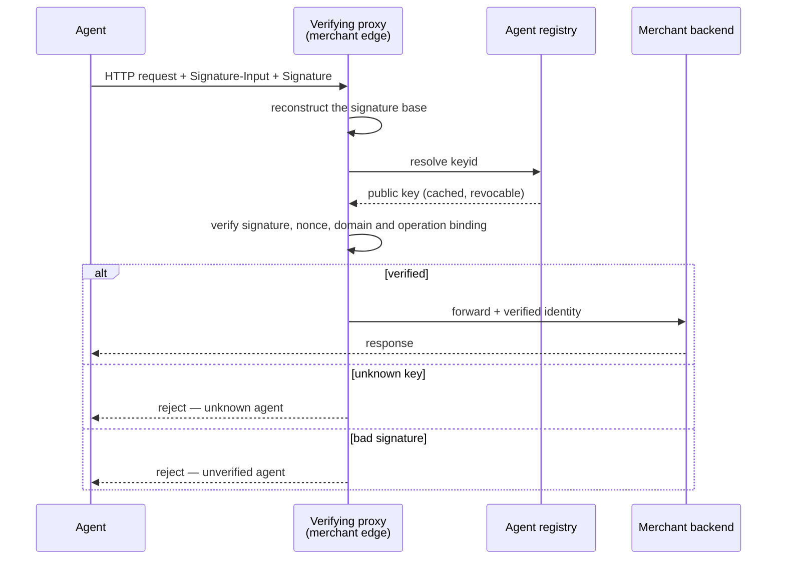
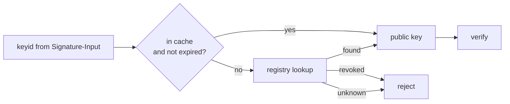
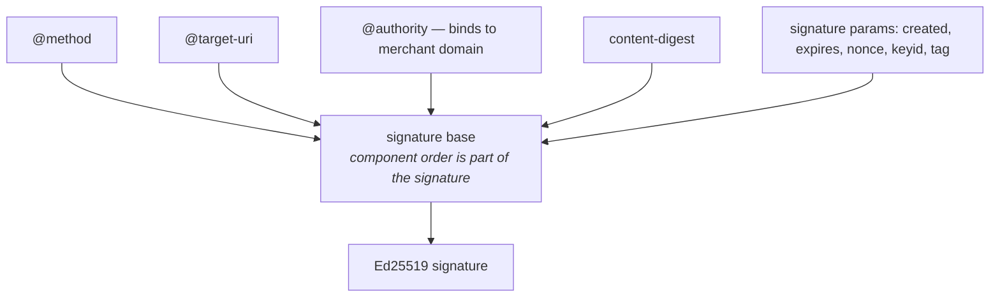

# Visa Trusted Agent Protocol (TAP)

**This document answers:** what the TAP specification says.
**It does not contain:** our implementation decisions — those live in
`../architecture/README.md` and `../architecture/adr/`, and the canonical
model's own boundary is recorded in `../../contracts/README.md`.

## Not a Visa-rails protocol

State this first, because it is the most common misreading. **TAP is not a
Visa-rails protocol.** Verification happens at the *merchant edge*: Visa's own
reference architecture places a verifying proxy — a CDN layer — in front of the
merchant, rather than anywhere inside a payment network. Visa operates the
production trusted-agent directory, but a directory is not a settlement rail,
and being listed in TAP's identity layer says nothing about which rails a
payment later travels over.

The problem this solves is concrete: merchants' existing bot-mitigation layers
have historically treated automated traffic as hostile and blocked it, which
also blocks the legitimate commerce agents this project exists to support. TAP
gives a merchant's edge a way to tell the two apart before the request ever
reaches the storefront. Issue #30 records the same reasoning independently of
this document: TAP verification happens at the merchant edge, not inside
Visa's rails, precisely because that is where the specification's own
reference architecture places it.

This is why AGENTS.md states the correction as a standing warning rather than a
one-off footnote, and why the tracking issue for this document (#33) records it
as a correction to carry forward from earlier drafts of the project's own
article series, which had described TAP as integrated with Visa's payment
infrastructure. It is not: the specification is open for any merchant, proxy
operator or registry to implement, and the working group behind it spans
multiple processors, not one.

TAP answers a different question from the protocol in the sibling document.
`../architecture/README.md`'s three-layer model puts them on separate axes for
exactly this reason: the **Identity** layer — *"who is this agent?"* — is TAP's
question, and the **Authorization** layer — *"what did the user approve, within
what limits?"* — is AP2's. Neither is an alternative to the other; a complete
transaction in this project uses both, with TAP's verified identity travelling
alongside, not instead of, an AP2 mandate.

Primary sources, in the order of authority `AGENTS.md` gives them:

1. <https://developer.visa.com/capabilities/trusted-agent-protocol>
2. IETF RFC 9421 (HTTP Message Signatures)

## The handshake

An agent's HTTP request carries `Signature-Input` and `Signature` headers. The
verifying proxy sitting at the merchant edge reconstructs the signature base
from the request, resolves the signer's key from the registry, and only then
decides whether the request reaches the merchant backend at all.

The two rejection branches are deliberately not one branch. An **unknown
agent** — a `keyid` the registry has never heard of — and an **unverified
agent** — a `keyid` the registry knows, but whose signature does not check out
— are different findings, and a proxy that collapses them into a single
generic rejection throws away a distinction a caller, or a dispute, might need
later. The merchant backend itself never verifies a signature — that is the
proxy's job alone, so that every path into the merchant has already been
through the same check.

## Registry resolution

Being listed in Visa's production trusted-agent directory requires a
commercial relationship. TAP's own reference implementation ships a local
registry instead — issue #26 names this as the single reason a TAP milestone
is feasible without a Visa account or any cost at all — and a `keyid` resolves
against whichever registry the verifying proxy is configured to trust, local
or otherwise; the protocol itself does not care which.

The trap sits in the cache branch, not the lookup branch: a cached public key
must still be revocable. Caching a `keyid`'s public key indefinitely, or
without re-checking revocation, turns a directory that can withdraw trust into
one that cannot — the whole point of a registry, rather than a bare
self-signed key, is that trust can be taken back. The specification also
contemplates a future federated directory model, so that Visa's operational
role in running the production registry does not become a permanent,
unremovable control point; a single hard-coded registry endpoint is a
narrower reading of the protocol than the protocol itself takes.

## Signature base construction

The signature base is built from a set of **covered components**, combined
with **signature parameters**, per RFC 9421. Covered components come in two
kinds: derived components, each named with a leading `@` and computed from the
request rather than read off a header — `@method`, `@target-uri` and
`@authority` among them — and ordinary header fields referenced by name, such
as `content-digest` (itself defined by a separate specification, RFC 9530, not
by RFC 9421). Signature parameters — `created`, `expires`, `nonce`, `keyid` and
`tag` — travel alongside the covered components as metadata describing the
signature itself, rather than content the signature is protecting.

**The component order is not incidental — it is part of what gets signed.** A
verifier that reconstructs the signature base in a different order than the
signer used will recompute a different signature base entirely, and the
signature will fail to verify even though every individual component matched.
Issue #25 names this as the trap where most interop failures between a TAP
signer and a TAP verifier live, not in the cryptography.

**TAP uses Ed25519** — a deterministic signature scheme. This is a direct
contrast with the sibling document: `ap2.md`'s binding section
states that the Checkout JWT must use a *non-deterministic* scheme such as
ECDSA, precisely because a deterministic signature over a low-entropy checkout
would make `checkout_hash` predictable enough for a rainbow-table attack.
Nothing analogous applies here — a TAP signature base is a per-request
combination of method, URI, digest, a timestamp and a nonce, which is not the
kind of low-entropy, replayable content a rainbow table profits from — so
Ed25519's determinism, and the smaller keys and faster verification that come
with it, is the better fit for a check a proxy performs on every request at
the merchant edge. Two protocols, two threat models, opposite requirements on
the same axis: neither choice generalises to the other's problem.

## Domain and operation binding

A TAP signature binds to the merchant's domain **and** to the exact operation
being performed — issue #28 records the specification's own framing: the
signature distinguishes a **browsing** intent from a **payment** intent, and a
signature valid for one is not valid for the other. The same separation
applies across merchants: a signature valid for browsing one merchant's site
is not valid for browsing a different one, let alone for paying either of
them.

The trap is that domain binding and operation binding are two separate checks,
and it is easy to implement one carefully and let the other be implied rather
than enforced. Testing only same-domain-same-operation and
different-domain-different-operation misses exactly the cases that matter:
right domain, wrong operation, and right operation, wrong domain. Both cross
products have to be rejected for the binding to mean anything.

## Consumer and payment identifiers

Beyond proving which agent is speaking, TAP allows a verified agent to pass
the merchant additional identifiers, subject to the consumer's consent.
Issue #29 records the specification's own wording for what may cross:
verifiable consumer identifiers, Payment Account References for cards already
on file, and identifiers such as loyalty numbers, email or phone, so that a
merchant can pre-fill or streamline a checkout it already trusts the agent to
be presenting.

This is the one point where TAP's identity layer touches the instrument axis
of `../architecture/README.md`'s three-layer model, and it is worth being
precise about the shape of that contact: TAP carries a *reference* to an
instrument — a PAR, a loyalty number — rather than issuing a payment
credential itself. That keeps it distinct from AP2's Payment Mandate, which
authorises payment, and from the instrument layer's own token, which scopes
it; TAP only ever says which agent is asking, and optionally, which existing
identifiers that agent is allowed to present on the consumer's behalf.

## Traps, collected

Every one of these is stated in full above. The list is here because it is the
part worth re-reading before writing code.

| Trap | Where |
|---|---|
| TAP is not a Visa-rails protocol; verification happens at the merchant edge | Not a Visa-rails protocol |
| An unknown `keyid` and a bad signature are different rejections, not one | The handshake |
| A cached public key must still be revocable — never cache indefinitely | Registry resolution |
| Signature base reconstruction must match the signer's component ordering exactly | Signature base construction |
| TAP uses Ed25519; AP2 forbids a deterministic scheme for the Checkout JWT — opposite requirements, different threat models | Signature base construction |
| Domain binding and operation binding are both required; test the cross products | Domain and operation binding |
| TAP carries a reference to an instrument, not a credential for one | Consumer and payment identifiers |
