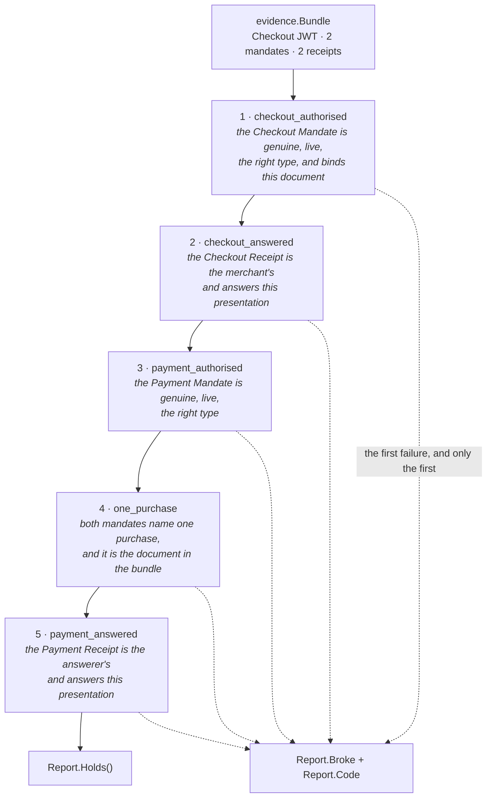

# Dispute evidence assembly and verification

**Date:** 2026-08-07
**Status:** approved
**Issue:** #18

## Why this exists

A Checkout Mandate, its receipt, a Payment Mandate and its receipt together form
a non-repudiable picture of one transaction. That sentence is the commercial
argument for AP2 — it is the direct answer to *"why would a PSP care"* — and it
is worth nothing until something reads the four artefacts back and says whether
they hold.

This is that something. `evidence.Bundle` is the four artefacts plus the document
they are about; `ap2.Dispute` is what an arbiter brings to them; `evidence.Report`
is what came back, link by link.

**What a holding chain says is that all four artefacts are about one document.**
Not "one transaction" — the chain is narrower than the sentence this section
opens with, and the difference is stated here rather than left implied, because
every other limit below is a variation on it. Two Checkout/Payment Mandate pairs
issued over the same merchant offer pair across each other perfectly, since the
digest is identical in all four; `TestTwoPairsOverOneOfferCrossVerify` is that
case. Which purchase four artefacts name is the fact a dispute turns on, and it
is not the whole of what "one transaction" would claim.

Every conclusion is recomputed from the tokens at the moment of the dispute.
Nothing here trusts a value because an earlier verifier already checked it, and
nothing here reads the event log — that is [ADR
0003](../architecture/adr/0003-correlation-and-event-log.md)'s rule and
`depguard`'s `collector-containment` makes it a property rather than a promise.

## The five links

| Link | Establishes | Reuses |
|---|---|---|
| `StepCheckoutAuthorised` | the Checkout Mandate is genuine, live, of the right type, and binds the document in the bundle | `CheckoutVerifier.VerifyCheckout` — `MerchantRules` |
| `StepCheckoutAnswered` | the Checkout Receipt is the merchant's, is labelled as a Checkout Receipt, and answers *this presentation* | `VerifyReceipt` + `AnswersMandate` |
| `StepPaymentAuthorised` | the Payment Mandate is genuine, live, of the right type | `PaymentVerifier.VerifyPayment` — `CredentialProviderRules` |
| `StepOnePurchase` | both mandates name one purchase, and that purchase is the document in the bundle | `BindingOf`, `Binding.Same`, `Binding.Covers` |
| `StepPaymentAnswered` | the Payment Receipt is the answerer's, is labelled as a Payment Receipt, and answers *this presentation* | `VerifyReceipt` + `AnswersMandate` |

## Reconciling the issue's five steps with the code

The issue's list is not wrong, but two of its steps do not survive contact with
what the packages actually expose. Both differences are recorded here rather
than quietly implemented.

| Issue's step | What the code makes it |
|---|---|
| 1. Verify the Checkout Mandate under the Merchant rules | link 1, unchanged |
| 2. Independently recompute the hash of `checkout_jwt` | **folded into link 1** on the checkout side; it reappears as the independent anchor inside link 4, on the payment side |
| 3. Confirm the Checkout Receipt `reference` matches, computed as `sd_hash` would be | link 2 |
| 4. Verify the Payment Mandate under the MPP rules using `checkout_hash` | links 3 and 4, and **under the Credential Provider's rules** |
| 5. Confirm the Payment Receipt reference matches | link 5 |

**Why step 2 is not a link of its own.** `MerchantRules.VerifyCheckout` passes the
merchant's document as `opts.Checkout`, and `ap2.VerifyCheckout` always ends in
`verifyBinding(alg, m.CheckoutHash, checkout)`. Tampering with `Bundle.Checkout`
therefore fails at link 1 with `checkout_hash_mismatch`, so a separate "recompute
the hash" link after it could never be the first to refuse — and a link that can
never fail first is not one anybody can test, which is the property the issue's
third box asks for.

**That argument is about the rule set, not about the chain**, and the two are
worth keeping apart because this document relies on the distinction two
paragraphs further down. `CheckoutMandates` is an interface — verification is
delegable, which is the point of a rule set being a value a role can be handed —
and against a delegate that checks the mandate against whatever document the
mandate itself discloses, a separate link 2 *would* be first to fail.
`laxCheckoutVerifier` in `dispute_test.go` is exactly that delegate, and this
branch ships it. So the decision stands on "under every rule set this repository
ships in production, that link is unreachable-as-first", and what catches the
delegate is link 4's anchor, below — a check with other work to do rather than a
link nobody could reach.

Where the independent recompute genuinely lives is the **payment** side. A closed
Payment Mandate never carries the document it binds to, so nothing in links 1–3
has ever compared it to one. `Binding.Covers(checkoutJWT)` inside link 4 is the
first and only time the Payment Mandate's digest meets the merchant's bytes.

The anchor is not redundant with link 1 even though `MerchantRules`' own binding
check makes it arithmetically implied there. `CheckoutMandates` is an interface,
so a delegate may check the mandate against whatever document the mandate itself
discloses — and without the anchor, two mandates agreeing on a digest of a
*different* checkout would carry the whole chain.

Link 4 has a second arm, reachable without anybody misbehaving. `checkout_hash`
is computed under whatever `_sd_alg` names, and `pkg/sdjwt` writes that claim
only for a payload carrying digests — so a Checkout Mandate issued with a
sha-384 blinder, which always blinds `checkout_jwt`, and a Payment Mandate that
blinds nothing and defaults to sha-256 hold two digests of one document under two
algorithms. Comparing those answers nothing, so `Binding.Same` refuses them as
`ErrBindingUnverifiable` and both are recomputed against the document instead.
Refusing the pair as a mismatch would report fraud because somebody chose
sha-384.

**Which links are first-reachable under production wiring, stated plainly.**
Links 1, 2, 3, 5 and the *payment* half of link 4's anchor all refuse first for
some bundle against an arbiter holding `MerchantRules` and
`CredentialProviderRules`. The *checkout* half of the anchor — `checkout.Covers`
inside the `ErrBindingUnverifiable` arm — does not: under every `CheckoutVerifier`
this repository ships, link 1 has already established that same equality, and the
two tests that reach it get there through `laxCheckoutVerifier`. It is kept
because a delegate is permitted and the anchor is what a delegate's shortcuts
must not be able to carry, and it is proved by deletion rather than by coverage,
which is the only honest way to hold a guard whose first-reachability depends on
who is verifying.

**Why step 4 is the Credential Provider's rules.** `MPPRules` has exactly one
method, `VerifyCredential(credential, checkoutHash)`. It takes a
`generated.PaymentCredential`, not a mandate, and never touches an SD-JWT. The
rule set that verifies a Payment Mandate is `CredentialProviderRules.VerifyPayment`,
and `mpp.Service` proves the point: it holds a `Payments ap2.PaymentVerifier`
field, which the role tests populate with `ap2.CredentialProviderRules`. So the
issue is right about *who re-verifies* — the processor does, deliberately — and
wrong about *which rule set*.

*"Using `checkout_hash`"* cannot be a parameter to that call either.
`PaymentOptions` has no `Checkout` field on purpose, and `payment.go` spends a
paragraph on why folding the binding into `VerifyPayment` is the one thing it
must not do. The binding is `BindingOf` plus `Covers`/`Same`, a separate visible
call, which is link 4.

The credential itself is **not** in the bundle, so `MPPRules.VerifyCredential` is
out of scope for the chain — and it does not need to be in it, because the
processor's verdict on the credential is already there as the Payment Receipt's
`result` and `error`.

## What the chain establishes, and what it does not

### It does not establish that the two mandates agree on the price

`StepOnePurchase` proves both mandates are about **one purchase** — the same
document. It does **not** prove they agree on what it costs.

Nothing in this implementation compares a Payment Mandate's `payment_amount`
against what the checkout it is bound to actually costs. The binding is by digest
and by digest alone; the checkout is opaque by construction, because the mandate
hashes the merchant's compact serialisation as a string and nothing reads inside
it. A Payment Mandate authorising 1 USD, bound to a checkout priced at 189 USD,
passes every link here.

That is conformant. AP2 defines `transaction_id` only as the base64url hash of
`checkout_jwt`, requires no verifier to compare the amount, and assigns the check
to no role. **Issue #88** records the finding in full, including that the merchant
is the only party positioned to make the comparison and is not making it. The
decision whether to diverge from the specification belongs there, not here, and
this issue deliberately does not add the check.

A dispute report that holds is evidence about *which document* four artefacts are
about. A reader who takes it for more than that has been misled, so
`StepOnePurchase`'s own doc comment and `Dispute.VerifySamePurchase`'s both say
so where a reader will meet them.

### It does not verify the merchant's signature over the Checkout JWT

There is no sixth link. `checkoutType = "ap2-checkout+jwt"` is unexported in
`internal/roles/merchant` — the offer's format belongs to the merchant, not to
this adapter, which treats the document as opaque bytes.

**So a holding chain asserts nothing about where `Bundle.Checkout` came from.**
That is the cost of the decision and it is worth stating without softening: a
bundle whose `Checkout` is the literal string `"this is not a JWT at all, nobody
signed it"`, with both mandates bound to it and both receipts genuine, verifies
link for link. `TestAHoldingChainSaysNothingAboutWhoIssuedTheOffer` is that
bundle.

An earlier draft of this section argued that a `success` Checkout Receipt is
already the merchant's signature over having accepted the offer. That is an
inference about one implementation rather than a link in the chain, and it does
not cover the case this change is proudest of — a chain over a **rejection**
Checkout Receipt also holds, and a rejection receipt being a valid link is the
headline property here.

Where provenance is actually closed is the role: `merchant.Service.settle` runs
`ownOffer` before it will issue *any* receipt, success or rejection, and answers
Problem Details with no receipt when it fails. So a receipt from that merchant
does imply the offer was its own. The arbiter cannot see that, and a delegate
need not have done it — which is why the property belongs in this section as a
limit rather than in the chain as a link.

### It covers Human Present bundles only

Under Human Not Present a closed mandate is a Key Binding JWT inside a
`~~`-joined `sdjwt.Chain`, verified through `MerchantRules.AuthoriseCheckoutChain`
and `CredentialProviderRules.AuthorisePaymentChain` rather than through
`VerifyCheckout` and `VerifyPayment`. Those two entry points landed with #12 and
work; this chain does not call them.

The reason is concrete rather than a matter of scope-drawing: **no Human Not
Present purchase exists to assemble a bundle from.** `internal/agent/purchase.go`
is the Human Present flow, and the autonomous loop that would produce an HNP
bundle is **#15**'s.

`Bundle`'s fields are `string` precisely so that this arrives as an addition. A
chain and a presentation are both compact serialisations, so the HNP variant is a
discrimination inside `Dispute.Verify` when there is a caller for it — not a
change to the type and not a second bundle. A chain path written now would be
speculative, and #90's `Chain.Root()` was deleted for exactly that.

## The decisions worth arguing with

### The arbiter brings the keys; the token never chooses one

A receipt carries `iss`, and resolving a key from it would let the party being
judged pick the key it is judged against — the same shape as the
algorithm-confusion bug `joseVerifier` is built to make unexpressible. So
`Dispute` holds two `authz.Verifier`s as named fields, one per answering party,
and nothing in `dispute.go` reads a key reference out of an artefact.

Two fields rather than one, because the two receipts are signed by two different
parties. The tamper matrix has a row for each direction of that confusion, and
both are refused at the signature.

### A rejection receipt is a valid link

The chain must hold when the merchant or the processor refused; the bundle then
*proves the refusal*. Requiring `result: success` would make the evidence unable
to represent the outcome it exists for, and would report the one artefact that
answers the question as a broken link.

This is the single most important property in the change and the one an
implementation is most likely to get backwards.
`TestARefusedPurchaseIsStillDisputable` runs it against the real four roles: the
processor refuses a credential scoped elsewhere, and the chain over the result
holds.

### The chain reports the earliest broken link

A receipt's `reference` is `sd_hash`, a digest over the whole presentation it
answers, so tampering with an artefact cascades to every downstream link that
references it. Reporting anything but the first failure would blame the merchant
for a mandate the agent forged.

`TestTheFirstBrokenLinkIsTheOneReported` proves the cascade rather than asserting
it: it substitutes an impostor-signed Checkout Mandate, shows the chain names
link 1, and then shows that link 2 refuses *as well* — which is what makes
reporting the first failure load-bearing rather than arbitrary.

### `Report` is returned without a second `error`

A broken chain is `Verify`'s answer, not its failure to answer. Every field of
the report is populated for a bundle that does not hold — `Held` names what was
established, `CheckoutReceipt` survives if link 2 got that far — and a caller
that dropped the report on a non-nil error would throw away the finding it asked
for. `Report.Holds()` reads the same fact a second return value would.

### `Bundle` is hand-written Go rather than a `contracts/` schema

`contracts/README.md`: *"That cross-language duplication is the reason the schemas
exist"*. There is no TypeScript copy of a dispute bundle, so a schema would be
generation for its own sake — and `Report` carries an `error`, so it could not be
generated at all, leaving half the vocabulary in each place.

**The trigger for moving it:** the frontend rendering a dispute. At that point
there are two languages holding the same shape, which is exactly what the
schemas are for.

The step *names* are already conformance surface even so, and they are published:
`backend/internal/adapters/ap2/testdata/dispute.json` carries them by ordinal as
well as by spelling, alongside a table of tampered bundle → (link, code).

### `StepNone` is not a sixth link

Two answers leave `Broke` at `StepNone`: a bundle missing artefacts, and an
arbiter missing keys or rules. Neither makes a statement about any artefact —
nobody has been shown to have done anything wrong — and a reader that took
`StepNone` for "the first link failed" would record a finding against a
counterparty nobody looked at. `Held` is empty in both cases.

`Bundle.Validate` reports every gap at once rather than the first, for the reason
`Dispute.usable` does the same: the reader is fixing their own storage or their
own wiring, and one name per attempt is one attempt per name.

### The bundle's Payment Receipt is the processor's

Two parties answer the Payment Mandate in the Human Present flow — the Credential
Provider when it funds the purchase, and the Merchant Payment Processor when it
is asked to move the money. Both receipts are genuine answers to the same
presentation.

A bundle carries one, because the arbiter brings one key to check it with, so
which one is a choice. `Purchase.Evidence` takes the processor's: it is the answer
that says whether money moved, which is the question a dispute is opened about. A
purchase that never reached the processor has no complete bundle, and
`Bundle.Validate` says so rather than quietly substituting the Credential
Provider's answer to a different question.

**And it is each party's *latest* answer, not its first.** `Client.Settle` is
exported and the four steps are documented as separately usable, so a retry needs
no misuse to reach: settle a purchase whose credential the processor refuses,
settle it again with a good one, and the trail is `[credprovider, merchant, mpp,
merchant, mpp]` with the money moved. A bundle built from the first answer would
be five links that all verify over the processor's signed statement that the
payment did not go through — every artefact in it genuine, so nothing in the
chain could catch it. The invariant is that the bundle describes the purchase as
of its last attempt, which is the same thing `Purchase.Settled` describes, and
the two cannot disagree.

`keep` still appends and never replaces. `Purchase.Receipts` is the evidence
trail, and an agent able to delete a signed refusal by retrying would be deleting
the fact AP2 makes the rejection receipt mandatory to produce — so the trail
keeps every answer and only the assembly picks.
`TestARetriedPurchaseIsDisputedOnItsLatestAnswer` pins both halves.

## The error codes

Every refusal is reported in `contracts/evidence/error_code.json`'s vocabulary, so
a dispute's verdict is nameable in the same terms as the receipts inside it.

`evidence.ErrIncomplete` is in `ap2`'s `adapterCodes` table, mapped to
`request_malformed`. It is the domain's error rather than the adapter's, and it is
in the adapter's table because `Dispute.Verify` is what hands it back: left
unmapped, `CodeOf` would answer `verifier_unavailable` and blame the arbiter for
a gap in what it was handed.

## Conformance

`TestGoldenABrokenChainNamesTheSameLink` reads
`backend/internal/adapters/ap2/testdata/dispute.json` and drives the published
tampers through `Verify`.

Two implementations shown the same broken bundle have to name the same link and
the same reason, or one dispute reaches two verdicts depending on whose code
heard it. Neither value is ours to choose: the link names come from
`internal/core/evidence` and the codes from `contracts/evidence/error_code.json`.

**The published set is narrower than the tamper matrix, on purpose.** A vector
says: apply this tamper to the *bundle*, and the first link to refuse must be
this one. Two rows in the matrix also swap the arbiter's `CheckoutVerifier` for
`laxCheckoutVerifier` in order to reach link 4 at all — under `MerchantRules`,
which is what `cmd/merchant` and every production wiring hold, the same bundles
refuse at `checkout_authorised`. Publishing those would judge a correct
implementation non-conformant for being right, so the `tamperCase.delegated` flag
keeps them out of the file while leaving them as ordinary tests of the anchor.
The golden test asserts the published set is exactly the undelegated rows, in
both directions, so neither list can drift.

It lives in `dispute_test.go` rather than `golden_test.go` because `make vectors`
selects by test *name* — `-run 'TestGolden'` over `internal/adapters/...` and
`pkg/...` — so a golden test is in the suite wherever it sits, as long as it is
named like one.

## What is not wired up

Nothing under `backend/cmd/` stands an arbiter up, and no role handler exposes a
dispute endpoint. The chain is a library, exercised by
`internal/adapters/ap2/dispute_test.go` and by three tests in
`internal/agent/purchase_test.go` that assemble a bundle from a real purchase —
two of them completed and refused, which the chain then verifies, and one
abandoned partway, which `Bundle.Validate` reports as incomplete.

That is worth saying rather than leaving a reader to discover it. An endpoint
would be a state-changing operation only if it stored the dispute — verification
itself changes nothing, and reads five strings — so whoever adds one needs an
idempotency key for the storage and not for the verdict.
