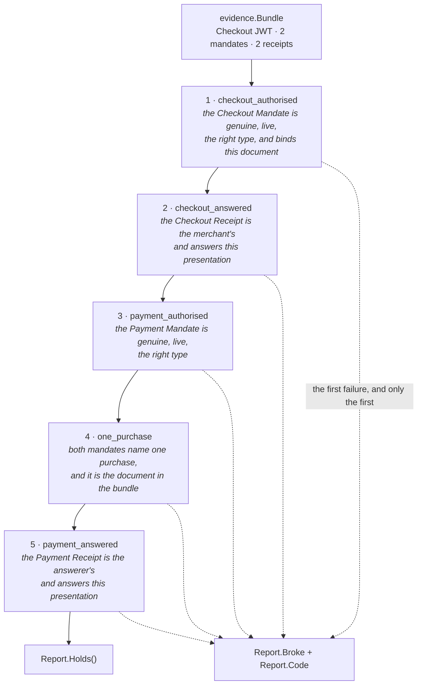

# Dispute evidence assembly and verification

**Date:** 2026-08-07
**Status:** approved
**Issues:** #18, and #110 for the Human Not Present half

## Why this exists

A Checkout Mandate, its receipt, a Payment Mandate and its receipt together form
a non-repudiable picture of one transaction. That sentence is the commercial
argument for AP2 — it is the direct answer to *"why would a PSP care"* — and it
is worth nothing until something reads the four artefacts back and says whether
they hold.

This is that something. `evidence.Bundle` is the four artefacts plus the document
they are about; `ap2.Dispute` is what an arbiter brings to them; `evidence.Report`
is what came back, link by link.

**What a holding chain says is that all four artefacts are about one document.**
Not "one transaction" — the chain is narrower than the sentence this section
opens with, and the difference is stated here rather than left implied, because
every other limit below is a variation on it. Two Checkout/Payment Mandate pairs
issued over the same merchant offer pair across each other perfectly, since the
digest is identical in all four; `TestTwoPairsOverOneOfferCrossVerify` is that
case. Which purchase four artefacts name is the fact a dispute turns on, and it
is not the whole of what "one transaction" would claim.

Every conclusion is recomputed from the tokens at the moment of the dispute.
Nothing here trusts a value because an earlier verifier already checked it, and
nothing here reads the event log — that is [ADR
0003](../architecture/adr/0003-correlation-and-event-log.md)'s rule and
`depguard`'s `collector-containment` makes it a property rather than a promise.

## What an arbiter has to supply, and why the bundle cannot

Two things for a Human Present bundle, and neither of them is in it. A Human
Not Present bundle needs two more, on the same reasoning and with a residual
that is worse; *It covers Human Not Present bundles too* below is where those
are argued.

**The keys.** A receipt carries `iss`, and resolving a key from it would let the
party being judged pick the key it is judged against.

**The instant the transaction happened.** `Verify` takes it as a parameter and
judges the two mandates' expiry against it, rather than reading a clock.

Their expiry and no other, which is worth naming because the bundle contains one
more. `Bundle.Checkout` is itself a JWT carrying an `exp` — `merchant.Service`'s
`ownOffer` refuses an offer without one — and the chain never reads it. That
follows from treating the offer as opaque bytes rather than parsing it, the same
decision that leaves the chain with no link over the offer's provenance, and it
is a limit rather than an oversight.

The second follows from the first. Every artefact in a bundle is a claim by a
party to the dispute, so a transaction time read out of one would be a timestamp
chosen by somebody with a stake in which side of an expiry it falls — and two
receipts can disagree about it. A real dispute arrives with a claimed transaction
date from the cardholder's statement, which is where the instant comes from.
Cross-checking that date against the receipts' `iat` is a reasonable thing to
layer on later; it is a corroboration, not a source, and it is not built.

**Judging as of now would not be an approximation, it would break the feature
outright.** Closed mandates are short-lived on purpose — the Trusted Surface
signs them with a fifteen-minute life — so no dispute in the world is heard
inside the window. An arbiter reading the wall clock answers every genuine bundle
with `mandate_expired`, and answers it as a **named broken link**, which per
`Report.Broke` is what names the counterparty. The result is a finding against
whoever presented the mandate for nothing but the passage of time, and a report
saying none of the five links was established.

So the instant is **required and never defaulted**. A zero one is refused as
`ErrMisconfigured` / `verifier_unavailable` at `StepNone`, in the same list as a
missing key: the arbiter was not given what it judges with, and nobody has been
shown to have done anything wrong. There is no safe default to fall back to —
now refuses everything, the epoch accepts mandates that had not been issued yet.

### How that reaches a delegated rule set

The awkward part is that `MerchantRules` and `CredentialProviderRules` carry
their own `Clock`, and `Dispute` holds them behind interfaces it cannot reach
into. Passing the instant to `Verify` alone would have changed nothing about what
a delegate did with it.

So the rule sets gained a second entry point each — `VerifyCheckoutAsOf` and
`VerifyPaymentAsOf` — behind two new interfaces, `CheckoutVerifierAsOf` and
`PaymentVerifierAsOf`. They take the instant as a parameter, replace the rule
set's `Clock` with it outright, and refuse a zero one. `Dispute` holds *those*
two, not the plain pair.

| | Verifies as of | Clock comes from | Held by |
|---|---|---|---|
| `VerifyCheckout` / `VerifyPayment` | now | the rule set's field | `merchant.Service`, `credprovider.Service`, `mpp.Service` |
| `VerifyCheckoutAsOf` / `VerifyPaymentAsOf` | a stated instant | the parameter | `ap2.Dispute` |

Three properties fall out, and they are the reason this shape was taken over the
alternatives:

- **Delegation survives untouched.** A delegate implements the `AsOf` method and
  is handed the instant like anybody else. `Dispute` still never constructs a
  rule set from raw keys, which is #8's second criterion.
- **No role service changed.** `merchant.Service` still calls `VerifyCheckout`,
  and `credprovider.Service` and `mpp.Service` still call `VerifyPayment`, with
  the signatures they always had. A role verifies as it goes; only the arbiter
  looks backwards. Two things outside the adapter did change, and are the whole
  of it: `evidence.Verifier` grew the parameter, and `internal/agent` passes one.
- **A rule set's clock can no longer reach a verdict silently.** The alternative
  — a required field on `Dispute` plus an obligation on the caller to pin its
  rule sets' clocks — is a rule nobody enforces, which is how this defect
  arrived. A `Dispute` cannot now be built from a rule set that judges as of
  today, and the instant is named at every call site rather than defaulted.

### What this does not buy, stated plainly

**A correct instant.** `Verify(b, someClock.Now())` compiles and reproduces the
original defect exactly — `Holds() == false`, `Broke = checkout_authorised`,
`Code = mandate_expired`, zero links held, against a counterparty who did
nothing. `purchase_test.go` contains that very line on purpose, to show the
answer an arbiter must not give.

The failure is not hypothetical. A service wiring an arbiter from the clock it
already holds writes `Verify(b, s.clock.Now())` because every other call in that
file passes `s.clock`, and then finds against a blameless counterparty on every
dispute it hears. **Passing the right instant is the caller's obligation, and it
is an obligation rather than a guarantee.**

Nothing in this package can close it. Telling a wrong instant from a right one
would take a second source for the transaction time, and the only candidates are
the artefacts — which belong to the parties being judged, and which is why the
instant does not come from them in the first place. That is the residual of the
decision rather than an oversight: **whoever supplies `at` controls every expiry
verdict in the report.**

The guarantee is also weaker for a delegate than for the rule sets here. A
delegate's `VerifyCheckoutAsOf` is as free to ignore `at` and read a clock of its
own as `laxCheckoutVerifier` is to honour its arguments; what the interface buys
there is that the instant was offered, not that it was used.

**What would make a wrong instant harder to pass, if it is ever worth it.** A
named parameter type — `type TransactionTime time.Time` on the port — would turn
`Verify(b, s.clock.Now())` into a compile error and force
`TransactionTime(s.clock.Now())`, which is at least a deliberate act a reviewer
can see. It is not built. It costs a domain type that exists only to be awkward,
it does not stop the conversion being written anyway, and an honest limit is
worth more here than a second mechanism that stops short of the same place.

Separate methods rather than a nullable instant on the existing ones, for the
reason `CheckoutChainVerifier` gives for the same choice: an optional argument
would read as *"expiry is checked against the transaction when you supply one"*,
and there would be a single entry point a caller could hand a dispute to by
mistake and have it silently judged as of now.

The instant is a parameter rather than a field for the reason `MerchantRules`'
nonce is a parameter. `Issuer` and `Clock` are fixed for a rule set's lifetime and
production wiring builds one at role startup; the instant belongs to one dispute,
and a field could only ever express one of them.

### What "expired" means once this holds

Expiry stops being reachable through the passage of time and becomes reachable
only when a mandate expired **before it was presented** — which is a genuine
finding against a real counterparty, because the verifier that answered it should
have refused. That is what `testdata/dispute.json` publishes, under
`payment_mandate_expired_before_presentation`.

A mandate that lapsed between the purchase and the hearing is not a finding
against anybody, and must not read as one.
`TestATransactionIsJudgedAsOfWhenItHappened` holds both halves: the bundle
verifies as of the transaction, and the same bundle judged a week later breaks at
link 1 with `mandate_expired` — which is simultaneously the old behaviour and the
proof that the instant is genuinely threaded through rather than accepted and
ignored.

## The five links

| Link | Establishes | Reuses |
|---|---|---|
| `StepCheckoutAuthorised` | the Checkout Mandate is genuine, live **as of the transaction instant**, of the right type, and binds the document in the bundle | `CheckoutVerifierAsOf.VerifyCheckoutAsOf` — `MerchantRules` |
| `StepCheckoutAnswered` | the Checkout Receipt is the merchant's, is labelled as a Checkout Receipt, and answers *this presentation* | `VerifyReceipt` + `AnswersMandate` |
| `StepPaymentAuthorised` | the Payment Mandate is genuine, live as of the transaction instant, of the right type | `PaymentVerifierAsOf.VerifyPaymentAsOf` — `CredentialProviderRules` |
| `StepOnePurchase` | both mandates name one purchase, and that purchase is the document in the bundle | `BindingOf`, `Binding.Same`, `Binding.Covers` |
| `StepPaymentAnswered` | the Payment Receipt is the answerer's, is labelled as a Payment Receipt, and answers *this presentation* | `VerifyReceipt` + `AnswersMandate` |

Under Human Not Present the same five links run over two `sdjwt.Chain`s, through
`Dispute.VerifyChain`. Three of the five change what they reuse and two do not:

| Link | What changes | Reuses |
|---|---|---|
| `StepCheckoutAuthorised` | **additionally** establishes that the constraints held — see *The semantic widening* below for what that rests on | `CheckoutChainVerifierAsOf.AuthoriseCheckoutChainAsOf` — `MerchantRules` |
| `StepCheckoutAnswered` | nothing; a receipt's `reference` is the digest of whichever shape it answers | `VerifyReceipt` + `AnswersMandate`, over `Presented` |
| `StepPaymentAuthorised` | the same addition, and it is the one that cannot be lied to | `PaymentChainVerifierAsOf.AuthorisePaymentChainAsOf` — `CredentialProviderRules` |
| `StepOnePurchase` | fed by `CheckoutAuthorisation.Binding` and `PaymentAuthorisation.Binding` rather than by `BindingOf`, because a chain is not an `*sdjwt.SDJWT` and the `_sd_alg` that governs is the delegating hop's | `Binding.Same`, `Binding.Covers` |
| `StepPaymentAnswered` | nothing | `VerifyReceipt` + `AnswersMandate`, over `Presented` |

`VerifyCheckoutReceipt` and `VerifyPaymentReceipt` take `ap2.Presented` rather
than `*sdjwt.SDJWT` so that both shapes reach them, which is the interface
`IssueReceipt` and `AnswersMandate` already took. Nothing on the Human Present
path changed: `*sdjwt.SDJWT` satisfies it unchanged, `nothingToAnswer` already
refused both a nil interface and a nil pointer inside one, and the conversion
simply happens one call earlier than it did.

## Reconciling the issue's five steps with the code

The issue's list is not wrong, but two of its steps do not survive contact with
what the packages actually expose. Both differences are recorded here rather
than quietly implemented.

| Issue's step | What the code makes it |
|---|---|
| 1. Verify the Checkout Mandate under the Merchant rules | link 1, unchanged |
| 2. Independently recompute the hash of `checkout_jwt` | **folded into link 1** on the checkout side; it reappears as the independent anchor inside link 4, on the payment side |
| 3. Confirm the Checkout Receipt `reference` matches, computed as `sd_hash` would be | link 2 |
| 4. Verify the Payment Mandate under the MPP rules using `checkout_hash` | links 3 and 4, and **under the Credential Provider's rules** |
| 5. Confirm the Payment Receipt reference matches | link 5 |

**Why step 2 is not a link of its own.** `MerchantRules.VerifyCheckout` passes the
merchant's document as `opts.Checkout`, and `ap2.VerifyCheckout` always ends in
`verifyBinding(alg, m.CheckoutHash, checkout)`. Tampering with `Bundle.Checkout`
therefore fails at link 1 with `checkout_hash_mismatch`, so a separate "recompute
the hash" link after it could never be the first to refuse — and a link that can
never fail first is not one anybody can test, which is the property the issue's
third box asks for.

**That argument is about the rule set, not about the chain**, and the two are
worth keeping apart because this document relies on the distinction two
paragraphs further down. `CheckoutMandates` is an interface — verification is
delegable, which is the point of a rule set being a value a role can be handed —
and against a delegate that checks the mandate against whatever document the
mandate itself discloses, a separate link 2 *would* be first to fail.
`laxCheckoutVerifier` in `dispute_test.go` is exactly that delegate, and this
branch ships it. So the decision stands on "under every rule set this repository
ships in production, that link is unreachable-as-first", and what catches the
delegate is link 4's anchor, below — a check with other work to do rather than a
link nobody could reach.

Where the independent recompute genuinely lives is the **payment** side. A closed
Payment Mandate never carries the document it binds to, so nothing in links 1–3
has ever compared it to one. `Binding.Covers(checkoutJWT)` inside link 4 is the
first and only time the Payment Mandate's digest meets the merchant's bytes.

The anchor is not redundant with link 1 even though `MerchantRules`' own binding
check makes it arithmetically implied there. `CheckoutMandates` is an interface,
so a delegate may check the mandate against whatever document the mandate itself
discloses — and without the anchor, two mandates agreeing on a digest of a
*different* checkout would carry the whole chain.

Link 4 has a second arm, reachable without anybody misbehaving. `checkout_hash`
is computed under whatever `_sd_alg` names, and `pkg/sdjwt` writes that claim
only for a payload carrying digests — so a Checkout Mandate issued with a
sha-384 blinder, which always blinds `checkout_jwt`, and a Payment Mandate that
blinds nothing and defaults to sha-256 hold two digests of one document under two
algorithms. Comparing those answers nothing, so `Binding.Same` refuses them as
`ErrBindingUnverifiable` and both are recomputed against the document instead.
Refusing the pair as a mismatch would report fraud because somebody chose
sha-384.

**Which links are first-reachable under production wiring, stated plainly.**
Links 1, 2, 3, 5 and the *payment* half of link 4's anchor all refuse first for
some bundle against an arbiter holding `MerchantRules` and
`CredentialProviderRules`. The *checkout* half of the anchor — `checkout.Covers`
inside the `ErrBindingUnverifiable` arm — does not: under every checkout rule set
this repository ships, link 1 has already established that same equality, and the
two tests that reach it get there through `laxCheckoutVerifier`. It is kept
because a delegate is permitted and the anchor is what a delegate's shortcuts
must not be able to carry, and it is proved by deletion rather than by coverage,
which is the only honest way to hold a guard whose first-reachability depends on
who is verifying.

**Why step 4 is the Credential Provider's rules.** `MPPRules` has exactly one
method, `VerifyCredential(credential, checkoutHash)`. It takes a
`generated.PaymentCredential`, not a mandate, and never touches an SD-JWT. The
rule set that verifies a Payment Mandate is `CredentialProviderRules.VerifyPayment`,
and `mpp.Service` proves the point: it holds a `Payments ap2.PaymentVerifier`
field, which the role tests populate with `ap2.CredentialProviderRules`. So the
issue is right about *who re-verifies* — the processor does, deliberately — and
wrong about *which rule set*.

*"Using `checkout_hash`"* cannot be a parameter to that call either.
`PaymentOptions` has no `Checkout` field on purpose, and `payment.go` spends a
paragraph on why folding the binding into `VerifyPayment` is the one thing it
must not do. The binding is `BindingOf` plus `Covers`/`Same`, a separate visible
call, which is link 4.

The credential itself is **not** in the bundle, so `MPPRules.VerifyCredential` is
out of scope for the chain — and it does not need to be in it, because the
processor's verdict on the credential is already there as the Payment Receipt's
`result` and `error`.

## What the chain establishes, and what it does not

### It does not establish that the two mandates agree on the price

`StepOnePurchase` proves both mandates are about **one purchase** — the same
document. It does **not** prove they agree on what it costs.

Nothing in this implementation compares a Payment Mandate's `payment_amount`
against what the checkout it is bound to actually costs. The binding is by digest
and by digest alone; the checkout is opaque by construction, because the mandate
hashes the merchant's compact serialisation as a string and nothing reads inside
it. A Payment Mandate authorising 1 USD, bound to a checkout priced at 189 USD,
passes every link here.

That is conformant. AP2 defines `transaction_id` only as the base64url hash of
`checkout_jwt`, requires no verifier to compare the amount, and assigns the check
to no role. **Issue #88** records the finding in full, including that the merchant
is the only party positioned to make the comparison and is not making it. The
decision whether to diverge from the specification belongs there, not here, and
this issue deliberately does not add the check.

A dispute report that holds is evidence about *which document* four artefacts are
about. A reader who takes it for more than that has been misled, so
`StepOnePurchase`'s own doc comment and `Dispute.VerifySamePurchase`'s both say
so where a reader will meet them.

### It does not verify the merchant's signature over the Checkout JWT

There is no sixth link. `checkoutType = "ap2-checkout+jwt"` is unexported in
`internal/roles/merchant` — the offer's format belongs to the merchant, not to
this adapter, which treats the document as opaque bytes.

**So a holding chain asserts nothing about where `Bundle.Checkout` came from.**
That is the cost of the decision and it is worth stating without softening: a
bundle whose `Checkout` is the literal string `"this is not a JWT at all, nobody
signed it"`, with both mandates bound to it and both receipts genuine, verifies
link for link. `TestAHoldingChainSaysNothingAboutWhoIssuedTheOffer` is that
bundle.

An earlier draft of this section argued that a `success` Checkout Receipt is
already the merchant's signature over having accepted the offer. That is an
inference about one implementation rather than a link in the chain, and it does
not cover the case this change is proudest of — a chain over a **rejection**
Checkout Receipt also holds, and a rejection receipt being a valid link is the
headline property here.

Where provenance is actually closed is the role: `merchant.Service.settle` runs
`ownOffer` before it will issue *any* receipt, success or rejection, and answers
Problem Details with no receipt when it fails. So a receipt from that merchant
does imply the offer was its own. The arbiter cannot see that, and a delegate
need not have done it — which is why the property belongs in this section as a
limit rather than in the chain as a link.

### It covers Human Not Present bundles too, through a second entry point

Under Human Not Present a closed mandate is a Key Binding JWT inside a
`~~`-joined `sdjwt.Chain`, verified through `MerchantRules.AuthoriseCheckoutChain`
and `CredentialProviderRules.AuthorisePaymentChain` rather than through
`VerifyCheckout` and `VerifyPayment`. `Dispute.VerifyChain` is what runs the
five links over that shape — #110 — and `Dispute.Verify` is unchanged.

`Bundle` did not have to grow a field, which is what the paragraph this section
replaces predicted: its fields are `string`, a chain and a presentation are both
compact serialisations, and which one a bundle carries is therefore something
`Verify` discriminates on the token it was handed rather than something the type
declares. What could not be discriminated away is what a chain needs and a
bundle cannot hold, so `VerifyChain` takes a third argument,
`ChainDisputeOptions`, and neither `evidence.Bundle` nor `evidence.Verifier`'s
two-argument port moved.

#### Two more things the arbiter brings

**The purchase's description.** `AuthoriseCheckoutChain` evaluates the open
mandate's constraints against a `constraint.Subject`, and `Bundle.Checkout` is
opaque bytes to this package — hashed, never parsed, the same treatment that
leaves the chain with no link over the offer's provenance — so there is nothing
in a bundle for one to be a pure function of. It is the merchant's own reading
of the offer it made.

**The two remembered nonces.** A delegation is a key binding, and a key binding
is checked against a challenge the verifier issued for one exchange and must
have kept. Neither is in the bundle for the same reason a key is not: it belongs
to the verifier, not to the token.

Both are refused up front by `chainUsable` rather than left to fail inside a
link — for the nonces, because both rule sets already refuse an empty one *from
inside link 1 or link 3*, and a report naming a broken link names the
counterparty who presented that mandate. An arbiter that turned up without the
challenge has not been shown a bad artefact. That is `StepNone`'s whole job.

**`Subject` has no such guard, and that is a decision.** A `constraint.Subject`
has no unset state a verifier can recognise — a purchase with no item and no
currency is a strange description, not a detectably missing one — and a rule
invented in the adapter would be a second, weaker copy of what the constraint
evaluator already knows, drifting from it in the direction that accepts less.
So a `Subject` nobody filled in reaches the evaluator and fails closed there, as
`constraint_violated` at link 1, which is a finding against an agent for the
arbiter's own gap. Closing that is a change to what `constraint.Subject` can say
about itself, and it is not made here.

#### One instant, not two

`Subject.At` and the `at` argument are the same fact arriving by two routes: `at`
is when the transaction happened, `Subject.At` is when the authority was
exercised. The live path cannot tell them apart — `merchant.Service` builds its
subject from `s.Clock.Now()` and hands the same clock to the rule set, so expiry
and the user's booking window are decided as of one moment, which is the
property `AuthorisePaymentChain`'s own comment already spells out for the payment
side.

Left to a caller they can differ silently, and the answer is a report naming the
agent for a booking window the transaction sat comfortably inside. So
`VerifyCheckoutMandateChain` **replaces** `Subject.At` with `at`, on
`fixedClock`'s exact reasoning: there is no reading in which the caller's value
is the right one, so refusing the pair would turn an unrepresentable state into
a reachable error for nothing.
`TestOneDisputeIsJudgedAsOfOneInstant` is that property.

#### The semantic widening, and what it rests on

For a chain, `checkout_authorised` **additionally** means the constraints were
evaluated and held. There is no equivalent under Human Present, because there is
no open mandate to evaluate against — the user signed the closed mandate
themselves, and there is nothing left to compare to a limit.

It reuses the real production verification path rather than a narrower
reimplementation, and that is the right call for the reason `VerifyCheckoutAsOf`
reaches `VerifyCheckout` through a pinned copy: a dispute should reproduce what
the live merchant decided, not form a second judgment that drifts from it. A
rule tightened on the role path reaches disputes for free.

**What it rests on has to be said with the candour `at` is said with.** Under
Human Present every link is recomputable from the five artefacts and the keys.
Here the first link is not. The constraints are signed and travel in the chain;
the description they are evaluated against is in none of the artefacts, and the
arbiter supplies it — so **whoever supplies `Subject` controls every constraint
verdict in the report**, exactly as *"whoever supplies `at` controls every expiry
verdict"*, and further: `at` moves the expiry verdicts alone. A `Subject` naming
a cheaper purchase than the one that happened verifies as authorised; one naming
a route nobody flew refuses as `constraint_violated` against an agent that did
nothing.

**One thing narrows it, and it is worth knowing which.** The payment side takes
no `Subject`: `AuthorisePaymentChain` derives one from the verified closed
Payment Mandate, so a lie about a fact that mandate also carries — the amount,
the payee — survives link 1 and is caught at `payment_authorised`, by a subject
nobody supplied. A lie about a fact only the merchant ever knew is caught
nowhere. `TestTheSubjectAnArbiterBringsDecidesTheConstraintVerdict` holds both
halves, and `evidence.Step`'s own `StepCheckoutAuthorised` comment says so where
a reader of a report will meet it rather than only here.

#### A chain-shaped bundle handed to `Verify` is diagnosed, never guessed

A chain always fails `sdjwt.Parse` — `Chain.String` writes an empty component
between the hops and `Parse` refuses an empty Disclosure — so the two shapes
cannot be confused in either direction. `Verify` therefore reports
`mandate_malformed` with a message naming `VerifyChain`, rather than the bare
"malformed SD-JWT" that names neither what is wrong nor what to do. It is a
diagnosis and not a redirect: `Verify`'s two arguments have nowhere to take a
subject or a nonce from, so guessing would have been worse than refusing. A
token that is neither returns `sdjwt.Parse`'s own error unchanged.

#### What is still not built

Nothing assembles a Human Not Present bundle. `internal/agent`'s watch loop
produces four chains per attempt rather than two mandates, `Purchase.Evidence`
is the Human Present assembly, and choosing which of the payment chains a bundle
carries is a decision nobody has needed to make — the arbiter's `PaymentChains`
audience and `PaymentNonce` are the processor's on the reasoning
`Purchase.Evidence` gives for the Payment Receipt, and nothing yet builds one.
`Verify` is not wired to a caller either, and never was.

## The decisions worth arguing with

### The arbiter brings the keys; the token never chooses one

A receipt carries `iss`, and resolving a key from it would let the party being
judged pick the key it is judged against — the same shape as the
algorithm-confusion bug `joseVerifier` is built to make unexpressible. So
`Dispute` holds two `authz.Verifier`s as named fields, one per answering party,
and nothing in `dispute.go` reads a key reference out of an artefact.

Two fields rather than one, because the two receipts are signed by two different
parties. The tamper matrix has a row for each direction of that confusion, and
both are refused at the signature.

### A rejection receipt is a valid link

The chain must hold when the merchant or the processor refused; the bundle then
*proves the refusal*. Requiring `result: success` would make the evidence unable
to represent the outcome it exists for, and would report the one artefact that
answers the question as a broken link.

This is the single most important property in the change and the one an
implementation is most likely to get backwards.
`TestARefusedPurchaseIsStillDisputable` runs it against the real four roles: the
processor refuses a credential scoped elsewhere, and the chain over the result
holds.

### The chain reports the earliest broken link

A receipt's `reference` is `sd_hash`, a digest over the whole presentation it
answers, so tampering with an artefact cascades to every downstream link that
references it. Reporting anything but the first failure would blame the merchant
for a mandate the agent forged.

`TestTheFirstBrokenLinkIsTheOneReported` proves the cascade rather than asserting
it: it substitutes an impostor-signed Checkout Mandate, shows the chain names
link 1, and then shows that link 2 refuses *as well* — which is what makes
reporting the first failure load-bearing rather than arbitrary.

### `Report` is returned without a second `error`

A broken chain is `Verify`'s answer, not its failure to answer. Every field of
the report is populated for a bundle that does not hold — `Held` names what was
established, `CheckoutReceipt` survives if link 2 got that far — and a caller
that dropped the report on a non-nil error would throw away the finding it asked
for. `Report.Holds()` reads the same fact a second return value would.

### `Bundle` is hand-written Go rather than a `contracts/` schema

`contracts/README.md`: *"That cross-language duplication is the reason the schemas
exist"*. There is no TypeScript copy of a dispute bundle, so a schema would be
generation for its own sake — and `Report` carries an `error`, so it could not be
generated at all, leaving half the vocabulary in each place.

**The trigger for moving it:** the frontend rendering a dispute. At that point
there are two languages holding the same shape, which is exactly what the
schemas are for.

The step *names* are already conformance surface even so, and they are published:
`backend/internal/adapters/ap2/testdata/dispute.json` carries them by ordinal as
well as by spelling, alongside a table of tampered bundle → (link, code).

### `StepNone` is not a sixth link

Two answers leave `Broke` at `StepNone`: a bundle missing artefacts, and an
arbiter missing what it judges with — its keys, its rules, the instant, or,
under Human Not Present, a remembered nonce. Neither makes a statement about any artefact —
nobody has been shown to have done anything wrong — and a reader that took
`StepNone` for "the first link failed" would record a finding against a
counterparty nobody looked at. `Held` is empty in both cases.

`Bundle.Validate` reports every gap at once rather than the first, for the reason
`Dispute.usable` does the same: the reader is fixing their own storage or their
own wiring, and one name per attempt is one attempt per name.

### The bundle's Payment Receipt is the processor's

Two parties answer the Payment Mandate in the Human Present flow — the Credential
Provider when it funds the purchase, and the Merchant Payment Processor when it
is asked to move the money. Both receipts are genuine answers to the same
presentation.

A bundle carries one, because the arbiter brings one key to check it with, so
which one is a choice. `Purchase.Evidence` takes the processor's: it is the answer
that says whether money moved, which is the question a dispute is opened about. A
purchase that never reached the processor has no complete bundle, and
`Bundle.Validate` says so rather than quietly substituting the Credential
Provider's answer to a different question.

**And it is each party's *latest* answer, not its first.** `Client.Settle` is
exported and the four steps are documented as separately usable, so a retry needs
no misuse to reach: settle a purchase whose credential the processor refuses,
settle it again with a good one, and the trail is `[credprovider, merchant, mpp,
merchant, mpp]` with the money moved. A bundle built from the first answer would
be five links that all verify over the processor's signed statement that the
payment did not go through — every artefact in it genuine, so nothing in the
chain could catch it. The invariant is that the bundle describes the purchase as
of its last attempt, which is the same thing `Purchase.Settled` describes, and
the two cannot disagree.

`keep` still appends and never replaces. `Purchase.Receipts` is the evidence
trail, and an agent able to delete a signed refusal by retrying would be deleting
the fact AP2 makes the rejection receipt mandatory to produce — so the trail
keeps every answer and only the assembly picks.
`TestARetriedPurchaseIsDisputedOnItsLatestAnswer` pins both halves.

## The error codes

Every refusal is reported in `contracts/evidence/error_code.json`'s vocabulary, so
a dispute's verdict is nameable in the same terms as the receipts inside it.

`evidence.ErrIncomplete` is in `ap2`'s `adapterCodes` table, mapped to
`request_malformed`. It is the domain's error rather than the adapter's, and it is
in the adapter's table because `Dispute.Verify` is what hands it back: left
unmapped, `CodeOf` would answer `verifier_unavailable` and blame the arbiter for
a gap in what it was handed.

## Conformance

`TestGoldenABrokenChainNamesTheSameLink` reads
`backend/internal/adapters/ap2/testdata/dispute.json` and drives the published
tampers through `Verify`; `TestGoldenABrokenDelegationChainNamesTheSameLink`
does the same for the `broken_chain` section through `VerifyChain`.

Two implementations shown the same broken bundle have to name the same link and
the same reason, or one dispute reaches two verdicts depending on whose code
heard it. Neither value is ours to choose: the link names come from
`internal/core/evidence` and the codes from `contracts/evidence/error_code.json`.

**The published set is narrower than the tamper matrix, on purpose.** A vector
says: apply this tamper to the *bundle*, and the first link to refuse must be
this one. Two rows in the matrix also swap the arbiter's `CheckoutVerifierAsOf`
for `laxCheckoutVerifier` in order to reach link 4 at all — under `MerchantRules`,
which is what `cmd/merchant` and every production wiring hold, the same bundles
refuse at `checkout_authorised`. Publishing those would judge a correct
implementation non-conformant for being right, so the `tamperCase.delegated` flag
keeps them out of the file while leaving them as ordinary tests of the anchor.

**A flag would be a convention; this is a compile error.** A row that does not
set `delegated` takes the arbiter as `_ *ap2.Dispute` and so has no name to
reconfigure it through — it can edit the bundle and nothing else. The published
set is bundle-only because the other rows cannot express anything more, not
because anybody remembered to set a field.

The golden test asserts the published set is exactly the undelegated rows, in
both directions, so neither list can drift.

It lives in `dispute_test.go` rather than `golden_test.go` because `make vectors`
selects by test *name* — `-run 'TestGolden'` over `internal/adapters/...` and
`pkg/...` — so a golden test is in the suite wherever it sits, as long as it is
named like one.

### The Human Not Present table, and what makes it the same picture

`dispute.json` gains a second section, `broken_chain`, driven by
`TestGoldenABrokenDelegationChainNamesTheSameLink`. It is purely additive: the
thirteen rows of `broken` are byte for byte what they were, so no published
claim about a Human Present bundle moved. Every chain row is reproducible from
the bundle alone, so `chainTamperCases` needs no `delegated` flag and there is
no publishable filter to apply.

Six rows, one per link with `checkout_authorised` carrying two, and each is the
chain-shaped version of a named row in `tamperCases`. **That correspondence is
the point of the table and it is asserted rather than arranged.**
`chainTamperCase.counterpart` names the presented row, and
`TestAChainBreaksWhereItsPresentedCounterpartDoes` compares the link, the code
and the sentinel across the two matrices — because the two behaviour tests each
hold a row to what it declares, and neither would notice one mode's expectation
being tightened without the other's. Two tables that happen to agree do not
establish that the same tamper answers the same way whether or not the user was
there; a comparison does.

## What is not wired up

Nothing under `backend/cmd/` stands an arbiter up, and no role handler exposes a
dispute endpoint — for `Verify` or for `VerifyChain`. The chain is a library,
exercised by `internal/adapters/ap2/dispute_test.go`,
`internal/adapters/ap2/dispute_chain_test.go` and by three tests in
`internal/agent/purchase_test.go` that assemble a bundle from a real purchase —
two of them completed and refused, which the chain then verifies, and one
abandoned partway, which `Bundle.Validate` reports as incomplete. Nothing
assembles a Human Not Present bundle at all; see the section above for why that
is a decision nobody has needed to take yet.

That is worth saying rather than leaving a reader to discover it. An endpoint
would be a state-changing operation only if it stored the dispute — verification
itself changes nothing, and reads five strings — so whoever adds one needs an
idempotency key for the storage and not for the verdict.
