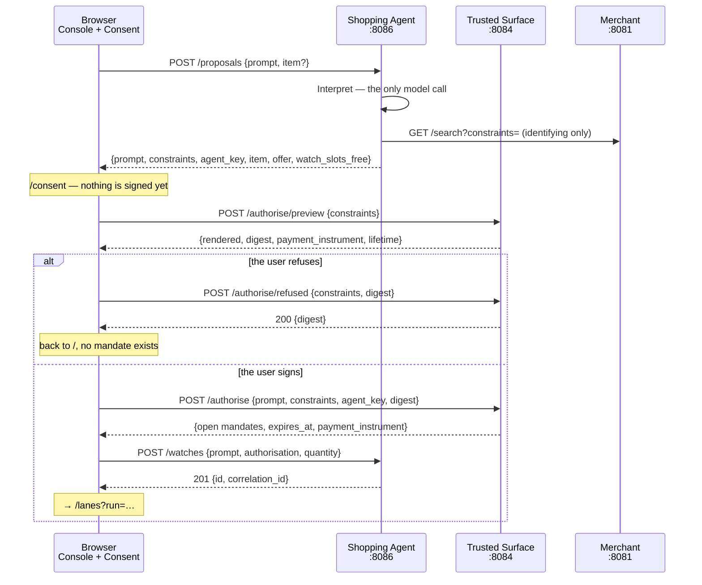

# The Trusted Surface consent screen, and the hop that stopped being one call

**Date:** 2026-08-10
**Status:** the screen is built — `/consent` is the Trusted Surface route #22
closed with. #193 is the gap left on it: the decision axis is carried by a
heading where the indicator vocabulary says enclosure.
**Issues:** #22. First slice of #109. Follows #15, #16, #17, #20, #21.
Bounded by #133 and #160, both of which it makes visible and neither of which it
fixes — see *What this does not do*.

## What this settles

The Human Not Present flow has no human in it.

`POST /watches` calls `Client.Authorise`, which interprets, searches, narrows and
posts to the Trusted Surface — all four inside one HTTP handler, all four with
nobody watching. The surface signs whatever the agent asks it to sign. That is
correct for a command line, where there is nobody to ask, and it is the whole of
what #22 exists to change: **the AI proposes, the human approves, and the
approval is over structured data rather than free text.**

Two things follow that are not obvious, and both are why this is a spec rather
than a ticket.

**The one call becomes four.** A consent screen needs render → show → decide →
sign, and a human sits in the middle of it. No arrangement of one request
contains that.

**The browser is the Trusted Surface's client, not the agent's.** This was not
decided here. `POST /authorise/preview` was built for it, `roles/surface`'s
package doc says so in as many words, and
`frontend/src/constraint/architecture.test.ts` already holds the rule for routes
under `routes/consent/` that do not exist yet. This spec is what makes those
three true of something.

## The shape



### The agent holds nothing between the first hop and the last

`POST /proposals` is a pure function of the prompt: interpret, search, narrow,
answer. **The console holds nothing** — no identifier to hand back, no record
with a lifetime of its own, nothing this handler cleans up when the user
refuses or closes the tab.

That is the handler's promise, and it is narrower than the route's. `POST
/proposals` still sits behind `roles.Middleware` like every other POST here,
and `transport.Idempotency` retains the body of any 2xx it sees for its
default 24-hour window, in a store bounded at 10,000 records and shared with
`POST /watches`. That record belongs to the middleware, not to this handler —
it ages out on its own schedule regardless of what `/proposals` itself
remembers, which stays nothing — and it is genuinely earned here for the
reason the error-mapping table below gives: a double-clicked *Interpret* must
not pay for two model calls.

The alternative — a pending intent the agent remembers — was considered and
rejected. It does not avoid the mandates travelling back through the browser,
because only the browser ever holds them; it only adds a third kind of
bookkeeping beside `watches`, with its own expiry, its own limit and its own way
to leak. What it buys is a shorter final request. That is not worth a new state
machine.

### `/proposals`, not `/intents`

AGENTS.md opens with the warning that `IntentMandate` is v0.1 training data and
does not exist in AP2 v0.2. A route named `POST /intents` that answers with
constraints is exactly what a reader arriving with that training data would take
for the issuance of one. The agent **proposes**; the user **disposes**; the
route names the half it does.

### `Client.Authorise` splits, and the command line does not notice

| | `Propose` (new) | `Authorise` (unchanged in effect) |
|---|---|---|
| `Interpret` + `interpret.Validate` | ✅ | delegates |
| `discover` — skipped when `Intent.Item` is set | ✅ | delegates |
| `narrow` — appends `item.id eq …` | ✅ | delegates |
| `POST /authorise` to the surface | — | ✅ |

`Authorise` becomes `Propose` plus one call. The CLI path — `cmd/agent -watch`
with no `-addr` — runs the same sequence, makes the same calls and fails in the
same place. Hard rule 2 is untouched: the interpreter is invoked exactly once,
in `Propose`, before anything is signed, and nothing below it can reach one.

`Propose` returns an `agent.Proposal`: the constraints as narrowed, the item, and
the agent key that will end up in both `cnf` claims.

### `POST /watches` accepts a signed authorisation, which is not a state

`internal/agent/console`'s package doc says **no route accepts a state**, and
gives the reason: *"An agent that could be told where its mandate stood would be
taking somebody else's word for its own bookkeeping."*

That rule survives, and the distinction is thin enough to be worth writing down
before somebody tests it. An `agent.Authorisation` is an **artefact**, signed by
the user's key. The agent does not parse it, evaluate it, or believe anything
about it — it carries it to verifiers whose job is to decide. Where a mandate
*stands* is still computed by `agent.Tracker` from what those verifiers answered,
and there is still no route by which an agent can be told.

The field's own comment carries this paragraph, because the tempting edit —
"while we are accepting an authorisation, we may as well accept its state" — is
one line away and reads as symmetry.

## The routes

Nothing in `internal/core/` changes. Nothing in `contracts/` changes: every new
shape is a hand-written DTO in `console/view.go` or `surface/service.go`, which
is the serialisation rule working as written.

### Agent — `POST /proposals`

```jsonc
// →
{ "prompt": "buy a flight to Palma when it drops below $200", "item": "" }

// ← 200
{
  "prompt": "…",
  "constraints": [ … ],
  "agent_key": { … },
  "item": "route:BEG-PMI",
  "offer": {
    "id": "route:BEG-PMI",
    "title": "Belgrade → Palma de Mallorca",
    "description": "Direct, 2h 40m. Cabin bag included, hold bag extra.",
    "image_url": "/images/catalogue/flight-beg-pmi.svg",
    "retailer": "Adria Wings",
    "price": { "amount": 24000, "currency": "USD" }
  },
  "watch_slots_free": 7
}
```

**`offer` is the merchant's own description of what `item` names, and the agent
does not read it.** That distinction is the whole of why this is allowed to
exist, because `agent.candidate` today reads the identifier and nothing else,
under a comment that is still true and must stay true: *"the rest of what the
merchant publishes — title, image, description — is for a person, and the agent
is not one; the price is deliberately ignored too, because the agent compares no
money anywhere and a field it read here would be the first place that stopped
being true."*

`discover` still selects on the identifier alone. What changes is that `Propose`
now serves a caller that **is** a person, so it carries the record through
instead of discarding it. Carrying is not reading: nothing in `internal/agent`
compares `price` to anything, and the field exists on this response for the same
reason `image_url` does. The comment on `candidate` is extended rather than
deleted, and `TestDiscoverStillChoosesOnTheIdentifierAlone` is what keeps the
first sentence of it honest.

Error mapping is **the one `Service.start` already uses**, taken as it stands
rather than restated. That `switch` has the reasoning written into it — an
agent's account of its own failure is a different thing from a verifier's
verdict, and neither is `generated.ErrorCode`'s vocabulary — and a second table
would be a second truth about the same errors.

| cause | status |
|---|---|
| `interpret.ErrNoScript`, `interpret.ErrNoConstraints`, `agent.ErrNothingToBuy` | `422` |
| anything else, including a merchant that did not answer | `502` |
| no `Idempotency-Key` | `400 idempotency_key_missing`, from `roles.Middleware` |

There is no `ErrTooManyWatches` arm: nothing is reserved here. The idempotency
key is genuinely earned on this route — a double-clicked *Interpret* must not pay
for two model calls.

### Agent — `GET /examples`

```jsonc
// ← 200
{ "examples": [ "buy a flight to Palma when it drops below $200", … ] }
```

**A route of its own, and a `GET`.** The obvious place for the menu is the 422
that refuses an unscripted prompt, and that place does not work: `Service.start`
answers 422 through `http.Error`, as plain text, for reasons its own comment
gives — an agent's account of its own failure is not `generated.ErrorCode`'s
vocabulary and must not borrow Problem Details to look like one. A list cannot
ride along with a body that is a sentence.

So the console fetches the menu when it loads, which is better than the
alternative anyway: the sentences are on screen **before** the user types rather
than after they have been refused. It is also the shape #109's picker needs, so
that issue inherits a route instead of inventing one.

Safe, so it sits outside the idempotency middleware by method semantics — the
argument `GET /watches/{id}/attempts/{n}/presented` already makes in this package.
It reads a table fixed at construction and changes nothing.

**The menu comes through the port.** `ErrNoScript`'s message already ends *"which
Prompts lists"*, and `ScriptedInterpreter.Prompts` is already documented as the
thing *"a caller printing this is showing somebody a menu"*. What was missing is a
way for the console to reach it: it holds an `IntentInterpreter`, and widening
that interface would oblige every implementation to have a menu when a
model-backed one has none.

So `Watcher` grows `Examples() []string`, and `console.Agent.Examples` does an
optional-interface probe — `interface{ Prompts() []string }` — on the interpreter
it was wired with. `ModelInterpreter` does not implement it and the list comes
back empty, which is the honest answer rather than a missing feature: with
`-interpreter gemini` there is no menu because any sentence is admissible, and the
console shows none.

`Watcher` therefore has three methods rather than two, and they are the three
calls `Service` makes. A second port with a second field on `Service` would allow
a console wired to propose from one agent and watch with another — a state nobody
wants and nothing would prevent.

### Surface — `previewed` grows two fields

```jsonc
// ← POST /authorise/preview
{
  "rendered": [ "the amount is at most 200.00 USD", … ],
  "constraints_digest": "…",
  "payment_instrument": { "id": "…", "type": "CARD", "description": "Visa ending 4242" },
  "open_mandate_lifetime_seconds": 3600
}
```

Consent over the constraints alone is consent to part of what the signature
covers. The open Payment Mandate pins an instrument the user never chose — the
surface's own configuration, deliberately, because the agent has no business
naming the card — and both mandates expire. A screen that asked for a signature
while showing neither would be asking for consent to two thirds of a decision.

`contracts/instrument/payment_instrument.json` already promised this screen: its
`description` field is documented as *"Shown on the Trusted Surface so the user
can tell which instrument they are approving."* #22 is where that stops being an
aspiration.

**A duration, never an instant.** `openMandateLifetime` is a constant and
`expiry := now.Add(…)` is computed at the moment of signing. A preview returning
a timestamp would promise an instant the signature will not honour — the drift
this whole preview/sign split exists to prevent, reintroduced by the field meant
to close it. `TestThePreviewLifetimeIsTheOneAuthoriseUses` pins the number
against the constant so the two cannot separate.

**Seconds as an integer.** A `time.Duration` marshals as nanoseconds, which
reads as `3600000000000` and looks like a defect; a string would need a parser on
the TypeScript side for a value with one use. The frontend formats it.

`preview` is currently a package-level function precisely because it needed
nothing from the `Service`. It now needs `s.Instrument`, so it becomes a method.
That is worth a line in the comment — not as an apology, but because the reason
it was free has stopped being true and the next reader deserves to know which of
the two facts changed.

### Surface — `POST /authorise/refused`

Decodes the **same `authorisation` type** as `/authorise`, calls the **same
`vetted()`**, checks the **same digest** — and signs nothing.

```jsonc
// →  { "prompt": "…", "constraints": [ … ], "constraints_digest": "…" }
// ←  200 { "constraints_digest": "…" }
```

The digest is **required** here, where `/authorise` leaves it optional. The
argument is narrow and holds: on this route the digest is the only content. A
refusal that names no rendering names nothing at all. Re-parsing and re-rendering
means a refusal cannot name a set the surface could not have produced, so a
refusal is checked exactly as strictly as an approval.

**What the event proves, and what it does not.** The route emits one
`obs.Event`. It is called by the browser, the browser may equally call nothing,
and no part of it can establish that a person was there — the same limit
`ConstraintsDigest` already documents about itself. So the event is *the caller's
claim that a human refused*, and it belongs where every claim of that kind
belongs: the collector, which ADR 0003 makes observability and never evidence.
The route comment carries this, because an event log entry reading "the user
refused" is exactly the sort of thing a later reader will cite as proof.

### Agent — `POST /watches` grows an optional `authorisation`

```jsonc
{ "prompt": "…", "quantity": 1, "authorisation": { … } }  // browser: already signed
{ "prompt": "…", "item": "…", "quantity": 1 }             // CLI: as today
```

Present, `Service.Start` skips `Watcher.Authorise` and goes straight to the watch
goroutine. Absent, today's behaviour is unchanged. `prompt` stays at the top level
in both, so `Run.typed` always has a source, and `item` comes from the
authorisation when there is one.

### Frontend — one proxy entry

`/authorise` → `VITE_SURFACE_URL`, default `http://127.0.0.1:8084`, matching
`deploy/demo.json`. The prefix covers all three routes.

The argument against solving it with CORS instead is the one the `/watches` block
already writes down: `Idempotency-Key` is not a simple request, so the browser
preflights; `transport.Idempotency` treats `OPTIONS` as safe and hands it to a mux
with no handler for it, which answers 405. CORS would therefore not be a header on
one route but a change to middleware every role runs — including a process holding
a signing key — to serve one browser in one development setup.

**The frontend mints `Idempotency-Key` per user action, not per screen.**
`crypto.randomUUID()`. Retrying the same button repeats the key and replays the
first answer, which is the point; editing the prompt and previewing again is a
different decision and takes a new one.

## What a demonstration can be driven with

The screens below are built against what exists, and what exists is four offers
in `deploy/catalogue.json` and five scripted sentences in
`interpret.Scenarios()` — the flight carries two wordings of one intent, declared
as two entries rather than matched fuzzily.

| sentence | offer | prices (USD) | cap | what happens |
|---|---|---|---|---|
| *buy a flight to Palma when it drops below \$200, this summer* (and *…under \$200…*) | `route:BEG-PMI` | 240 → 210 → **189** | 200 | waits, **is refused at 210**, buys at 189 |
| *buy me this bicycle when it drops below \$400* | `gtin:05012345678900` | 450 → **380** | 400 | waits, buys at 380 |
| *two tickets to the Vlado Georgijev concert in November, up to \$160 all in* | `event:vlado-georgijev-2026-11-14` | **75** | 160 | buys at once |
| *find and buy telescopic ladders, cheapest* | `gtin:05014477390221` | **139** | 150 | buys at once |

**Only the flight demonstrates a refusal**, and whoever runs a demonstration has
to know it. The bicycle's second price is already inside its cap, so no verifier
ever says no on that path; the concert and the ladders are bought on the first
quote. The beat where a verifier refuses — which is the one thing on these
screens that a slide deck cannot fake — exists on one of the four.

This is also the first time any of the five is reachable without a command line.
`GET /examples` puts them under the box, so the four scenarios stop being
something a reader has to find in a Go file.

**Four is not enough and that is #160**, not this issue. Every scripted sentence
narrows to exactly one offer, so `GET /search` answers a list of one and #109's
table would have a single row. Nothing in this design depends on the number: the
proposal settles on one offer, the consent screen describes that one, and both
behave identically against a catalogue of two hundred.

## The screens

```
src/routes/Console.tsx              placeholder → slice 1
src/routes/consent/Consent.tsx      new. The `routes/consent/` prefix is what
src/routes/consent/Signing.tsx      constraint/architecture.test.ts keys on
src/routes/consent/model.ts
src/consent/useProposal.ts          the calls to /examples, /proposals, /authorise*
```

**No module under `routes/consent/` may reach `constraint/render`, by any path.**
That rule exists today and passes vacuously — its own comment admits *"Zero
consent routes exist today, so this loop is currently empty and proves nothing on
its own."* This is the change that fills it, and it also adds the line the rule
was missing: an assertion that the loop is **not empty**, so the guard cannot
quietly return to proving nothing if the directory is ever renamed.

**The palette and the type are the ones pinned today**, and #22 must not
pre-empt either: `palette.test.ts` pins the hexes and says in as many words that
the spec leads and the stylesheet follows. #159 owns both. Its palette half has
since landed — seven tokens, navy in dark and cream in light — and repainted
these two screens without touching them, because they name tokens rather than
hexes. Its type half has since landed too, and it did touch them: the sentences
these screens render out of `previewed.rendered` are what #159 names as the
worst of the inversion — an amount inside prose, set in mono on the one screen
whose job is to be read — and they are set in the sans.

### `/` — the shopping console, first slice

```
┌──────────────────────────────────────────────┐
│  What would you like me to buy?   ← display  │
│                                              │
│  ┌────────────────────────────────────────┐  │
│  │ buy a flight to Palma when it drops    │  │  ← sans
│  │ below $200                             │  │
│  └────────────────────────────────────────┘  │
│                                              │
│  The agent interprets this. You sign what    │  ← graphite
│  it understood, not this text.               │
│                            [ Interpret ]     │
└──────────────────────────────────────────────┘
```

The line under the box sets the expectation before the consent screen arrives,
which is the only moment it can be set.

**A refused prompt is the state this screen shows most often**, and saying so is
part of the design rather than an admission. `make demo` runs `-interpreter
scripted` by default — it must, because hard rule 4 forbids a test or a
demonstration that depends on a live model — so free text fails on anything but
the scripted sentences.

Two things carry that. `GET /examples` is fetched when the screen loads, and its
sentences sit under the box as clickable prompts, so the menu is visible before
anybody is refused. And a 422 renders the server's own sentence verbatim, with the
menu already beside it. With `-interpreter gemini` the list comes back empty and
nothing is offered, which is correct: there is no menu because any sentence is
admissible.

#109 replaces this box with search results, a quantity per row and the tracker.
The seam is exactly here: everything between the proposal and the consent screen
is #109's, and nothing built now has to move for it.

### `/consent` — the Trusted Surface

```
┌──────────────────────────────────────────────┐
│  Confirm what the agent may do               │
│                                              │
│  ┌─ What you asked for ──────────────────┐   │
│  │ buy a flight to Palma when it drops   │   │  ← graphite, smaller
│  │ below $200                            │   │
│  │                                       │   │
│  │ This text is not what you sign.       │   │
│  └───────────────────────────────────────┘   │
│                                              │
│  ┌─ What you are signing ────────────────┐   │
│  │ the amount is at most 200.00 USD      │   │  ← ink, larger
│  │ the item is route:BEG-PMI             │   │
│  │ at is on or before 2026-08-31         │   │
│  │ ───────────────────────────────────── │   │
│  │ Pays    Visa ending 4242              │   │
│  │ Valid   1 hour from signing           │   │
│  └───────────────────────────────────────┘   │
│                                              │
│  ┌─ What route:BEG-PMI is ───────────────┐   │
│  │ ┌────┐ Belgrade → Palma de Mallorca   │   │  ← graphite; the
│  │ │ img│ Adria Wings · 240.00 USD today │   │    merchant's words
│  │ └────┘ Direct, 2h 40m. Cabin bag…     │   │
│  │                                       │   │
│  │ The merchant's description of this    │   │
│  │ offer. Not part of what you sign.     │   │
│  └───────────────────────────────────────┘   │
│                                              │
│           [ Refuse ]      [ Sign ]           │
└──────────────────────────────────────────────┘
```

**The third zone exists because the sentence alone is unreadable.**
`Render()` produces `the item is route:BEG-PMI` — and for the bicycle, `the item
is gtin:05012345678900`. Those are the identifiers the constraint actually
carries and the ones the merchant evaluates, so they are right; they are also
nothing a person can act on. A user asked to approve a purchase they cannot
identify is not giving consent.

**It cannot be fixed by rendering the sentence differently.** The sentences come
from the surface's own `Render()` precisely so that what is read is what is
signed, and a second renderer on this path is what
`constraint/architecture.test.ts` exists to forbid. So the identifier stays
exactly as the constraint states it, and the merchant's description sits *beside*
it, outside the signed box, labelled as not part of it — the same device the
typed prompt uses at the top, one party along.

**The price on the card is doing real teaching, and is worth keeping for that
reason.** It says `240.00 USD today` next to a constraint reading `at most
200.00 USD`. A reader who has never heard of AP2 can see, in one glance, that
they are authorising a purchase that **cannot happen yet** — which is the entire
premise of Human Not Present, stated by two numbers rather than by a paragraph.

**And it is where a wrong item becomes catchable.** `agent.discover` takes
`found[0]` under a comment saying that choosing among candidates is a product
decision this demo does not make. With today's four offers every scripted
sentence narrows to exactly one, so the choice never shows. When #160 widens the
catalogue it will, and until #109 puts the picking in front of a person, this
card is the only place a user can notice that the agent went looking for a
bicycle and found a ladder. That is a reason to build it now rather than with the
table.

The card scales to a catalogue of any size because it describes **one** offer —
the one the proposal settled on. Nothing about it changes when there are two
hundred.

**Both halves are on screen, and that is a decision.**
`docs/specs/2026-08-06-hnp-screen-brief.md` §2 raises it and leaves it open; this
settles it. Showing the typed sentence beside the interpretation is what makes a
misreading catchable — a `"summer"` that quietly included September is caught by
comparison and by nothing else. The risk that a reader takes the text for the
thing being signed is carried by two devices rather than by hope: different
weights on different tokens, and one sentence that says it outright.

It is also the one place in the system where the text really is the user's own.
`surface.authorisation.Prompt` is documented as *"the caller's account of what the
user typed"* — because that route is called by the agent, and nothing reaching it
has been near a person. Here it was typed into the box above, in this browser, by
the person reading it. The brief's open question about whether a screen may
present it as the user's own words is answered **yes, on this screen and on no
other**; `console/view.go`'s `typed` field, which is the agent's copy, keeps its
existing caution.

`Pays` and `Valid` sit inside the same box, below a rule, because they are part of
what the signature covers.

**"Approve is disabled until every constraint has rendered"** — #22's third box —
becomes something a machine checks: *Sign* is disabled while
`rendered.length !== constraints.length`. `vetted()` renders from the parsed
constraints, so in practice the two always agree; the rule exists so that a
disagreement **fails closed** instead of signing more than was displayed.

**How the proposal reaches this screen.** React Router `location.state`. A reload
loses it and the screen falls to its resting state — *"Nothing is waiting for
approval"*, with a way back. That is correct rather than a gap: a reload means
nothing was signed and the proposal no longer exists. `sessionStorage` would
survive it, at the cost of a constraint set outliving the decision it belongs to.

**After signing the screen does not jump.** `POST /authorise` and `POST /watches`
are two round trips. `Signing.tsx` holds an intermediate state with the signed
sentences still on screen, and navigates to `/lanes?run=<correlation_id>` only on
`201`.

## Failure

| where | what the user sees | what is signed |
|---|---|---|
| `POST /proposals` → `422` | the server's sentence, verbatim, beside the menu already on screen; the text stays in the box | nothing |
| `POST /proposals` → `502` or network | which party did not answer, and a retry | nothing |
| `POST /authorise/preview` refuses a constraint | the canonical code, and **no sign button** | nothing |
| `POST /authorise/refused` fails | the refusal stands; a note that it was not recorded | nothing |
| `POST /authorise` → `request_malformed` | shown plainly, with no retry — this one is our defect | nothing |
| `POST /authorise` → anything else | the surface's sentence, a line saying the surface may have signed and this browser was not told, and a retry | **unknown** |

**A refusal is never conditional on the network.** If `POST /authorise/refused`
fails, the user's *no* still holds, because `/authorise` was simply never called.
The screen returns and says the record did not go through. The alternative is a
*Refuse* button that stops working when the collector is down, which is the worst
available way to lose a person's decision.

**The last row is the only `unknown` in that column, and it is #206's.** Every
other row can say *nothing* because something the browser can see proves it: the
call was never made, or the surface answered before it signed.
`request_malformed` is in the second group — every site emitting it on that route
sits before the first `Issue…` — and it is the *only* answer in that group the
browser can rely on, which is why the row above it is one code rather than a
class. A 502, a dropped connection or a backgrounded tab leaves no answer to
read, and `client.ts`'s own doc comment is explicit that the surface may have
signed and only the response was lost. Writing *nothing* there would have this
screen assert the absence of a mandate carrying the user's key on the strength of
a failure it cannot classify, so the column says what is true and the screen
carries it in a sentence.

**A retry is offered on that row and not on the one above it**, and the reason is
not that nothing was signed — it may have been. It is that the retry repeats the
same request under the same `Idempotency-Key`, which is what lets the surface
answer with the mandates it already produced. That mechanism has a gap where
`authorise` fails *between* its two signatures, since a 5xx is deliberately not
remembered; issue #212 is where that is tracked, and the screen's wording states
the mechanism rather than promising the guarantee.

### The one that is not routine: `/watches` fails after `/authorise` succeeded

The user has signed. Two open mandates exist, carrying their key's authority, and
the agent never received them. There is no revocation in this model — AP2 has
none here and this is not the place to invent one.

The screen says so rather than hiding it: the signature exists, the watch did not
start, the mandates expire in `openMandateLifetime`, and there is a button that
sends **the same authorisation** again under a fresh idempotency key. That hour is
the whole blast radius and it belongs on screen, because it is the only fact that
makes the state tolerable.

**One predictable route into that state is removed in advance.**
`console.DefaultLimit` is 8, and `Service.Start` reserves a slot *before*
authorising for exactly this reason — `reserve()`'s comment: *"an authorisation
that succeeds into a full registry has collected a signature nothing is going to
spend."* The new flow loses that guarantee, because the browser signs before it
first contacts the agent, so a 429 now arrives after a signature.

`watch_slots_free` on the proposal is the cheap repair, and it is deliberately
**not** a reservation — no state, nothing held, nothing to expire. It is a fact at
the time of asking, and it lets the console refuse to send somebody to a consent
screen when the answer is already zero. Two tabs racing still end in a 429 and it
is still messaged properly; what disappears is the one reliable way to reach a
signature with nowhere to spend it.

## Tests

### Go

| test | what it fails on |
|---|---|
| `TestProposeDoesNotCallTheSurface` | a surface endpoint that fails the test if it is reached |
| `TestDiscoverStillChoosesOnTheIdentifierAlone` | two candidates differing only in title and price — the first is chosen, so nothing began selecting on the fields the proposal now carries |
| `TestTheProposalCarriesTheOfferTheMerchantPublished` | title, retailer, image and price arrive unaltered from `GET /search` |
| `TestAProposalIsNotAWatch` | after `POST /proposals`, `GET /watches` is empty — the agent kept nothing |
| `TestASignedAuthorisationStartsAWatchWithoutCallingTheSurface` | `Watcher.Authorise` must not be called |
| `TestARepeatedKeyProposesOnce` | the interpreter is called once; the count is read **on the test goroutine** |
| `TestTheMenuIsTheInterpretersOwnPrompts` | `GET /examples` against a scripted interpreter, compared to `Prompts()` rather than to a literal |
| `TestTheMenuIsEmptyWhenTheInterpreterHasNone` | the optional-interface probe, against an interpreter without `Prompts` |
| `TestThePreviewNamesTheCardAndTheLifetime` | both new fields present and populated |
| `TestThePreviewLifetimeIsTheOneAuthoriseUses` | the number pinned against `openMandateLifetime` |
| `TestARefusalSignsNothing` | the signer is not called |
| `TestARefusalIsCheckedAsStrictlyAsAnApproval` | the same unreadable constraint yields the same code on both routes |
| `TestARefusalNeedsTheDigestItRefused` | absent and wrong are two different outcomes |
| `TestAWatchStartedFromASignedAuthorisationCarriesTheUsersSentences` | `signed` on the run is what the surface returned |

The `require`-off-the-test-goroutine rule applies throughout, and the testify
`.Once()` hazard applies to `TestARepeatedKeyProposesOnce` specifically: the
expectation stays permissive and the count is asserted from the test goroutine.

**No new golden vectors, and the reason is worth recording.** The criterion is an
artefact that travels and has a second implementation. `rendered` is one and is
already covered by `render_vectors.json`. `open_mandate_lifetime_seconds` is a
number with one implementation, and a vector for it would be a sequence of calls
on one of our own Go types — which is a unit test, and is the row above.

**No new error codes.** Everything these routes answer with is already declared
in `contracts/evidence/error_code.json` and already classified in
`testdata/rejections.json`, so `make check`'s classification gate needs no entry.

### TypeScript

`constraint/architecture.test.ts` stops passing vacuously, and gains the assertion
it was missing: the set of consent routes is non-empty.

Beyond that: `Console` sends an `Idempotency-Key`, and two previews either side of
an edit send **different** ones; a 422 renders the server's sentence and the typed
text survives it; the consent screen distinguishes what was typed, what is signed
and what the merchant says the identifier refers to — three zones, asserted as
elements rather than as colours, with the offer card **outside** the signed box;
*Sign* is disabled when `rendered.length !== constraints.length`; *Refuse*
calls `refused` and **never** `authorise`; a `refused` that fails still returns;
the full path lands on `/lanes?run=`; a `/watches` failure after signing produces
the retry screen; a reload with no router state produces the resting state.

Gates: `make check` and `make frontend-check`.

## What this does not do

- **No Human Present consent.** `/approve` is untouched. #20's spec argues why
  that flow has no screen worth building and nothing here disagrees.
- **No catalogue, no quantity, no tracker.** Those are #109, and the seam is the
  proposal.

- **No wider catalogue.** #160. Four offers is what these screens are built
  against and what they are honest about; nothing here has to change when it
  grows.

- **No fix for the concert prompt's quantity, and the screen will make it
  visible.** #133: *two tickets… up to \$160* interprets to `quantity lte 2`,
  which is signed and enforced, while the watch takes its quantity from
  `-quantity` and buys one. Nothing is violated — one satisfies `lte 2` — but the
  consent screen now renders *"the quantity is at most 2"* to a person who then
  receives one ticket, which is a worse experience of the same defect than a CLI
  had. The real repair is a basket size the interpretation returns and the
  screen shows, which is a change to `IntentInterpreter` and belongs to #133.
  What this design must not do is quietly stop showing the constraint.

  **#133 has since landed, and it settled one thing this bullet left open.**
  The surface does *not* render the basket size, and could not honestly be made
  to: it signs constraints, and a count is not one — nothing puts a quantity in
  a mandate and no verifier is ever asked about it. So the number is the
  agent's, carried by the browser from `POST /proposals` to `POST /watches`,
  and the screen shows it **outside** the signed box under a label of its own.
  That placement is the part worth keeping in a spec rather than only in a
  component: this design's standard is that what a person reads inside that box
  is what their signature covers, and the box is one line away from being able
  to state something untrue about itself. Making the surface sign a count
  instead is a protocol change — the mandate would carry a claim no verifier
  evaluates, or `quantity eq 2` would replace `lte 2` and forbid buying one —
  and neither belongs to #133.

  **#198 is the same decision one field along, and it is recorded here on the
  sentence above.** *"Two tickets, up to \$160 all in"* carries no condition and
  *"buy a flight to Palma when it drops below \$200"* does; they are different
  authorisations and they render **identically** from the constraints, because
  the words that separate them are in the sentence and in no limit. So the
  agent's reading of which one it is — `interpret.Trigger` — is on the screen
  under a label of its own, **outside** the signed box, on exactly the terms the
  basket size is: no verifier can refute it at the point of sale, nothing puts
  it in a mandate, and the surface is never told it. Two headings rather than
  one shared box, because the questions differ — *how many* and *when* — and a
  heading vague enough to cover both is the thing this screen has least room
  for.

  **Where it is not the same decision is what an unreadable value does.** A
  quantity has an honest zero and every caller downstream holds a number of its
  own; a trigger has neither, so `interpret.Validate` refuses an interpretation
  that states none, and *Sign* is disabled for any value this browser cannot
  read — absent, empty or a word it does not hold. That is the same rule as
  `rendered.length !== constraints.length` one column along: a screen that
  cannot say which of the two authorisations it is collecting a signature for
  has no business collecting one. `agent.Watch` reads an absent trigger as a
  watch instead, and the asymmetry is deliberate — a loop with nobody in front
  of it is safer not buying, and a screen with somebody in front of it is safer
  not signing.

- **No choice among candidates.** `discover` takes `found[0]`, and this design
  does not change that. What it adds is the offer card, so a first match that was
  wrong can at least be *seen* and refused. Choosing is #109's table.
- **No repaint.** #159 owns the palette and the type hierarchy.
- **No proof that a human was there.** Nothing in this design establishes it and
  nothing pretends to. What it establishes is that a signature can only cover a
  set some rendering described, and that the rendering came from the party that
  signs rather than from the party that asked.
