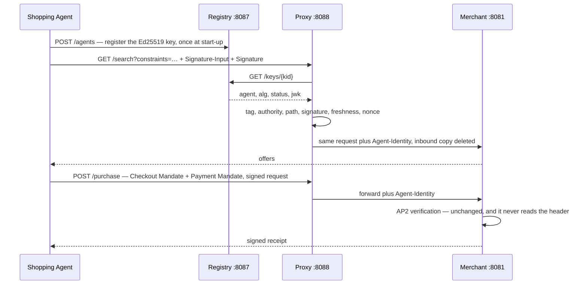

# The TAP milestone's architecture, package by package

**Date:** 2026-08-13
**Status:** proposed. Nothing is built; `internal/adapters/tap` is a `doc.go`,
`cmd/registry` and `cmd/proxy` print *not implemented yet* and exit 1.
**Issues:** Refs [#307](https://github.com/SkylinePlatform/agentic-payments/issues/307).
Shapes [#24](https://github.com/SkylinePlatform/agentic-payments/issues/24)–[#33](https://github.com/SkylinePlatform/agentic-payments/issues/33).
Takes `2026-08-13-tap-implementation-decisions.md` as settled and does not
re-open any of its five decisions.

**Sources are marked throughout**, in the distinction the TAP documents already
keep, with one grade added because this document is about code rather than about
a protocol: **[SPEC]** the published Visa *Merchant Specifications* page,
**[RFC]** RFC 9421 or RFC 8941, **[LIB]** read out of a third-party library's
source at the version named, **[TREE]** read out of this repository, and
**[PROJECT]** this project's own reading or design. A claim held on the last of
those is not weaker, but it is ours to defend.

---

## What this settles

Every package the Visa TAP milestone adds or fills, what lives in each one, what
it may import, and the type and interface signatures somebody can start typing
from. Plus the four things that cannot be worked out from the package list alone:

1. **Where the boundary falls when a third-party RFC 9421 library wants key
   material**, which is `key-material-containment`'s first real test and the
   finding most likely to change the plan. It also settles *which* library, which
   decision 3 explicitly deferred to whoever wrote the bridge.
2. **Where the identity ports live**, which the decisions spec left open as
   #31's call.
3. **How the error-code classification survives a second adapter**, given that
   `adapter-isolation` forbids either adapter importing the other and the
   classification's whole value is that it is closed over the vocabulary.
4. **Where RFC 9421's published vectors live** once `pkg/httpsig` is deleted and
   `make vectors` no longer has a `pkg/` package to find them in.

It does **not** design a screen, a nonce eviction policy, or the body-borne
objects of #29. *What this does not do* at the end says which of those are
deliberate and which are simply next.

---

## The finding that decides the shape: the library takes key material

Decision 3 deletes `pkg/httpsig` and takes RFC 9421 as a dependency, names
`remitly-oss/httpsig-go` as the default and `dadrus/httpsig` as the runner-up,
and says: *whoever writes the bridge should look at both APIs before committing,
and record which was taken and why.* This section is that record. All three
candidates were downloaded and read at the versions named.

### What each library demands of a caller holding a key

`key-material-containment` denies `crypto/ecdsa`, `crypto/ed25519`,
`crypto/rsa`, `crypto/ecdh` and `crypto/x509` everywhere except
`internal/platform/crypto` [TREE, `backend/.golangci.yml`]. The rule's own
comment states the property it protects: *a package that cannot import
`crypto/ed25519` cannot name the types a private key would have to arrive in.*
So the question for each library is not "does it touch key material" — all three
do, internally, and that is fine because depguard lints this module and not the
module cache. The question is **what type the library's exported API makes our
bridge name.**

| Library | Version read | Signing key the exported API takes | Verifying key | Verdict |
|---|---|---|---|---|
| `yaronf/httpsign` | v0.5.2 | `NewEd25519Signer(key ed25519.PrivateKey, …)` [LIB] | `NewEd25519Verifier(key ed25519.PublicKey, …)` [LIB] | **Ruled out.** The bridge would have to import `crypto/ed25519` to name the argument. That is a depguard failure, and AGENTS.md says a depguard failure here is an architecture violation rather than a style nit. |
| `dadrus/httpsig` | v0.9.0 | `Key{Key any}`, type-switched to `ed25519.PrivateKey` in `signer.go` [LIB] | `Key{Key any}`, type-switched to `ed25519.PublicKey` in `verifier.go` [LIB] | **Passes the letter, fails the spirit.** `any` needs no import, so depguard stays green — while a raw private key travels out of `internal/platform/crypto` inside an `any`. The rule would be intact and the property it exists to protect would be gone, which is the worst of the three outcomes because nothing would say so. |
| `remitly-oss/httpsig-go` | v1.2.2 | `SigningKeyOpts.Signer crypto.Signer` — the **standard library's** interface, dispatched for Ed25519 as `pkgSigner.Sign(nil, base, crypto.Hash(0))` [LIB, `signatures.go:169–182`] | `KeySpec.PubKey crypto.PublicKey`, type-asserted to `ed25519.PublicKey` [LIB, `verify.go:427–434`] | **Taken.** The signing side never sees a private key: `crypto.Signer` exposes `Public()` and `Sign()` and nothing that yields the private half. The verifying side takes a *public* key as an opaque `any`, which is material this module already moves around in JWK form. |

**So the choice is `remitly-oss/httpsig-go`, and the reason is not the one
decision 3 anticipated.** Decision 3 chose it on stable-v1 and
Cloudflare-dependency grounds and expected `tag` semantics to be the thing that
might overturn it. The deciding property turned out to be
`SigningKeyOpts.Signer` — the escape hatch remitly added for TPMs and HSMs, which
is exactly the shape our key store already is. It is the only one of the three
whose exported API can be driven by a caller that does not hold a private key.

**The root `crypto` package is not on the deny list, and that is not an
oversight to route around — it is the correct line.** `crypto.Signer` and
`crypto.PublicKey` are the standard library's *opaque* handles: the first cannot
return its private key, and the second is an `any` that in our case will always
hold an `ed25519.PublicKey`, which is published in a JWKS already. Naming either
of them from `internal/adapters/tap` does not let that package name a private
key's type.

**The rule as written does not have to change.** State that loudly, because the
opposite would have been the finding: no `//nolint`, no widening of the
`!**/internal/platform/crypto/**` exception, no new exempt directory. What
changes is that `internal/platform/crypto` grows two exported functions, below.

### What `internal/platform/crypto` has to add, and the guard for each

Two functions, both in the only package allowed to name the types, both
deliberately narrow.

```go
// StandardSigner returns the standard library's crypto.Signer for a slot's
// active key.
//
// It exists for exactly one caller: a third-party implementation of a public
// standard that does its own signing and takes crypto.Signer as the escape
// hatch for callers whose key is not a Go value. internal/adapters/tap is that
// caller and RFC 9421 is that standard.
//
// It is not a widening of what leaves this package. crypto.Signer exposes
// Public() and Sign() and has no method that yields a private key, which is the
// same guarantee authz.Signer gives — said in the standard library's vocabulary
// instead of this project's, because the library cannot be taught ours.
func (s *Store) StandardSigner(slot Slot) (crypto.Signer, error)

// StandardPublicKey returns the published public key for ref, in the standard
// library's opaque form.
//
// Same caller, other direction. A public key is material this module already
// moves — roles.PublicKey hands one to a Trusted Surface as a JWK, and every
// role that serves HTTP publishes one at /.well-known/jwks.json — so what this
// adds is a second
// encoding of something already public, not a second thing that is public.
func (s *KeySet) StandardPublicKey(ref authz.KeyRef) (crypto.PublicKey, error)
```

Both claim a check, so both need a test that fails when the check is disabled —
AGENTS.md's rule, and these are cheap because the test file is inside
`internal/platform/crypto` and may therefore name the concrete types:

| Guard | Mutation it catches |
|---|---|
| `TestAStandardSignerIsNotThePrivateKeyItself` — asserts the returned value does **not** type-assert to `ed25519.PrivateKey` | Returning `k.priv` directly. That compiles, satisfies `crypto.Signer`, and passes every functional test, because `ed25519.PrivateKey` *is* a `crypto.Signer`. |
| `TestAPublishedVerificationKeyCannotSign` — `assert.NotImplements(t, (*crypto.Signer)(nil), got)` | Returning the private half from `StandardPublicKey`. `ed25519.PublicKey` does not implement `crypto.Signer`; `ed25519.PrivateKey` does. |

The second is the one worth writing carefully. It is a one-line assertion whose
failure mode is a key leak, and it is provable by breaking in ten seconds.

### The two costs of taking remitly, and what each one buys instead

Neither is a reason to reverse the choice. Both have to be handled in the first
pull request, or they become silent defects.

**Cost 1 — remitly selects the signature by its label, and TAP says never to do
that.** `Verifier.verify` calls `unmarshalSignature(sigsfv, ver.profile.SignatureLabel)`
[LIB, `verify.go:178`], which looks the label up as a dictionary key. `docs/protocols/tap.md`
is explicit, on RFC 9421 §7.2.5's authority, that an intermediary may relabel a
signature and that applications must select on `tag` — and TAP's own architecture
puts a proxy in the path, so this is not a remote hazard.

*The fix is ours and it is small.* `internal/adapters/tap` parses
`Signature-Input` as an RFC 8941 Dictionary itself, finds the member whose `tag`
parameter is `agent-browser-auth` or `agent-payer-auth`, reads that member's
label, and hands the label to remitly. **Selection is by tag; the label is only
how the chosen signature is then addressed.** Belt and braces: put `MetaTag` in
`RequiredMetadata` and assert `VerifyResult.Tag()` against the expected value
after verification returns.

This needs an RFC 8941 parser, and `github.com/dunglas/httpsfv` is already in the
build list as remitly's own dependency [LIB, `go.mod`] — so it costs a `require`
line and no new module. Say so in the pull request rather than letting a reader
count two dependencies where there is one module graph.

**What this buys:** the tag-selection logic is ours, in our own package, with our
own test — which is better than delegating it, because `dadrus`'s
`WithRequiredTag` would have hidden the one TAP-specific rule this milestone most
wants to demonstrate inside a dependency.

**Cost 2 — remitly's clock is not injectable.** `VerifyProfile.nowTime` is
unexported and defaults to `time.Now` [LIB, `verify.go:127`, `verify.go:440–446`].
Hard rule 5 says time goes through the injected clock; `forbidigo` cannot see
into the module cache, so nothing would fail — the eight-minute window would
simply be untestable without sleeping, and `time.Sleep` is banned too.

*The fix:* set `DisableTimeEnforcement: true` on the profile and enforce
freshness in `internal/adapters/tap` against the injected `authz.Clock`. That is
where it belonged anyway: **the eight-minute rule is TAP's [SPEC], not RFC
9421's**, and no general-purpose library knows it. One clock, ours, and a
fake-clock test for each of `created` in the future, `expires` in the past, and a
window wider than eight minutes.

Two more profile settings that must not be left at their defaults, because
`DefaultVerifyProfile` is written for a different profile of the same RFC:
`RequiredFields` must be `Fields("@authority", "@path")` and **not** the default
`content-digest`/`@method`/`@target-uri`; and `DisallowedMetadata` must be empty,
because the default disallows `alg` and decision 4 requires it present.

### What the library gets right, and is therefore not ours to re-derive

- **The signature base is RFC-correct.** Component names are serialised through
  `sfv.Marshal`, so they are quoted; the label is not in the
  `@signature-params` line; the parameters are copied rather than re-serialised
  [LIB, `base.go`]. Decision 4 is satisfied *by using the library*, which is the
  cleanest possible way to satisfy it — Visa's three divergences become
  something we document rather than something we have to avoid re-introducing.
- **The algorithm comes from the key, never from the header.** `verifySignature`
  switches on `ks.Algo` — the algorithm on the `KeySpec` the fetcher returned —
  and `validate` checks that against `AllowedAlgorithms` [LIB, `verify.go:390–447`,
  `verify.go:486–491`]. That is the same closure `authz.KeyResolver`'s contract
  makes, arrived at independently, and it is why the directory being the
  authority on the algorithm (below) composes cleanly.
- **RFC 9421 Appendix B.2.1–B.2.6 ship as testdata**, `test-key-ed25519`
  included [LIB, `testdata/`]. That is the library's own conformance evidence,
  not ours — see *Golden vectors*.

### The dependency itself, stated rather than slipped in

`backend/go.mod` has no runtime dependency today; `testify` is test-only [TREE].
This adds four modules to the build list:
`github.com/remitly-oss/httpsig-go`, and transitively
`github.com/dunglas/httpsfv`, `github.com/google/go-cmp` and
`github.com/golang-jwt/jwt/v5` [LIB, `go.mod`]. Two of those are ours to
be uncomfortable about: `go-cmp` is a test library appearing in a non-test
require, and `golang-jwt/jwt/v5` is a JWT implementation arriving in a repository
that deliberately wrote its own SD-JWT. Neither is imported by anything we write.
Say all of it in the pull request body — decision 3 already asks for the first
sentence, and the reader who was not in the conversation will count the rest.

---

## The eight dependency rules, checked against this proposal

Every rule in `backend/.golangci.yml`, against every package below. This table is
the thing to re-read before the first pull request, not a formality.

| Rule | Does this proposal violate it? |
|---|---|
| `core-isolation` | **No.** `internal/core/identity` gains ports that import `internal/core/authz` and `internal/core/generated` and nothing else. The rule denies `internal/adapters`, `internal/platform`, `internal/roles`, `internal/agent` and `pkg` — it says nothing about core importing core, and the *reason* it says nothing is that a rule forbidding it would forbid `authz` importing `generated`, which it already does [TREE, `internal/core/authz/mandate.go`]. See *Where the identity ports live* for why that import is the right direction. |
| `adapter-isolation-ap2` / `-tap` | **No**, and one place needed redesigning to keep it so. `internal/adapters/tap` imports neither `ap2` nor anything that imports it. The place it bit is the error-code classification, which today is computed inside the ap2 package; *The error-code path* moves it. |
| `pkg-purity` | **Not engaged.** `pkg/httpsig` is deleted, `pkg/sdjwt` is untouched, and TAP adds nothing under `pkg/`. |
| `key-material-containment` | **No** — see the section above. The two new functions live inside the excepted directory; every other TAP package holds `crypto.Signer`, `crypto.PublicKey`, `authz.Signer`, `authz.Verifier` or `authz.KeyRef`, none of which requires a denied import. |
| `collector-containment` | **Not engaged.** `cmd/proxy` and `cmd/registry` emit through `obs.Emitter` like every other role [TREE, `internal/roles/run.go`], which is the collector's *client* side and is not the denied package. |
| `console-containment` | **Not engaged.** Nothing in TAP reaches `internal/agent/console`. Worth one sentence in review anyway: a proxy that wanted to know whether an agent's mandate was spent would be the exact bug that rule describes, one party along. |
| `no-weak-randomness` | **No.** The RFC 9421 `nonce` is signer-chosen and must come from `crypto/rand`. remitly's `NonceRandom32` uses `crypto/rand` [LIB], and where we generate one ourselves it goes through `crypto/rand` like `crypto.Challenger` already does. |
| `forbidigo` (`time.Now`, `time.Sleep`, `io.LimitReader`) | **No**, with the one catch above: remitly calls `time.Now` internally, which `forbidigo` cannot see, so `DisableTimeEnforcement` moves freshness onto our clock. `io.LimitReader`: the registry client reads a JWKS-shaped answer over HTTP and must use `transport.RefusingOver` with a named constant carrying its measured worst case — `maxRegistryAnswer`, beside `maxJWKS`'s reasoning [TREE, `internal/roles/jwks.go`]. |

---

## The package tree

```
backend/
  cmd/
    registry/         main.go        ⟵ fills a stub that exits 1 today
    proxy/            main.go        ⟵ same
  internal/
    core/
      identity/       doc.go         ⟵ fills an empty package
                      directory.go   Directory, Registration, Status, sentinels
                      verified.go    Verified, Interaction
                      replay.go      Seen, ErrNonceReplayed
    adapters/
      tap/            doc.go         ⟵ exists, extended
                      tag.go         Tag, the two operation values
                      sign.go        Signer, SignerConfig, Sign
                      transport.go   Signing — the selective round-tripper
                      verify.go      Verifier, VerifierConfig, Verify
                      select.go      the tag-not-label signature selection
                      keys.go        KeySource, the bridges to remitly
                      freshness.go   the eight-minute window, on authz.Clock
                      errors.go      sentinels and CodeOf
                      testdata/      RFC 9421 Appendix B, and our TAP profile
    roles/
      registry/       service.go     the directory as an HTTP service
                      store.go       registrations in memory
                      client.go      Client — Directory + KeySource, cached
      proxy/          service.go     the verifying reverse proxy
                      identity.go    what it attaches downstream
      identity.go     VerifiedAgent — how a merchant reads it back  (package roles)
    platform/
      crypto/         standard.go    StandardSigner, StandardPublicKey
                      store.go       + Import, for published private vectors
      store/          seen.go        SeenSet — the time-bounded nonce set
      problem/        testdata/rejections.json  ⟵ moves here from adapters/ap2
  pkg/
    httpsig/          ⟵ DELETED
deploy/
  demo.json           + registry and proxy, implemented: true, with health
frontend/
  src/lanes/model.ts  ⟵ #32's decision; this document only frames it
```

---

## Package by package

### `internal/core/identity` — the identity axis, filled

Imports `context`, `errors`, `time`, `internal/core/authz` and
`internal/core/generated`. Nothing else, ever.

```go
// Status is where a registration stands. Revocation is the whole reason a
// directory exists rather than a bare self-signed key, so it is a first-class
// value and not the absence of a record.
type Status string

const (
    Active  Status = "active"
    Revoked Status = "revoked"
)

// Registration is what a directory holds about one key.
//
// generated.Agent is the canonical model's own identity type — id, name,
// operator, keys — and it exists already; this port does not invent a second
// one.
type Registration struct {
    Agent  generated.Agent
    Key    authz.KeyRef
    Status Status
}

// Directory answers the one question a message signature can ask: this key
// identifier — whose is it, and what algorithm was it registered for?
//
// Note what it does not take. There is no algorithm parameter, because the
// algorithm is an *answer* here and never a question. A directory that could be
// told which algorithm to look for is a directory an attacker can steer, which
// is algorithm confusion wearing a directory's clothes. authz.KeyResolver
// refuses the same thing from the other end by demanding a KeyRef that already
// carries both halves; this is where the second half comes from.
type Directory interface {
    Lookup(ctx context.Context, keyID string) (Registration, error)
}

var (
    // ErrAgentUnknown means no registration names that key identifier.
    ErrAgentUnknown = errors.New("identity: no registration for that key identifier")
    // ErrAgentRevoked means the registration exists and trust has been
    // withdrawn. Distinct from unknown on purpose: a verifier that collapses
    // them tells a revoked agent the same thing it tells a stranger, and loses
    // the one signal that says the directory did its job.
    ErrAgentRevoked = errors.New("identity: the registration has been revoked")
)

// Interaction is what an agent proved it was doing, in the canonical model's
// vocabulary rather than the wire's.
//
// TAP spells these agent-browser-auth and agent-payer-auth in a tag parameter.
// Those strings live in internal/adapters/tap and not here, on exactly the terms
// contracts/README.md sets for AP2: issued_at is an RFC 3339 instant in the
// model and iat is epoch seconds in the adapter. A core that spelled a tag
// value would be TAP-shaped, and no depguard rule catches TAP-shaped — only
// TAP-importing.
type Interaction string

const (
    Browsing Interaction = "browsing"
    Paying   Interaction = "paying"
)

// Verified is what a verifying edge proved, and the only thing it may pass
// downstream.
//
// It carries no signature, no nonce and no timestamp pair. A downstream reader
// cannot re-check any of those — it did not see the request — so carrying them
// would invite exactly the mistake the value exists to prevent: a merchant
// re-deriving a verdict from evidence it cannot verify. At is when the edge
// decided, for the event log.
type Verified struct {
    Agent       generated.Agent
    Key         authz.KeyRef
    Interaction Interaction
    At          time.Time
}

// Seen records signature nonces that have already been accepted, so that one
// cannot be accepted twice while it is still inside its window.
//
// The direction is what makes this a different mechanism from the one this
// repository already has. RFC 9421's nonce is chosen by the *signer*, so a
// verifier needs a seen-set; crypto.Challenger is verifier-issued, which is a
// challenge, and TestTheReplayThisDoesNotStop is the passing test that says so
// [TREE]. That test is one to invert, not one to notice.
type Seen interface {
    // Record returns ErrNonceReplayed when nonce has already been recorded and
    // that record has not yet passed expires.
    Record(ctx context.Context, nonce string, expires time.Time) error
}

var ErrNonceReplayed = errors.New("identity: signature nonce already used inside its window")
```

**What is deliberately not here.** No `PublicKey` accessor, no `crypto.PublicKey`,
no signature type, no HTTP. The material the RFC 9421 library needs is a wire
concern and is declared by the adapter that needs it — next section, and *Where
the identity ports live* argues why that split is the right one rather than the
timid one.

### `internal/adapters/tap` — the wire, and the bridge to the library

May import `internal/core/*`, `internal/platform/*`, the standard library
including root `crypto`, and the two third-party modules. May **not** import
`internal/adapters/ap2` or `internal/roles`.

```go
// ---- tag.go ------------------------------------------------------------

// Tag is TAP's operation binding, and it is the first thing a verifier looks
// at — before the required-fields check and before any cryptography [SPEC].
type Tag string

const (
    TagBrowse Tag = "agent-browser-auth"
    TagPay    Tag = "agent-payer-auth"
)

// Interaction maps a wire tag onto the canonical model's vocabulary, and
// TagFor maps back. Two functions rather than a map, so an unknown tag is a
// refusal rather than a zero value.
func (t Tag) Interaction() (identity.Interaction, error)
func TagFor(i identity.Interaction) (Tag, error)

// ---- sign.go -----------------------------------------------------------

// SignerConfig is everything the signing side needs and nothing it can pick up
// from the request.
type SignerConfig struct {
    // Key is the agent's Ed25519 key, from the "tap-agent" slot. It is a
    // crypto.Signer and not an authz.Signer because RFC 9421 is implemented by
    // a library that speaks the standard library's interface — see keys.go.
    Key crypto.Signer

    // KeyID is what goes in the keyid parameter, and it is the same kid the
    // registry holds. authz.KeyRef is where both halves travel together; this
    // is the half the wire carries.
    KeyID string

    // Authority is what the signature commits to: the externally visible
    // authority of the merchant edge, configured. Decision 5, and RFC 9421
    // §7.4.3. Never req.Host, and never derived from the URL being called,
    // because the point is that those two may differ.
    Authority string

    Clock    authz.Clock
    Lifetime time.Duration // must be <= MaxWindow
}

// MaxWindow is the widest interval TAP permits between created and expires.
// Eight minutes [SPEC]. A signature claiming more "should be blocked" — the same
// verdict a bad signature gets — so a generous signer is not lenient, it is
// producing something a conforming verifier refuses.
const MaxWindow = 8 * time.Minute

type Signer struct{ /* … */ }

func NewSigner(cfg SignerConfig) (*Signer, error)

// Sign adds Signature-Input and Signature to req, covering @authority and
// @path and nothing else [SPEC].
func (s *Signer) Sign(req *http.Request, tag Tag) error

// ---- transport.go ------------------------------------------------------

// Signing returns an http.Client that signs the requests it sends to the
// merchant edge and leaves every other request untouched.
//
// The shape is transport.Correlating's [TREE]: copy the client, replace the
// Transport. The difference is the selectivity, and it is decision 2 rather
// than an optimisation — TAP is a merchant-edge protocol, and signing the
// Credential Provider, the Merchant Payment Processor and the Trusted Surface
// would be over-application. internal/agent/purchase.go has one outbound choke
// point, which makes signing everything the path of least resistance; this
// function is what makes being selective the easy thing instead.
//
// Within the merchant edge there is no allow-list: GET /.well-known/jwks.json
// and GET /nonce are signed like everything else, which is the other half of
// decision 2.
func Signing(base *http.Client, s *Signer, merchantEdge string, tag Tag) *http.Client

// ---- keys.go -----------------------------------------------------------

// KeySource hands over the published public key a registration names, in the
// form the RFC 9421 library takes.
//
// Declared here rather than in internal/core/identity, and that is the
// interface-segregation call this document makes rather than inherits.
// crypto.PublicKey is an empty interface belonging to a library's calling
// convention, not a fact about who an agent is; a port in core naming it would
// put a wire detail on the identity axis for one dependency's benefit. The
// implementation is internal/roles/registry.Client, which satisfies this and
// identity.Directory at once.
type KeySource interface {
    PublicKey(ctx context.Context, ref authz.KeyRef) (crypto.PublicKey, error)
}

// ---- verify.go ---------------------------------------------------------

type VerifierConfig struct {
    Directory identity.Directory
    Keys      KeySource
    Seen      identity.Seen
    Clock     authz.Clock

    // Authority is what this verifier requires @authority to be — its own
    // externally visible authority, configured. Decision 5. A verifier that
    // read this off the incoming request would be verifying a statement about
    // its own internal topology, which is acute for TAP because its only two
    // covered components are exactly the two a proxy rewrites.
    Authority string

    // Accept is the set of operations this edge will honour. Both, in the
    // demo; the field exists so that "right domain, wrong operation" is a
    // configuration a test can express rather than a branch it has to reach.
    Accept []Tag
}

type Verifier struct{ /* … */ }

func NewVerifier(cfg VerifierConfig) (*Verifier, error)

// Verify checks one inbound request and returns the identity it proves.
//
// Each step's failure is a different code — see errors.go. Select the
// signature by its tag; require @authority and @path; resolve keyid against
// the directory; check the algorithm the directory registered against the one
// the header claims; verify; check freshness against the injected clock;
// record the nonce.
//
// The first two steps are the specification's, in its order. The last two are
// not, deliberately: the specification checks the timestamps and the nonce
// before it locates the key or validates the signature, and recording a nonce
// for a request whose signature has not verified hands an unauthenticated
// caller a way to fill the seen-set. Freshness follows it because it is our own
// check against the injected clock around the library's verification rather
// than one the library performs (decision 3). The algorithm check is ours too,
// and is decision 4's defence rather than a step the specification lists.
func (v *Verifier) Verify(ctx context.Context, r *http.Request) (identity.Verified, error)

// ---- errors.go ---------------------------------------------------------

var (
    ErrNoTrustedTag    = errors.New("tap: no message signature carries a trusted-agent tag")
    ErrAgentUnknown    = errors.New("tap: the registry has never held this key identifier")
    ErrAgentRevoked    = errors.New("tap: the registration has been revoked")
    ErrSignatureFailed = errors.New("tap: the message signature does not verify")
    ErrWindowTooWide   = errors.New("tap: created and expires are more than eight minutes apart")
    ErrNotFresh        = errors.New("tap: the signature is not currently valid")
    ErrReplayed        = errors.New("tap: this nonce has already been used inside its window")
    ErrScopeMismatch   = errors.New("tap: the signature is not bound to this authority or this operation")
    ErrMalformed       = errors.New("tap: the signature headers do not parse")
)

// CodeOf is ap2.CodeOf's counterpart: the canonical code a refusal carries into
// a Problem Details response.
//
// TODO(extract-after-third-protocol): this and ap2.CodeOf have the same shape
// and share not one error value. See "What is duplicated on purpose".
func CodeOf(err error) generated.ErrorCode
```

**A note on `ErrScopeMismatch` and #28's cross products.** Domain binding
(`@authority`) and operation binding (`tag`) are two checks and one code, which
is the right pairing for the wire — a counterparty is told the signature is not
for this — and the wrong pairing for a test. So the two must be separately
provoked: right domain / wrong operation, and right operation / wrong domain,
each a row in the rejection suite, each with a sentinel-plus-code assertion.
Testing only same/same and different/different is #28's named trap and it passes
while one of the two checks is missing entirely.

### `internal/roles/registry` — the local directory

```go
// Service is the local agent directory: register, resolve, revoke.
//
// The route shape mirrors what the specification documents for the production
// directory — a keyed lookup and a well-known key location [SPEC] — because #26
// asks for an interface a remote directory could replace without touching
// callers. What it deliberately does not mirror is the live service's answer:
// measured 13 August 2026 that directory holds one 2048-bit RSA key and no
// Ed25519 key at all, so there is nothing there an agent signature could be
// checked against. This is not a convenience that saves a Visa account. It is
// the only thing there is to resolve against.
type Service struct{ /* … */ }

func New(Config) (*Service, error)
func (s *Service) Handler() http.Handler
```

| Route | What it does |
|---|---|
| `POST /agents` | Register an agent and its key set. `Idempotency-Key` required, per the standing rule; a repeat with the same key is the same registration. |
| `GET /agents/{id}` | The registration, for the console and for a human with `curl`. |
| `GET /keys/{kid}` | Resolve one key identifier: `{agent, kid, alg, status, jwk}`. This is the operation the proxy calls. |
| `POST /keys/{kid}/revoke` | Withdraw trust. `Idempotency-Key` required. |
| `GET /.well-known/jwks.json` | The registry's own key, through `roles.JWKS`. |
| `GET /healthz` | Required before `implemented: true` — see *The demo topology*. |

```go
// Client is the registry as a verifier sees it.
type Client struct {
    Base  string
    HTTP  *http.Client
    Clock authz.Clock
    TTL   time.Duration
}

var (
    _ identity.Directory = (*Client)(nil)
    _ tap.KeySource      = (*Client)(nil)
)

func (c *Client) Lookup(ctx context.Context, keyID string) (identity.Registration, error)
func (c *Client) PublicKey(ctx context.Context, ref authz.KeyRef) (crypto.PublicKey, error)
```

**`TTL` is the whole of the revocation story and it must be a named constant with
its reasoning beside it.** `roles.Peer` caches a counterparty's key set for the
life of the process and never invalidates, which its own comment records as
accepted debt and names #26 as the fix [TREE]. This is that fix, so it must not
inherit the debt. `docs/protocols/tap.md` is blunt that the published material
supplies nothing to revoke with — no revocation list, no `exp`, no `ETag`, and
`Cache-Control: max-age` is a staleness hint rather than a statement about trust.
So the only honest mechanism is a short bounded cache, and the number is a
[PROJECT] decision that should be small enough for `POST /keys/{kid}/revoke` to
be visible on screen inside one demo — **thirty seconds**, which is two orders
of magnitude under the live directory's hour and is chosen for the demonstration
rather than for a deployment. Write that sentence in the constant's comment.

The test that makes it mean something: revoke a key, advance the fake clock past
`TTL`, and assert the next request is refused with `agent_unknown`. Provable by
breaking — remove the expiry and it stays accepted.

### `internal/roles/proxy` — the verifying edge

```go
type Config struct {
    // Upstream is the merchant this proxy fronts.
    Upstream *url.URL

    // Authority is what agents signed, and what this verifies against: this
    // proxy's own externally visible authority, configured. Decision 5.
    Authority string

    Verifier *tap.Verifier
    Events   *obs.Emitter
    Clock    authz.Clock
}

type Service struct{ /* … */ }

func New(Config) (*Service, error)
func (s *Service) Handler() http.Handler
```

`httputil.ReverseProxy` with a `Rewrite` function. Every inbound request is
verified — no allow-list, decision 2 — and a refusal is written with
`problem.New(code, detail)`, which is how every other role in this tree answers.

The one thing in this package that is easy to get wrong and expensive to get
wrong:

```go
// IdentityHeader is where this proxy puts what it proved.
//
// It is base64url over the JSON projection of identity.Verified. One header
// rather than four, so that a downstream reader either has a whole identity or
// has none — three of four headers arriving is not a partial identity, it is a
// forgery in progress.
//
// The name is this project's [PROJECT]. TAP says a verified identity is passed
// downstream and names no header.
const IdentityHeader = "Agent-Identity"
```

**The proxy deletes any inbound `Agent-Identity` before it sets its own, and that
is the single most important line in this package.** Without it, an unsigned
request that simply sets the header walks past the whole protocol — the proxy
would forward a claim it did not make, and the merchant has no way to tell the
difference. It gets a test named for the attack, not for the code:
`TestAForgedIdentityHeaderIsReplacedAndNeverForwarded`, driving an unsigned
request carrying a plausible header and asserting both that it is refused and
that nothing bearing that header reached upstream. Provable by breaking: delete
the `Del` and it goes red.

### `internal/roles` — how a merchant reads it back

One function in the existing `roles` package, beside `roles.PublicKey` and
`roles.AgentKey` which already answer questions of exactly this shape:

```go
// VerifiedAgent reads the identity a verifying proxy attached.
//
// It reads and never checks. #30's third done-when is that the merchant backend
// never verifies signatures itself, and this is the shape that makes that true
// rather than merely intended: there is nothing here a merchant could verify
// with, because the value carries no signature — see identity.Verified's own
// comment on why.
//
// trusted is what makes the header safe to read at all. A merchant reachable
// without going through the proxy must ignore it, because then anybody can set
// it. cmd/merchant's -behind-proxy is the flag, it defaults to false, and with
// it false this returns (zero, false) whatever the header says.
func VerifiedAgent(r *http.Request, trusted bool) (identity.Verified, bool)
```

### `cmd/registry` and `cmd/proxy`

Both through `roles.Main`, like `cmd/surface`, `cmd/credprovider`, `cmd/mpp` and
`cmd/merchant`. `cmd/agent` is the exception and stays one — it mints its emitter
before it knows whether it will serve at all, so it binds and serves itself
[TREE, `internal/roles/run.go`, the comment on `FlushGrace`]. Since issue #273
that is `roles.Listen` and then `roles.Serve` rather than one call to
`roles.Run`, because its boot watch signs two open mandates between the two and
must not do so against a port this process turns out not to hold. Neither new
binary has anything to do in between, so both stay on `roles.Main`.

```
registry  -addr :8087
          -collector http://127.0.0.1:8085/events

proxy     -addr :8088
          -upstream  http://localhost:8081        the merchant
          -authority localhost:8088               decision 5 — what agents signed
          -registry  http://localhost:8087
          -collector http://127.0.0.1:8085/events
          -window    8m
```

`-authority` defaults to the host and port of `-addr`, and the flag's help text
says why it exists to be overridden: behind a real CDN it is the customer-facing
name and not the socket. That default is what keeps `make demo` working with no
extra configuration while the flag keeps the decision visible.

`cmd/agent` gains `-registry`, and registers its `tap-agent` key at start-up.
Self-registration rather than a seed file, because it exercises the register path
on every `make demo` and because the agent mints a fresh key per start
[TREE, `roles.NewIdentity`], so a seed file would be stale by construction.

`cmd/agent`'s package documentation gains the paragraph decision 1 asks for: this
agent now has two identities and neither is published from a JWKS of its own — an
ES256 key handed to the Trusted Surface through `roles.PublicKey` and travelling
endorsed in every open mandate's `cnf`, and an Ed25519 key registered with
`cmd/registry`, which is where a TAP verifier resolves it. `cmd/agent` mounts no
`roles.JWKSPath` [TREE], and the paragraph has to say which key is which.

### `internal/platform` additions

```go
// package store

// SeenSet is a time-bounded single-use record, and it is identity.Seen's
// implementation.
//
// In platform rather than in an adapter because it is mechanism and not policy,
// and because the sameness is provable rather than assumed: nothing here knows
// what a nonce is for. Issue #27's own note makes the same call and draws the
// contrast — mandate semantics stay duplicated between adapters until a third
// protocol shows the seam; a bounded seen-set does not.
//
// It takes an authz.Clock, so the window is exercised by advancing a fake clock
// rather than by sleeping, which forbidigo forbids anyway.
type SeenSet struct{ /* … */ }

func NewSeenSet(clk authz.Clock, opts ...SeenOption) (*SeenSet, error)
func WithCapacity(n int) SeenOption
func (s *SeenSet) Record(ctx context.Context, nonce string, expires time.Time) error
```

Bounded memory is a requirement rather than a nicety: an unbounded set is a
remote memory-exhaustion primitive handed to whoever can send requests. Evict on
expiry, and refuse rather than silently drop at capacity — a seen-set that
forgets under load stops preventing replay exactly when replay is happening,
which is `io.LimitReader`'s failure mode wearing different clothes.

```go
// package crypto — beside StandardSigner and StandardPublicKey above

// Import adopts an existing private key, given as a JWK carrying "d", into a
// slot.
//
// It exists for one purpose: RFC 9421 publishes its test vectors with the
// private keys they were made with, and Ed25519 is deterministic, so a vector's
// signature can be reproduced byte for byte — which is conformance evidence a
// generated key cannot give. A JWK rather than the RFC's PEM, so that this
// reuses the JWK path and nothing has to import crypto/x509.
//
// No production caller has one, and TestNoProductionCodeImportsAKey is the
// check that keeps it that way.
func (s *Store) Import(slot Slot, jwk []byte, idempotencyKey string) (authz.KeyRef, error)
```

### The demo topology

`deploy/demo.json` already carries `registry` and `proxy`, both `implemented:
false` and both after `mpp` [TREE]. They move: `registry` above `merchant`,
`proxy` below `mpp`, and the agents' `-merchant` moves to the proxy's address.
Order: collector, surface, registry, merchant, credprovider, mpp, proxy, agent,
frontend. *There is one agent since #313, not two — `agent-watch` and `agent-buy`
were both removed and the survivor renamed.*

**The trap the decisions spec names — and issue #313 dissolved it.** Kept rather
than deleted, so the next reader can tell it was considered rather than missed.

*As written:* the flat two-second `stubGrace` is what an *implemented* process
with no health check costs [TREE, `internal/demo/runner.go`, the `p.Health == ""`
branch]. Flipping the proxy to `implemented: true` without a health endpoint
spends two seconds between the merchant and the watching agent where there were
none, pushing that agent's baseline towards the `$210` it is meant to refuse — and
`TestTheMerchantsFirstPriceOutlastsTheStackComingUp` asserted the floor was zero
as a property in its own right, so `make check` refused the flip.

**Neither survives.** With no boot watch there is no start-up baseline for
`stubGrace` to slide, so the arithmetic has nothing to be about; the test was
deleted with the guarantee it held. Flipping a stub now costs two seconds of
start-up and nothing else. `implemented: true` and `GET /healthz` should still land
in the same commit — a role reported as up that answers nothing is its own defect —
but no gate enforces it and this spec no longer claims one does.

---

## Where the identity ports live

The decisions spec left this open as #31's call and named the two options: either
`core/identity` imports `core/authz`, which is the first cross-axis import inside
core, or the crypto ports move to a neutral home, which touches fifteen packages.

**Recommendation: `core/identity` imports `core/authz`, and the port returns an
`authz.KeyRef` rather than working around one.**

The reasoning is not about cost. It is that the *problem statement* is slightly
wrong, and getting it right dissolves the awkwardness.

TAP's wire gives a `keyid` alone, and `authz.KeyResolver` demands a `KeyRef`
carrying both a kid and an algorithm. That refusal is deliberate and it is what
closes algorithm confusion — the resolver rejects the pair when the algorithm
registered for that kid differs from the one the header claims, and it can only
make that comparison if it is told both halves [TREE, `internal/core/authz/keys.go`].

The tempting move is a second port beside it — `ResolveByKeyID(kid) (Verifier,
error)` — and that move is the bug. A resolver that takes a kid alone has to get
the algorithm from somewhere, and the only somewhere on the wire is the `alg`
signature parameter, which the attacker wrote. **The port that takes a kid alone
is the algorithm-confusion resolver.** It must not exist, in core or anywhere
else.

What TAP actually needs is one step earlier: something that says *what algorithm
is this kid registered for*. That is not a key-resolution question, it is a
**directory** question, and the directory is the only party that can answer it,
because the directory is where the key was registered. So:

- `identity.Directory.Lookup(ctx, keyID)` returns a `Registration` carrying an
  `authz.KeyRef` — kid and algorithm, both stated by the holder of the key.
- The verifier builds nothing from the header. It compares the header's `alg`
  against the registered one and refuses a mismatch.
- Whatever then checks the signature — `authz.KeyResolver` where we do it
  ourselves, remitly's `KeySpec` where the library does — receives an algorithm
  that came from the registry.

Read that way, `core/identity` importing `core/authz` is not a compromise. The
identity axis's answer *is* a key reference plus who it belongs to, and
`authz.KeyRef`'s own doc comment describes exactly the value the directory holds.
Declaring a second, structurally identical `identity.KeyRef` to avoid the import
would put two spellings of one fact in core and make the adapter convert between
them for no gain.

**The trade-off, stated rather than waved at.** `core-isolation` denies adapters,
platform, roles, agent and pkg — it says nothing about core importing core, and
it cannot, because `authz` already imports `generated` [TREE]. So this is legal.
What it costs is the claim that the three axes are independent: after this,
`identity` depends on `authz`, and a future fourth axis that needs a key
reference will follow the same path, and eventually `authz` is not the
authorization axis but also the place keys are described. The clean answer to
that is the fifteen-package move — `authz.Signer`, `Verifier`, `KeyResolver`,
`KeyRef`, `Algorithm` and `Clock` into a neutral `core/keys` — and the honest
reason not to do it now is that the milestone would open with a mechanical rename
touching every file in the tree, which is a bad first pull request and a worse
first article.

**So: take the import, and write the reason down where the next person meets it.**
`core/identity`'s `doc.go` should say that the dependency on `authz` is for key
references only, that it is the first cross-axis import in core, and that the
alternative is a neutral key package if a third axis ever needs the same thing.
A one-way door recorded as a one-way door is a decision; the same door with no
sign on it is drift.

**What must not be watered down.** The direction. `core/authz` must never import
`core/identity`. If a mandate ever seems to need an agent identity, that is the
transaction-level composition problem in the next section, and the answer is that
it happens outside core.

---

## How TAP composes with AP2 without touching it

`docs/architecture/README.md`'s three-layer model says a transaction carries a
TAP-verified identity *alongside* an AP2 mandate. Concretely, in this
implementation:



**What the proxy attaches.** One header, `Agent-Identity`, base64url over the
JSON projection of `identity.Verified`: the agent, the key reference, the
interaction and the instant the edge decided. Any inbound copy is deleted first.

**How the merchant reads it.** `roles.VerifiedAgent(r, trusted)`, which reads and
never checks, and which returns nothing at all when `cmd/merchant` was not
started with `-behind-proxy`.

**What the merchant does with it.** In this milestone: emits it. The merchant's
existing `obs.Emitter` gains one event carrying the verified agent on the same
correlation ID as the AP2 verification that follows — and *that is the
composition*. Two independent verdicts about one transaction, joined by the
identifier ADR 0003 already threads through every hop, and the three-lane view is
where a reader sees them as one story.

**What in `internal/core` has to learn identity exists.** `core/identity` gains
the ports above, and **nothing in `core/authz` changes at all** — not the
mandate, not the constraint model, not the receipt.

That is a claim worth defending rather than assuming, because the obvious
alternative is a `core.Transaction` owning both a mandate and an identity, and it
is wrong three ways. It would make `authz` and `identity` mutually visible, which
is the direction the previous section forbids. It would model as one object two
verdicts reached by different parties at different times from different evidence
— the proxy proved who was asking, the merchant proved what was approved — and a
struct holding both invites code that treats one as implying the other. And it
would be the first place in this repository where the three-layer thesis stopped
being three axes and became a single record with three fields, which is precisely
the leaky abstraction AGENTS.md warns against under a different name.

**#31's honest finding, stated in advance.** #31 says that if the axes turn out
not to fit cleanly, that is a genuine finding and should be written up rather
than papered over. The finding this design predicts is the opposite one and is
still worth writing: they fit so cleanly that **they never meet in the model at
all**. The only place a TAP identity and an AP2 mandate appear together is the
event log and the screen — observability, not evidence. Whether that is the
thesis vindicated or the thesis untested is the interesting question, and the
answer is that a merchant which *acted* on the identity — priced differently for
a verified agent, say — would be the test. This milestone does not do that, and
saying so is better than implying otherwise.

---

## What is duplicated on purpose

TAP is the **second** protocol. AGENTS.md accepts duplication between adapters
until a third reveals the real seams, marks it
`// TODO(extract-after-third-protocol)`, and forbids `internal/common/` and
`internal/shared/`. These are the things that will look extractable in review.

| Will look extractable | Why it stays duplicated |
|---|---|
| `tap.CodeOf` beside `ap2.CodeOf` | Same shape, and not one shared error value. Extracting it produces a function that takes a list of `(sentinel, code)` pairs — which is a `for` loop, and the loop is not the part anybody gets wrong. What is hard is deciding which code a refusal deserves, and that is protocol knowledge. |
| `tap/errors.go`'s sentinel table beside `ap2/errors.go`'s `adapterCodes` | Same. The table's value is its contents. |
| `tap/keys.go` beside `ap2/jose.go` | **The most tempting and the most wrong.** Both adapt `authz.Signer`/`authz.Verifier` into a third party's vocabulary. `ap2/jose.go`'s own comment already answers it: the translation lives in the adapter because the adapter is the only layer allowed to know both sides. A shared bridge would have to know JOSE *and* RFC 9421, which is a package that knows both protocols — the thing `adapter-isolation` exists to prevent, reached by a route depguard does not watch. |
| `tap.Verifier`'s config beside `ap2.MerchantRules` | Both are "a role's verification policy". They share no field. |
| `tap`'s created/expires window beside `pkg/sdjwt`'s `exp`/`nbf` | Both are freshness. One is JOSE claims inside a signed payload, the other is RFC 9421 parameters inside a signature base, and the eight-minute ceiling has no analogue on the AP2 side. |
| `registry.Client`'s cache beside `roles.Peer`'s | Superficially the same memoised key fetch. `Peer` caches for the life of the process and documents that as debt; `Client` must expire, because expiry is the only revocation mechanism TAP's published material leaves available. Merging them means one of the two behaviours wins, and the wrong one winning is a revoked agent that keeps being accepted. |

**Two things genuinely belong in `platform/`**, and both meet #27's test — the
sameness is provable rather than assumed, and neither knows what protocol it is
serving:

1. **`store.SeenSet`.** #27's own note makes this call. Build it as a general
   time-bounded single-use record with an injected clock and a capacity bound —
   not as `TAPNonces`, or the next caller inherits a name that lies.
2. **`crypto.StandardSigner` / `crypto.StandardPublicKey` / `crypto.Import`.**
   Not because they are shared — TAP is their only caller today — but because
   `internal/platform/crypto` is the only package that *may* name the types.
   Location by permission rather than by reuse, and the doc comments should say
   so, or a future reader will wonder why a TAP-only function lives in platform.

**One thing that looks like it belongs in `platform/` and does not:** the
signing round-tripper. `transport.Correlating` is next door and has the same
shape, and the resemblance is a coincidence — `Correlating` is protocol-neutral
plumbing that every call in the tree wants, and `tap.Signing` is a protocol
choice about which counterparties get signed requests. Putting it in `transport`
would make `internal/platform` import an adapter, which is the dependency arrow
`core-isolation` exists to keep pointing the other way, one layer out.

---

## The error-code path

### What a new code has to touch, in order

1. **`contracts/evidence/error_code.json`** — add the value to `enum`. The
   schema's own description says the list describes the domain rather than what
   is built, which is exactly why the rest of this list exists.
2. **`make generated`** — regenerates `internal/core/generated`. No hand edit;
   the directory is gitignored and `make check` rebuilds it.
3. **`internal/platform/problem`'s `renderings` table** — the HTTP status and
   the human title. `TestEveryCodeRenders` fails until it is there [TREE], so
   this step is enforced rather than remembered. The four TAP codes that already
   exist all render 401 [TREE, `problem.go:165–168`].
4. **The classification** — currently
   `internal/adapters/ap2/testdata/rejections.json`, and see below.
5. **A row in a rejection suite**, if the status is `vectored`: an artefact, a
   real verification entry point, the sentinel and the code.

**The four TAP codes already exist and already render**, which is why the first
vertical slice is cheap: `agent_unknown`, `agent_unverified`, `signature_replayed`
and `signature_scope_mismatch` are in the enum, in the rendering table as 401,
and classified as `tap` [TREE]. The first proxy pull request produces two of them
without touching `contracts/` at all.

Codes this milestone will probably want to add, listed so the enum change is one
decision rather than four: something for *the request carried no trusted-agent
tag at all* — which is a different finding from `agent_unverified`, because
nothing was even claimed — and something for *the signature window is wider than
the protocol permits*, which `signature_scope_mismatch` does not describe.
Whether those deserve codes or fold into the existing four is a decision for the
pull request that needs them; what must not happen is a fold done silently,
because the classification file is where a second implementer reads what we can
say.

### Where the classification lives once there are two adapters

**This is a real problem and it needs solving before the first TAP rejection
lands.**

Today `internal/adapters/ap2/golden_rejection_test.go` owns
`testdata/rejections.json`, and `TestGoldenEveryErrorCodeIsClassified` checks two
directions: every declared code is classified, and every classification names a
declared code. It computes the "vectored" set from `ap2.rejectionVectors()` alone
[TREE]. `adapter-isolation-ap2` and `-tap` forbid either adapter importing the
other, so that suite can never count TAP's rows.

The failure is not a broken build. It is worse: the four `tap` entries say
*milestone #24–#33, no input to construct* while `internal/adapters/tap` is busy
producing them, and the check stays green because from ap2's vantage point zero
is still the right count. **A classification that has silently stopped being true
is worth less than no classification**, for the reason AGENTS.md gives about
diagrams.

**Recommendation: split the check along the depguard line rather than fighting
it.** Three checks, one file, and the file moves out of both adapters.

- **`backend/internal/platform/problem/testdata/rejections.json`** is the new
  home. `problem` already reads `contracts/evidence/error_code.json` and already
  names every code in a table, so closure over the vocabulary is a property it
  owns. It imports neither adapter and never will.
- **`problem` owns closure.** Every declared code has an entry with a status and
  a note; every entry names a declared code. This is the half that must not be
  split, and it needs no adapter to run.
- **Each adapter owns its own arm.** `statusVectored` becomes two values,
  `vectored-ap2` and `vectored-tap`. The ap2 suite asserts that every code marked
  `vectored-ap2` has a row in its own vectors and that no code it vectors is
  marked otherwise. The tap suite asserts the mirror. Neither can see the other's
  rows, and neither needs to.

Reading the file across directories is not new: `golden_rejection_test.go`
already reads `../../../../contracts/evidence/error_code.json`, with a comment
explaining that checking against the generated Go constants would agree with a
stale schema by construction [TREE]. The same reasoning applies.

**Two alternatives, and why not.** *One file per adapter* is not closure: two
files each closed over a subset leave a code that neither claims, which is
exactly the gap the check exists to find. *A third package importing both
adapters* is legal — `adapter-isolation` selects on the importing file's path, so
a test in `internal/platform/problem` importing both is not covered — but the
symbols it would need are declared in `_test.go` files and are therefore
unreachable from another package. Making them reachable means exporting the
vector tables from non-test code, which is a worse trade than moving a JSON file.

Note this is a **change to existing behaviour**, so it is a pull request of its
own with its own issue, landing before the first TAP rejection rather than
alongside it. The old-versus-new table for its body is one row: *the vectored set
was computed from one adapter and is now computed per adapter, with closure
checked where neither adapter can reach.*

---

## Golden vectors

`make vectors` runs `-run 'TestGolden'` over `internal/adapters/...`,
`internal/core/...` and `pkg/...` [TREE, `Makefile`]. Deleting `pkg/httpsig`
removes the package RFC 9421's vectors would have lived in.

**They move to `internal/adapters/tap/golden_rfc9421_test.go`, with the vectors
in `internal/adapters/tap/testdata/`. No Makefile change** — `internal/adapters/...`
already covers it.

**The convention that distinguishes the two kinds, and it is the filename.**
`pkg/sdjwt/golden_rfc9901_test.go` names its external source in the file name and
opens with *"The vectors in this file are copied from RFC 9901 and are the
conformance evidence for this package"* [TREE]. `golden_test.go`, unqualified, is
where our own fixtures live. So:

| File | What is in it | Whose evidence |
|---|---|---|
| `tap/golden_rfc9421_test.go` | Appendix B.2 — the signature bases and `Signature-Input` values the RFC prints, and B.2.6's Ed25519 signature reproduced byte for byte | Somebody else's. This is what makes "we implement RFC 9421" checkable by a stranger. |
| `tap/golden_test.go` | The TAP profile: a two-component base over `("@authority" "@path")` with all six parameters, both tags, and the header pair it produces | Ours. TAP's own first header example does not parse as an RFC 8941 field at all, so there is no published vector to copy — this is a fixture we own and must say we own. |
| `tap/golden_rejection_test.go` | Each refusal through the real `Verifier.Verify`, with its sentinel and code | Ours, and the arm of the classification described above. |

**Why our own RFC vectors, when the library ships its own.** Because they test
different things. remitly's suite proves remitly implements the RFC. Ours proves
*the bridge* does: that the `SignerConfig` we construct produces the RFC's exact
base for the RFC's inputs, that `StandardSigner` hands the library a signer it
drives correctly, and that our tag-selection preprocessing does not disturb a
signature the RFC published. The bridge is the only code we wrote, and it is the
only code that can be wrong.

**Ed25519's determinism is what makes the strongest version of this possible**,
and it is worth one sentence in the file. `pkg/sdjwt`'s RFC 9901 vectors take the
ES256 signature on trust because that package may not import `crypto/ecdsa`
[TREE, `pkg/sdjwt/golden_rfc9901_test.go`]; the signature itself is settled
separately, in `internal/platform/crypto`'s `TestRFC9901IssuerSignatureVerifies`,
from the RFC's published *public* key alone [TREE]. That verify-only pattern is
available for RFC 9421 B.2.6 at no cost and needs no private key. What Ed25519's
determinism adds is the stronger claim — B.2.6's signature reproduced byte for
byte — and that is what needs `crypto.Store.Import` to adopt the RFC's private
key, in the one package `key-material-containment` lets hold it. Decision 11's
second opinion is therefore about whether byte-for-byte reproduction is worth the
function, not about whether conformance is checkable without it.

---

## The frontend, at the level of structure only

Issue #32. **This section frames the decision and does not make it.** Frontend
work here is investor-facing and gets its own design pass;
`docs/specs/2026-08-06-three-lane-view-design.md` is the standard, and a
structural note is not a substitute for it.

**What exists.** `frontend/src/surfaces.tsx` reduced four routes to two and
records why: a heading with one item under it is a heading pretending to sort
something, and a person following one purchase should not lose their place four
times [TREE]. `LANES` has three columns; `laneOf` returns `null` for a role no
column claims; `titleOf` falls back to the role's own name so an unplaced step is
drawn rather than dropped; `Lanes.tsx` has a *No lane yet* section whose comment
names registry and proxy; and `model.test.ts` asserts `laneOf("registry")` is
null with the reason that answering `merchant` would draw a TAP step in an AP2
party's column [TREE].

That is a deliberately good position: **the first proxy pull request needs no
frontend change at all.** The handshake appears in *No lane yet* the moment the
proxy emits.

Three options for #32, with what each costs.

**A — leave `laneOf` alone; TAP events stay in *No lane yet*.** Costs nothing and
teaches nothing: a section titled *No lane yet* is an admission, and TAP's
handshake is the milestone's headline. Right for the first slice, wrong as the
answer.

**B — a fourth column.** The three-lane design says the spine's position in the
middle of the agent's column is the one thing not negotiable [TREE], and a fourth
column moves it. Also wrong on the merits: the proxy is not a fourth party to the
*transaction*, it is the merchant's edge, and drawing it as a peer of the user
teaches the wrong topology.

**C — a separate TAP view, paired with the Mandate Inspector.** #32 already
gestures at this — *showing TAP identity and AP2 authorization side by side on
one transaction is the clearest possible statement of the three-layer thesis*.
Structurally it is a zone of the existing **The protocol** screen rather than a
third route, which is what `surfaces.tsx` exists to prevent. It costs a second
model module beside `lanes/model.ts` and a decision about how the two are joined
on screen — the correlation ID is what joins them in the data, and that is
already there.

**Recommendation: C, and B is the one to rule out explicitly** so nobody
re-litigates it in a review. Between A and C there is a real sequencing choice —
A first, C when #32 gets its design pass — and if C lands, `laneOf`'s null and
`model.test.ts`'s assertion **stay as they are**: the roles still have no lane in
the three-lane view, because the TAP view is not that view. Changing that test is
the tell that option B has crept back in.

---

## Decisions this document made that the decisions spec did not cover

Listed rather than buried, because each is reversible and each should be looked
at.

1. **`remitly-oss/httpsig-go` is confirmed, on `key-material-containment`
   grounds rather than the ones decision 3 named.** `dadrus` would require a raw
   `ed25519.PrivateKey` to leave `internal/platform/crypto` inside an `any` —
   depguard-green and property-broken. `yaronf` is a hard depguard failure.
2. **Tag-based signature selection is ours, not the library's**, with
   `dunglas/httpsfv` as a direct import. This is the cost of item 1 and the
   alternative was `dadrus`.
3. **Freshness is enforced against `authz.Clock`, with the library's own time
   enforcement switched off**, because remitly's clock is not injectable and the
   eight-minute rule is TAP's rather than the RFC's.
4. **`core/identity` imports `core/authz`**, and the port is a *directory*
   lookup returning a `KeyRef` rather than a resolve-by-kid. The neutral
   `core/keys` move is named as the future exit and deliberately not taken now.
5. **`tap.KeySource` is declared in the adapter, not in core.** Core does not
   name `crypto.PublicKey`.
6. **`identity.Verified` carries no signature, nonce or timestamp pair**, so a
   downstream reader structurally cannot re-derive a verdict it did not witness.
7. **One `Agent-Identity` header, base64url JSON, inbound copy deleted**, rather
   than several discrete headers.
8. **`cmd/merchant -behind-proxy`, defaulting to false.** Without it a merchant
   reachable directly would trust a header anyone can set.
9. **The agent self-registers with the registry at start-up**, rather than the
   demo seeding it.
10. **The rejection classification moves to
    `internal/platform/problem/testdata/rejections.json`**, and `vectored` splits
    into `vectored-ap2` and `vectored-tap`. This is a change to working code and
    wants its own issue.
11. **`crypto.Store.Import` exists**, so that RFC 9421's published Ed25519
    signature can be reproduced exactly. It is a function whose only caller is a
    test, in the package where key material lives, and that deserves a second
    opinion.
12. **The registry cache TTL is thirty seconds**, chosen so a revocation is
    visible inside one demo rather than measured against any deployment.
13. **Ports 8087 for the registry and 8088 for the proxy**, which are free
    today.
14. **Frontend option C, and option B ruled out.**

---

## What this does not do

**It does not design the body-borne objects.** #29. The specification names their
canonicalisation as *"a canonical representation of all fields in the object in
the order received"* and names no scheme [SPEC], and it says both objects are
signed with the same private key as the message signature while showing that
signature as Ed25519 and both objects as PS256 — which one key cannot do. Both
are unresolvable from public material. Nothing in the package layout above
prejudges it: the two objects would be types in `internal/adapters/tap` and a
consent input somewhere in `core/identity`, and neither shape is settled here.

**It does not decide the nonce eviction policy.** #27. `store.SeenSet` is named
and its two hard requirements — injected clock, bounded memory — are stated. What
happens at capacity, and whether eviction is lazy or swept, is the pull request's.

**It does not design a screen.** *The frontend* frames three options and
recommends one; #32 does the work, with a design pass.

**It does not size the vertical slice.** The decisions spec already did that —
one signed browsing request, verified at the merchant edge, drawn on screen — and
this document is the map that slice is cut from, not a second plan.

**It does not touch AP2.** Nothing above changes a file under
`internal/adapters/ap2`, `internal/core/authz`, `internal/roles/surface`,
`internal/roles/credprovider` or `internal/roles/mpp`. The two exceptions are
`internal/roles/merchant`, which gains a reader for a header it may ignore, and
the classification file, which moves. If a TAP pull request finds itself editing
an AP2 verification path, that is the signal to stop and re-read this section.
