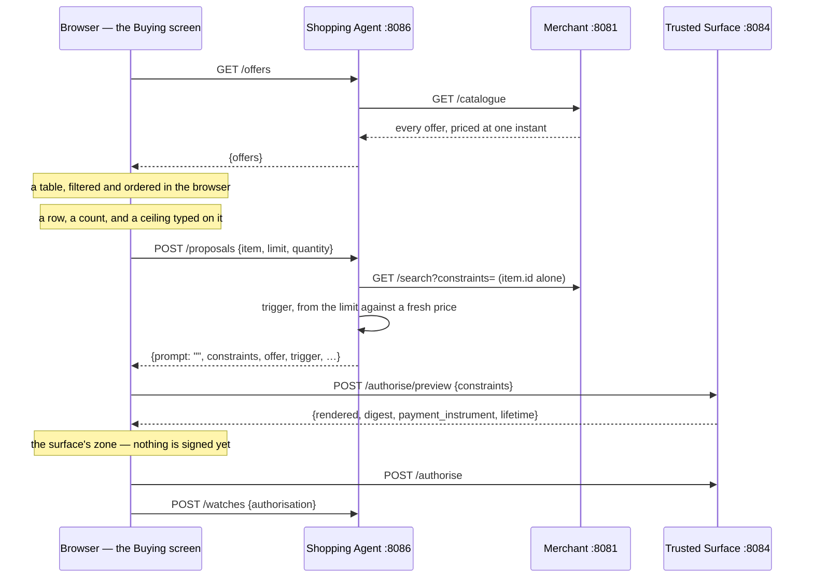

# The catalogue is the entry, and the limit is the buyer's

**Date:** 2026-08-31
**Status:** built.
**Issues:** #314. Follows #22, #109, #298, #299, #301. Depends on #313, which is
what made the screen this describes open on nothing.

## What this settles

Under `make demo` the way into the whole flow was a textarea, and the textarea
was a fiction.

`-interpreter scripted` is the default and has to be — hard rule 4 forbids a
demonstration that depends on a live model — so the agent knows three sentences
and answers `422` to everything else. The consent design already said so in as
many words: *"a refused prompt is the state this screen shows most often"*. What
that means in front of a person is that they do not choose what to buy. They
guess which of three sentences the agent was told about.

And the thing that makes the purchase worth watching — **the cap, the ceiling on
the amount they are signing for** — was not theirs at all. It is an `lte`
constraint in `internal/agent/interpret/scenarios.go`, beside a `scenario.cap`
the author of the demonstration wrote into `deploy/catalogue.json`. The screen
asked somebody to approve a limit and never let them set one.

> **This is today's price. What the agent may pay, and whether it buys now or
> waits, is yours.**

That sentence is the whole change. Everything below is what it costs to make it
true.

## The shape



No interpreter appears anywhere on it. Hard rule 2 is untouched, and `make demo`
still reaches no model.

## Browsing is not searching

`Catalogue.Search` refuses an empty constraint set, and the reason is written on
`ErrNoConstraints` itself: emptiness reads as *everything is permitted* to a
mandate and *nothing is filtered* to a query, and answering the whole catalogue
to an empty set collapses two readings this package closed on purpose.

So a shop window is a different question and gets a different route.
`GET /catalogue` answers every offer, priced at one instant, and its doc comment
says what it does **not** claim: unlike a search, an offer appearing here is no
statement that any mandate would authorise buying it.

**Seven searches, one per shelf, was the alternative and it is worse.** It
returns the same rows and **seven different `observed_at` values** — a table
showing prices from moments that never co-existed, which is precisely the defect
`Results.ObservedAt` exists to prevent, one screen further out.

**The filters are client-side for the same reason.** Refetching on a keystroke
would give back exactly what the single clock read was bought to prevent.
Sixty-three rows filtered in a browser is not a performance question at any
catalogue size this project has.

**The shelves come off the rows, not off `GET /shelves`.** What the buttons have
to match is the table in hand; a shelf from a second call could name a category
no row on screen sits on — a filter that matches nothing, drawn from an answer
about a catalogue this screen is not showing. The interpreter's own use of
`GET /shelves` is a different question, because it needs the shop's vocabulary
before there are any rows at all.

## The limit is proposed by the agent, not appended by the browser

`frontend/src/catalogue/quantity.ts` appends `quantity lte n` in the browser and
carries an argument for why that is right. A limit does not follow from it, and
the reason is one field along.

**The trigger has to be derived by the party holding a fresh price.**
`interpret.Trigger` says whether this authorisation buys now or waits, and
`agent.triggerFor` answers it by comparing the limit to what the offer costs. The
number on a table in a browser can be a schedule step old; the one `settle` just
re-quoted cannot. So the comparison happens where the fresh price is, and what
travels back is a reading this agent made rather than a claim the caller
supplied.

That keeps the property the consent design rests on: **every constraint on that
screen was proposed by the agent.**

`POST /proposals` therefore takes a second request shape, mutually exclusive with
`prompt`:

```jsonc
{ "item": "gtin:05012345678900",
  "limit": { "amount": 38000, "currency": "USD" },
  "quantity": 1 }
```

Neither field, or both, is a `422`. **Both refusals matter and neither may be
defaulted.** A sentence's limits are *inferred* — the entire reason the surface
renders them before anybody signs — and a stated limit is the person's own
number. Silently preferring one would put a constraint set in front of somebody
that is not the set they thought they were asking for.

The set is exactly three constraints and there is no fourth by construction:
what to buy, what it may cost, how many. `narrow` appends the first, so the item
is pinned by the same function and in the same spelling every other path uses.

### `triggerFor` reads; it does not evaluate

AGENTS.md gives constraint evaluation to the verifier and to nobody else, and
this is close enough to it to be worth stating. Nothing here decides whether a
purchase is permitted: the merchant evaluates `amount lte …` against its own
price at the moment of sale, and it may well refuse an attempt this function
called immediate, because the price can move in between. What is answered is the
weaker question a screen needs — *is this person telling the agent to buy, or to
wait* — which a sentence answers with its words and a table answers with its
numbers.

`internal/agent` still cannot import the evaluator, and
`TestTheAgentCannotReachAConstraintEvaluator` still holds it.

### The limit is a ceiling on the purchase, not on one of the thing

**`amount` at the verifier bounds what will actually be charged.**
`merchant.Catalogue.Subject` says so on the line that builds it — *"a cap is
compared against what will actually be charged, so the caller multiplies (Quote
does) and this does not"* — `Quote` produces the `LinePrice`, and the merchant
signs its checkout over that.

So the number typed into the row is the ceiling on the **order total**, the
constraint carries it unmultiplied, and everything that compares against it
compares against `price × quantity`: `agent.triggerFor`, and the sentence under
the box.

**Getting that wrong reintroduces issue #298**, which is how the first version of
this was written. Comparing the limit against the *unit* price makes a ceiling of
400.00 read as an instruction to buy three 450.00 items — the agent buys, and the
merchant refuses it for exceeding a cap on 1,350.00. A mandate signed first and
refused afterwards, on the demonstration's headline screen. In the other
direction a limit below the unit price reads as a wait for a price the schedule
may well reach, while the mandate could never have been satisfied.

It was invisible for one reason worth recording: **every fixture used a quantity
of one**, which is the single value where the line total and the unit price
coincide. `TestTheLimitBoundsThePurchaseAndNotOneOfTheThing` is the row that makes
them come apart, and the overflow refusal beside it is
`merchant.Catalogue.Quote`'s own, made one party earlier — a wrapped total is a
negative or tiny price that a cap constraint waves through.

### A stale row can predict the wrong trigger, and the consent screen is what catches it

The table is fetched once and the merchant's prices move every three to six
seconds, so the row's sentence — *waits until it costs 380.00 USD or less* — is
computed against a number that can already be a step old. `ProposeStated`
re-quotes, so the trigger it derives can differ from the one the row predicted:
somebody who set a limit expecting to wait can get `immediate`, because the price
came down between the page load and the click.

**That is not repaired here and does not need to be**, because the screen that
collects the signature states the agent's own reading. `Consent.tsx` draws
`whenItBuys(proposal.trigger)` in a zone of its own, outside the signed box,
unconditionally on both paths — issue #198 put it there for exactly this class of
problem, where two authorisations render identically from their constraints and
differ only in when they fire. `canSign` is gated on that value being one the
browser recognises, so a trigger this build cannot read disables signing rather
than guessing.

So the row predicts and the consent screen tells. Polling the catalogue to keep
the prediction current would spend the single-clock-read property for a sentence
that is already backed up one screen later.

### `openValue`, and a bug the test found before the code shipped

`generated.Constraint.Value` is `any`, so a `generated.Amount` assigned into it
compiles and marshals to exactly the right JSON. What it does not do is **parse**:
`constraint.parseMoney` reads `map[string]any`, because every constraint in this
system arrived over a wire and was decoded from JSON, and a Go struct assigned
in-process is the one shape that never was.

So a proposal built the obvious way is one the Trusted Surface would render
perfectly and this process could not read back — a disagreement invisible until
something on this side tried.
`TestTheAgentSpellsTheFieldsTheRegistryKnows` runs the verifier's own parser over
what `ProposeStated` actually produces, which is why it caught it; a table of
hand-built constraints, built the same wrong way, could not have.

## Nobody typed anything, and nothing invents a sentence

`Run.typed` is the empty string on this path, and it travels that way.
`Run.title`'s own comment is the precedent and it is exact: an identifier
substituted for a name is the identifier wearing the name's clothes.

Three consequences, each decided rather than inherited:

- **`Service.Start` requires a prompt only when it still has to authorise one.**
  With a signed authorisation in hand the limits are already signed and the
  prompt's one remaining job is `Run.typed`. Without one, the agent is about to
  interpret the sentence, so a watch with no sentence is a watch with nothing to
  authorise — still refused. The handler refuses the same absence at the edge, so
  it reads `422` rather than falling through the error table to `502`.
- **The consent screen draws *What you chose* where it drew *What you asked
  for*.** The first zone exists so a sentence and its interpretation can be
  compared — a *"summer"* that quietly included September is caught that way and
  no other. That argument needs a sentence. What replaces it still has to show
  the choice, because an offer identifier is not something a person recognises,
  and it sits **outside** the signed box on exactly the terms the basket size
  already does.
- **The lanes draw no quotation.** `Lanes.tsx` already guards
  `authorisation.typed !== ""`, so an empty prompt draws nothing rather than a
  pair of empty quotation marks. Nothing had to change.

## Where the sentence box survives

`GET /examples` already told the two worlds apart, and the screen already read it
— to word a paragraph. It now decides whether the box exists at all.

| `examples` | What that means | The screen |
|---|---|---|
| non-empty | a scripted interpreter, and this is its whole menu | catalogue only |
| empty | a model-backed interpreter; any sentence is admissible | box **and** catalogue |
| `null` | the agent has not answered | catalogue only |

The `null` row is the three-state rule the screen already applied to its own
prose, and it matters for the same reason: a box drawn on a guess would be drawn
precisely when the agent is unreachable.

**The sentence chips went with the box rather than moving above the table.** They
were a menu for a control that no longer exists in the world that had one, and in
the world that keeps the box there is no menu to show — `console.Agent.Examples`
answers nothing for a model-backed interpreter.

**Both tables exist and they are not the same table.** With a proposal in hand
the limits came out of a sentence, the search has already narrowed the shop, and
the surface is about to render the ceiling it read — so a limit box on those rows
would take a number that reaches no mandate, which is worse than no box. That is
what `stated` carries into `Table`.

## The opening limit

The limit box starts at the offer's price rounded down to its leading digit:
450.00 opens at 400.00, 240.00 at 200.00.

**It starts below the price on purpose.** A limit at or above today's price is an
instruction to buy now, and a table that opened that way would make the first
purchase anybody tries an immediate one — the case Human Not Present has nothing
to say about. Starting under it means the ordinary first run shows the thing the
screen exists for.

One leading digit rather than two, because two gives 440.00 and one gives 400.00,
and only the second is a number a person would have typed. It costs a larger drop
just past a power of ten — 1,459.00 opens at 1,000.00 — and that is the right
side to err on: this is a suggestion in an editable box, and a suggestion that
waits is more use than one that buys.

## What this does not do

- **No change to `internal/core/` or `contracts/`.** Every new shape is a
  hand-written DTO, which is the serialisation rule working as written.
- **No change to the Trusted Surface.** `vetted()` still parses and renders
  everything it signs, so where a constraint came from does not change what can
  be signed. That is the property that makes a browser-chosen limit safe at all.
- **No change to `interpret`.** The three scripted sentences, `GET /examples`,
  `POST /interpret` and `POST /candidates` are untouched, and `make demo-live` is
  where they are still reachable.
- **No pagination.** `GET /catalogue` reaches the same worst case `GET /search`
  already had — `maxResponse`'s comment measures it at 124.5 KiB against a 1 MiB
  cap — by construction rather than by a query that matched everything. What
  moved is the frequency, not the size, and #251's ruling that widening the
  constant is not the answer stands.
- **No cross-currency limit.** The agent refuses a limit in a currency the offer
  is not priced in. Nothing here holds rates, and neither does anything
  downstream.
