# Documentation-First Implementation Plan

> **For agentic workers:** REQUIRED SUB-SKILL: Use superpowers:subagent-driven-development (recommended) or superpowers:executing-plans to implement this plan task-by-task. Steps use checkbox (`- [ ]`) syntax for tracking.

**Goal:** Write the architecture, protocol and business documentation that the
rest of the POC is built from, and restructure the GitHub issue set to follow
from it.

**Architecture:** Ten markdown documents across `docs/architecture/`,
`docs/protocols/` and `docs/business/`, each answering exactly one question and
carrying an explicit rule about what it must not contain. Eighteen mermaid
diagrams live inline in the document that explains them, so they render on
GitHub where they are read; `make diagrams` exports them to SVG for Medium.
Three ADRs record the cross-cutting decisions every role will share.

**Tech Stack:** Markdown with inline mermaid; `@mermaid-js/mermaid-cli` via
`npx` for SVG export; GNU Make; `gh` CLI for the issue restructuring.

## Global Constraints

- Design authority is `docs/superpowers/specs/2026-08-03-documentation-first-design.md`. Where this plan and the spec disagree, the spec wins.
- Every change goes through a pull request. Never commit to `main`.
- Branch naming: `docs/`, `feat/`, `fix/`, `chore/`. Conventional Commits, scope `docs` for documentation.
- Documentation is written in **English**. The repository is English throughout.
- `make check` must stay pure Go. `make diagrams` is on-demand and must not be wired into `check` or CI.
- Exported SVGs are gitignored. `make diagrams` regenerates them.
- AP2 has exactly **two** mandate types: Checkout Mandate and Payment Mandate. Never write `IntentMandate` or `CartMandate` — that is v0.1 and obsolete.
- Mandates are secured with **SD-JWT** (RFC 9901), not W3C Verifiable Credentials.
- The Checkout JWT must be signed with a **non-deterministic** scheme (ECDSA), never Ed25519. TAP uses Ed25519 — different threat model.
- `vct` carries a version suffix: `mandate.checkout.open.1`, `mandate.payment.1`.
- The Trusted Surface **MUST** be non-agentic. No LLM in it, ever.
- Amounts are ISO 4217 fiat in integer minor units. `$200` is `USD 20000`.
- Never copy code or text from `github.com/visa/trusted-agent-protocol` — it is not open source.

---

## File Structure

| File | Responsibility |
|---|---|
| `Makefile` | add `diagrams` target |
| `.gitignore` | ignore exported SVG and the mmdc-rewritten markdown |
| `docs/business/problem-statement.md` | why fragmentation matters, why agents worsen it (D13) |
| `docs/business/use-cases.md` | the flight scenario in beats, three described cases (D14) |
| `docs/business/where-skyline-sits.md` | one section positioning the POC under Skyline (D15) |
| `docs/architecture/README.md` | three-layer model, module graph, agentic boundary (D1–D3) |
| `docs/architecture/adr/0001-transport-and-errors.md` | HTTP, RFC 9457, error taxonomy in `contracts/` |
| `docs/architecture/adr/0002-idempotency.md` | `Idempotency-Key`, fingerprint, vs replay protection |
| `docs/architecture/adr/0003-correlation-and-event-log.md` | `X-Correlation-ID`, `cmd/collector`, log ≠ evidence |
| `docs/protocols/ap2.md` | what the AP2 spec says; roles, flows, binding, disclosure (D4–D9) |
| `docs/protocols/tap.md` | what TAP and RFC 9421 say; handshake, registry, binding (D10–D12) |
| `docs/diagrams/INDEX.md` | catalogue: diagram → owning document → exported file |
| `AGENTS.md` | link the protocol-facts section to `docs/protocols/` |

Every document opens with a one-line statement of the question it answers and a
line naming what it does not contain. That pairing is what stops the set
drifting into duplication.

---

### Task 1: `make diagrams` export pipeline

Built first because it is the harness every later task verifies against: a
malformed mermaid block fails here rather than rendering as a grey box on
GitHub weeks later.

**Files:**
- Modify: `Makefile`
- Modify: `.gitignore`
- Create: `docs/architecture/README.md` (minimal, one diagram — grown in Task 4)

**Interfaces:**
- Produces: `make diagrams` — renders every ` ```mermaid ` block in `docs/**/*.md` to `docs/diagrams/<doc>-<n>.svg`. Later tasks rely on it to validate their diagrams.

- [ ] **Step 1: Add the target to the Makefile**

Place it after `tidy`, before the `check` block. `npx -y` avoids a
`package.json` for a single dev tool — the same reasoning that keeps the Go
generator out of `backend/go.mod`.

```makefile
# mermaid-cli pulls a headless Chromium, which is why this is not wired into
# `check`: AGENTS.md promises that the gate needs only Go. Diagrams are
# exported on demand, by whoever needs a picture for an article.
MERMAID_CLI ?= @mermaid-js/mermaid-cli@11.4.2

.PHONY: diagrams
diagrams: ## Export inline mermaid from docs/ to SVG for the article series
	@mkdir -p docs/diagrams
	@for doc in $$(find docs -name '*.md' -not -path 'docs/diagrams/*' -not -path 'docs/superpowers/*'); do \
		grep -q '```mermaid' $$doc || continue; \
		name=$$(basename $$doc .md); \
		echo "diagrams: $$doc"; \
		npx -y $(MERMAID_CLI) -i $$doc -o docs/diagrams/$$name.md --outputFormat svg >/dev/null; \
	done
	@echo "diagrams: exported to docs/diagrams/"
```

- [ ] **Step 2: Ignore the generated output**

Append to `.gitignore` under the existing Node section:

```gitignore
# Exported diagrams. `make diagrams` regenerates them; committing them would
# add a class of file that can silently go stale against the document it came
# from.
docs/diagrams/*.svg
docs/diagrams/*.md
!docs/diagrams/INDEX.md
```

- [ ] **Step 3: Create a document with one diagram to exercise the target**

Create `docs/architecture/README.md` with only the first diagram; Task 4 grows
it. This is the failing-test equivalent: the target has nothing to render until
a document exists.

````markdown
# Architecture

**This document answers:** how we build the system.
**It does not contain:** re-explanations of AP2 or TAP — see `../protocols/`.

## The three-layer model

AP2 and TAP are not competing alternatives. They answer different questions,
and a complete transaction uses both.

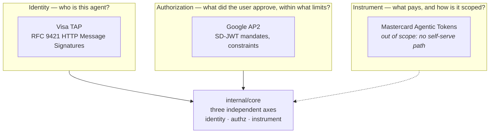

Adapters populate the axes; `core` never learns which protocol filled one.
````

- [ ] **Step 4: Run the target and confirm the SVG appears**

Run: `make diagrams`
Expected: prints `diagrams: docs/architecture/README.md`, then
`docs/diagrams/README-1.svg` exists and is non-empty.

Verify: `test -s docs/diagrams/README-1.svg && echo OK`

- [ ] **Step 5: Confirm nothing generated is tracked**

Run: `git status --short docs/diagrams/`
Expected: empty output. If an SVG appears, the `.gitignore` entry is wrong.

- [ ] **Step 6: Confirm `make check` is untouched**

Run: `make check`
Expected: `0 issues.` and all tests pass, exactly as before. `diagrams` must
not have been pulled into the gate.

- [ ] **Step 7: Commit**

```bash
git add Makefile .gitignore docs/architecture/README.md
git commit -m "docs: add make diagrams export pipeline"
```

---

### Task 2: `docs/business/problem-statement.md`

**Files:**
- Create: `docs/business/problem-statement.md`

**Interfaces:**
- Produces: the problem framing that `use-cases.md` and `where-skyline-sits.md` both build on.

- [ ] **Step 1: Write the document**

Header pair, then four sections. Required claims, each of which must be stated
explicitly:

1. **Fragmentation predates AI.** Card rails, bank transfer, wallets and
   stablecoins each solve payment with incompatible identity, authorization and
   settlement models. A merchant integrating three of them integrates three of
   everything.
2. **Agents make it acute, and they do it in three specific ways.** An agent
   has no identity a merchant can verify, so bot mitigation blocks it. It has
   no bounded authority, so "buy me a flight" is indistinguishable from "empty
   my account". And it has no scoped instrument, so a card number handed to an
   agent is a card number handed to whatever the agent does next.
3. **Those three gaps map to three protocols**, which is why they are not
   competitors — forward-reference `../architecture/README.md`.
4. **What breaks today**, concretely: a merchant cannot tell an agent from a
   scraper; a user cannot bound what an agent may spend; a PSP cannot tell,
   after the fact, whether a human ever approved.

Include diagram **D13**:

````markdown
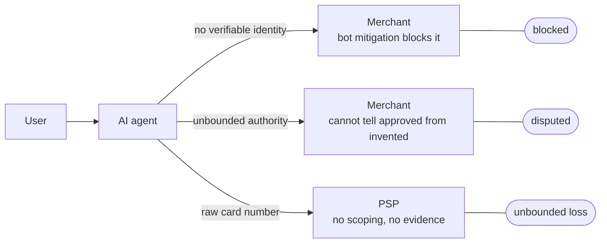
````

Must not contain: SD-JWT, RFC numbers, Go types, or any implementation detail.

- [ ] **Step 2: Verify the diagram renders**

Run: `make diagrams`
Expected: `docs/diagrams/problem-statement-1.svg` exists and is non-empty.

- [ ] **Step 3: Commit**

```bash
git add docs/business/problem-statement.md
git commit -m "docs(business): problem statement — fragmentation and the three agent gaps"
```

---

### Task 3: `docs/business/use-cases.md`

The scenario defined here is used by every sequence diagram in Tasks 8 and 9.
Write it before them.

**Files:**
- Create: `docs/business/use-cases.md`

**Interfaces:**
- Consumes: the framing from `problem-statement.md`.
- Produces: the flight scenario — route `BEG→PMI`, cap `USD 20000` minor units, window `2026-06-01..2026-08-31`, prices `$240 → $210 → $189`. Tasks 8 and 9 reuse these exact values so every diagram tells one story.

- [ ] **Step 1: Write the built scenario as beats**

Reproduce the beat table from the spec verbatim (beats 1–10), then state that
beats 5, 8 and 10 are the ones that carry the article series, and why: beat 5
proves the verifier rejects rather than the agent, beat 8 makes selective
disclosure visible, beat 10 shows both protocol layers on one transaction.

State the seed requirement explicitly: the mock merchant needs inventory whose
price moves over time, `$240 → $210 → $189`, because a static price cannot
demonstrate beats 4, 5 and 6.

Include diagram **D14**, the scenario at business level — no protocol nouns:

````markdown
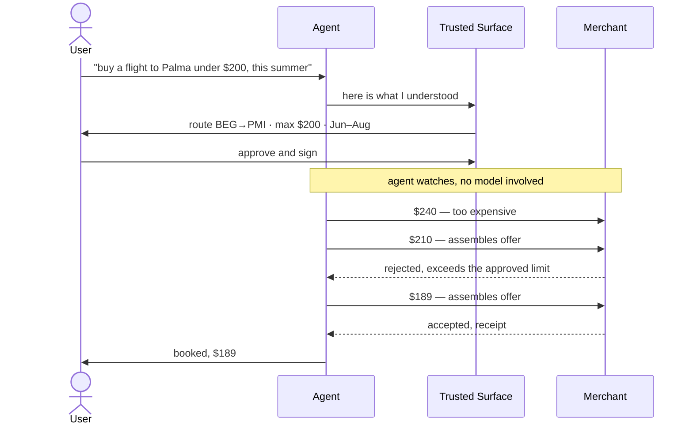
````

- [ ] **Step 2: Write the three described cases**

Each gets a short paragraph and one sequence diagram, at business level — no
protocol nouns. State plainly under each that it is described, not built.

**Human Present retail purchase.** The user approves one specific cart. Note
the spec's own observation that this can often be replaced by an ordinary
e-commerce journey; it is implemented because it is the closed-mandate backbone
the autonomous flow builds on, not because it is the interesting demo.

````markdown
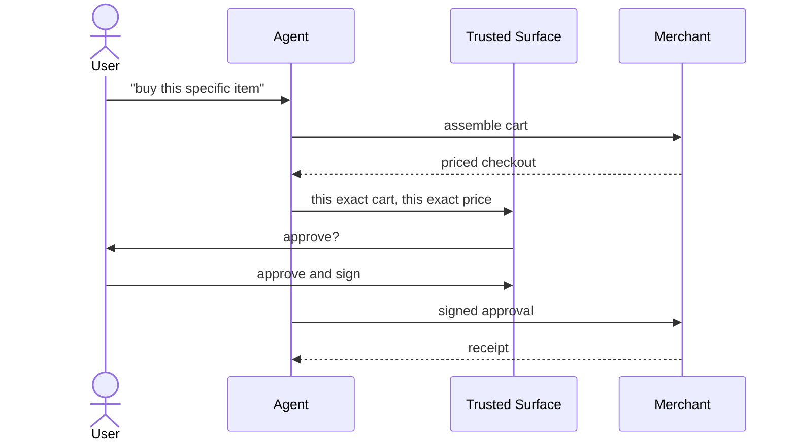
````

**Subscription.** One open mandate carrying a temporal recurrence constraint,
reused across billing periods until it expires. The interesting property is the
expiry: authority ends without anyone having to revoke it.

````markdown
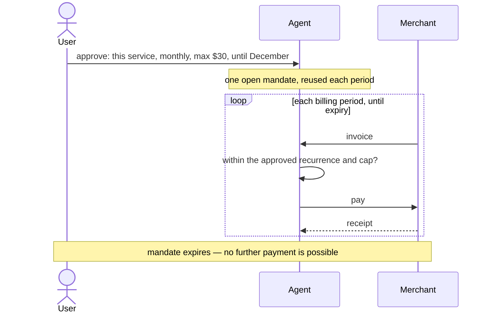
````

**B2B procurement.** An agent acting inside a corporate approval limit, where
the constraint set encodes policy rather than personal preference. Shows a
constraint failing for a reason that is not price.

````markdown
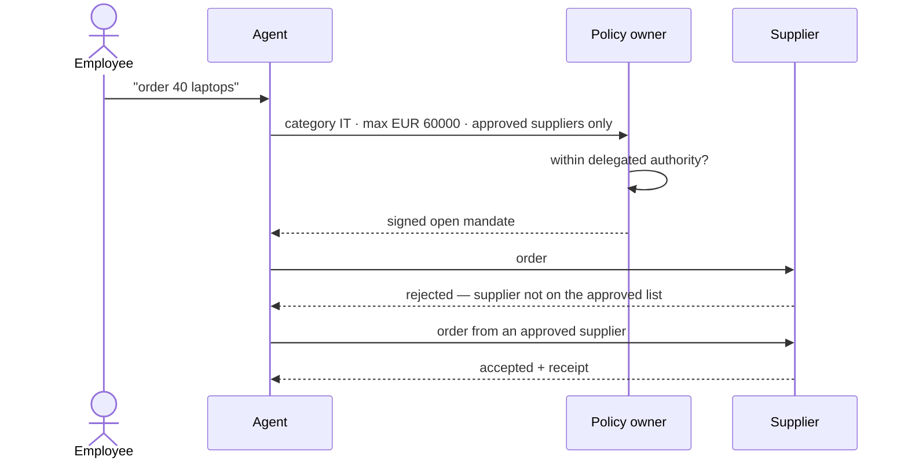
````

- [ ] **Step 3: Verify diagrams render**

Run: `make diagrams`
Expected: four SVGs, `docs/diagrams/use-cases-1.svg` through `-4.svg`.

- [ ] **Step 4: Commit**

```bash
git add docs/business/use-cases.md
git commit -m "docs(business): flight scenario in beats, three described cases"
```

---

### Task 4: `docs/architecture/README.md`

**Files:**
- Modify: `docs/architecture/README.md` (created minimally in Task 1)

**Interfaces:**
- Consumes: the three-layer diagram already present from Task 1.
- Produces: the architecture overview that all three ADRs sit under.

- [ ] **Step 1: Add the module dependency section and diagram D2**

Explain that the six depguard rules are the architecture, not style, and that a
lint failure is an architecture violation. State each rule and the property it
protects.

````markdown
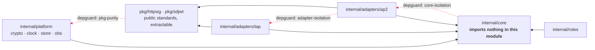
````

Caption: dashed red edges are forbidden and enforced in CI.

- [ ] **Step 2: Add the agentic boundary section and diagram D3**

State the rule: an LLM may appear only in `internal/agent/interpret/`, and
validation and processing are deterministic regardless of whether the calling
role is agentic. This is a spec requirement, not a preference.

````markdown
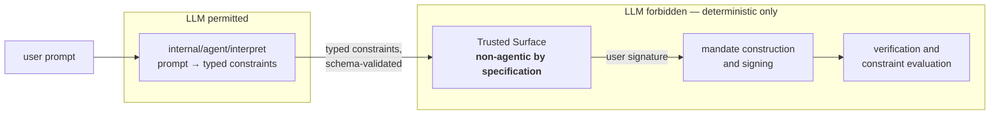
````

Caption: the interpreter runs once, before anything is signed. After that the
system is deterministic — watching a price is `price < 20000`, not a model call.

- [ ] **Step 3: Add the "what is mocked" section**

List, with the reason: Credential Provider (no public sandbox lets a non-PSP
enrol a real card — an ecosystem constraint, not a shortcut), Merchant, MPP,
agent registry, settlement. Then list what is **not** mocked: SD-JWT, signing
and verification, constraint evaluation, mandate binding, receipts, dispute
evidence. Close with: nothing here is PCI-compliant and nothing moves real
money.

- [ ] **Step 4: Add the module layout section**

Explain why `go.mod` sits in `backend/` (a module whose `go.mod` is not at the
repository root cannot claim the root import path) and point at `make
workspace` for the editor consequence.

- [ ] **Step 5: Verify diagrams render**

Run: `make diagrams`
Expected: three SVGs, `README-1.svg` through `README-3.svg`.

- [ ] **Step 6: Commit**

```bash
git add docs/architecture/README.md
git commit -m "docs(architecture): three-layer model, module graph, agentic boundary"
```

---

### Task 5: ADR 0001 — transport and error taxonomy

**Files:**
- Create: `docs/architecture/adr/0001-transport-and-errors.md`

**Interfaces:**
- Produces: the error-taxonomy decision that Task 12's transport issue implements.

- [ ] **Step 1: Write the ADR**

Sections: Status (accepted, 2026-08-03) · Context · Decision · Consequences ·
Rejected alternatives.

Required content:

- **HTTP is not a choice.** RFC 9421 signs HTTP messages — method, path,
  headers. TAP without HTTP has nothing to sign. gRPC and everything else are
  ruled out by the protocol, not by preference.
- JSON over HTTP; errors as RFC 9457 Problem Details
  (`application/problem+json`).
- **Error codes are protocol surface, not a transport detail.** Issue #7
  requires a rejection to return a *signed* receipt carrying the appropriate
  error, so the same code appears in the HTTP response and inside a signed
  receipt. The taxonomy therefore lives in `contracts/` as part of the
  canonical model; the HTTP layer and the receipt layer each render it. Had it
  lived in the transport package, receipts would have to import HTTP, or the
  codes would be duplicated and drift.
- **Rejected:** URL API versioning (`/v1/`). The versioning that carries
  meaning is the `vct` suffix on a mandate, which already exists. A URL version
  would be ceremony without content.

- [ ] **Step 2: Commit**

```bash
git add docs/architecture/adr/0001-transport-and-errors.md
git commit -m "docs(architecture): ADR 0001 — transport and error taxonomy"
```

---

### Task 6: ADR 0002 — idempotency

**Files:**
- Create: `docs/architecture/adr/0002-idempotency.md`

- [ ] **Step 1: Write the ADR**

Required content:

- `AGENTS.md` requires an idempotency key on every state-changing operation.
- **The pattern already exists**: `crypto.Store.Generate` takes a key and
  stores an `idempotencyRecord` holding a request fingerprint. Generalise it
  into `platform/store` rather than inventing a second mechanism.
- The key travels in an `Idempotency-Key` header. The fingerprint is a hash of
  method, path and body. Same key with the same fingerprint replays the stored
  response; same key with a **different** fingerprint returns `409`, because
  that is a client error the caller needs to see rather than a reason to hand
  back someone else's result.
- **Idempotency is not replay protection, though they share machinery.**
  Idempotency: the same request twice yields the same answer once — a retry
  *should* succeed from cache. Replay protection (#27, the nonce store): a
  signed message may be used exactly once ever — a second attempt *must* fail.
  Opposite semantics over similar storage; merging them is a classic bug. Two
  distinct types in `platform/store`, with this paragraph as the reason.
- Retention is time-bounded with a configurable window and bounded memory.

- [ ] **Step 2: Commit**

```bash
git add docs/architecture/adr/0002-idempotency.md
git commit -m "docs(architecture): ADR 0002 — idempotency, and why it is not replay protection"
```

---

### Task 7: ADR 0003 — correlation IDs and the event log

**Files:**
- Create: `docs/architecture/adr/0003-correlation-and-event-log.md`

- [ ] **Step 1: Write the ADR**

Required content:

- A correlation ID is generated when a transaction enters the system and
  propagates across every HTTP hop in an `X-Correlation-ID` header.
- **Rejected: W3C Trace Context (`traceparent`).** It is the standard and would
  otherwise be right. The event log here is a teaching aid that ends up in
  screenshots, and `corr: flight-7a3f` is legible in an image where
  `00-4bf92f3577b34da6a3ce929d0e0e4736-00f067aa0ba902b7-01` is not. Migration
  is trivial if real telemetry is ever needed.
- Roles emit structured events at protocol-significant moments: mandate
  constructed, presented, verified, rejected; receipt issued.
- `cmd/collector` gathers them and streams to the frontend over SSE. It is an
  eighth binary and **is not an AP2 role** — demo infrastructure, labelled as
  such so nobody mistakes it for part of the protocol.
- **The event log is observability, never evidence.** Dispute evidence (#18) is
  assembled solely from signed artefacts. A log can be edited; a signed receipt
  cannot. Reaching for the log as evidence would be a security error.

- [ ] **Step 2: Commit**

```bash
git add docs/architecture/adr/0003-correlation-and-event-log.md
git commit -m "docs(architecture): ADR 0003 — correlation IDs and the event log"
```

---

### Task 8: `docs/protocols/ap2.md`

The largest document: six diagrams. It records what the specification says, not
what we decided.

**Files:**
- Create: `docs/protocols/ap2.md`

**Interfaces:**
- Consumes: the flight scenario values from Task 3 (`BEG→PMI`, `USD 20000`, `$240/$210/$189`).
- Produces: the protocol reference that `AGENTS.md` links to in Task 11.

- [ ] **Step 1: Write the mandate model section**

State plainly, because most published material gets this wrong: AP2 v0.2
defines **two** mandate types — Checkout Mandate and Payment Mandate. Intent
Mandate and Cart Mandate are v0.1 and obsolete. The "intent" dimension is
handled by the open/closed distinction, not a third mandate:

- **Open** — signed by the *user*, carries constraints and the agent's public
  key in `cnf`. Not yet bound to a transaction.
- **Closed** — bound to one specific transaction. In Human Present the user
  signs it; in Human Not Present the *agent* signs it with its own key and the
  verifier checks it against the open mandate's constraints.

Verifiers always receive closed mandates in both modes; only the verification
path differs.

- [ ] **Step 2: Add the roles section and diagram D4**

````markdown
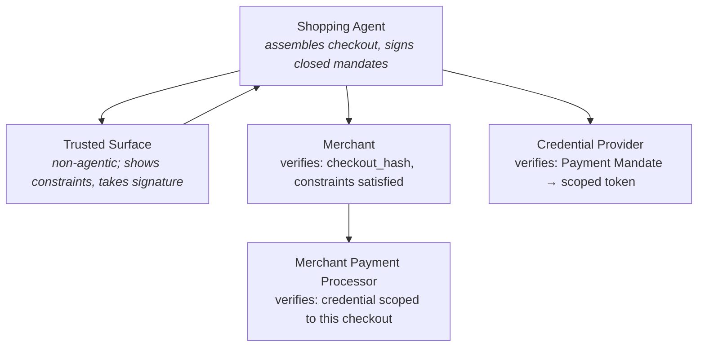
````

Note that one entity may play several roles, and that a role may delegate its
verification to another party.

- [ ] **Step 3: Add the Human Present sequence, diagram D5**

````markdown
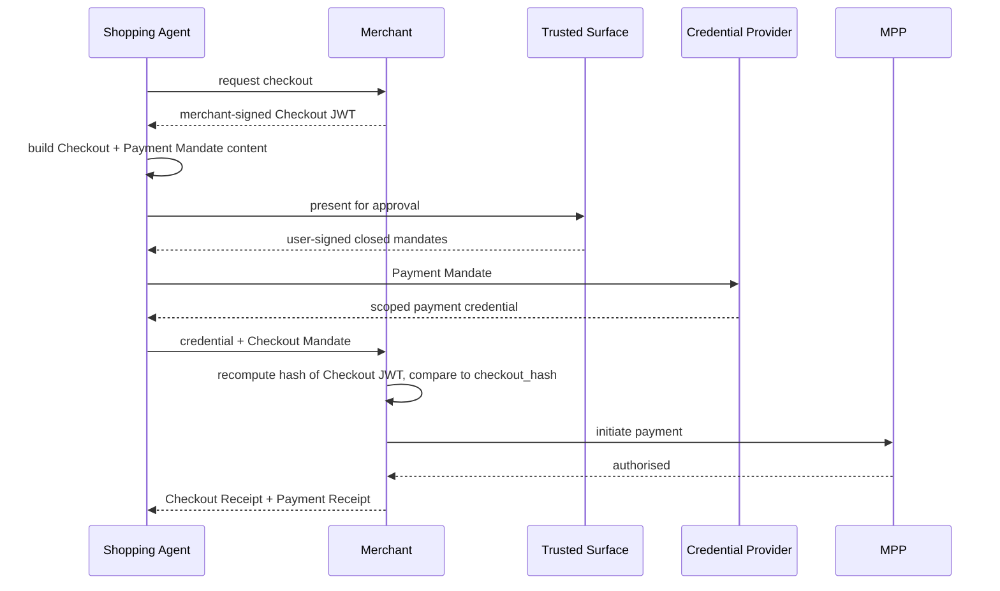
````

- [ ] **Step 4: Add the Human Not Present sequence, diagram D6**

Use the flight scenario values so this diagram tells the same story as D14.

````markdown
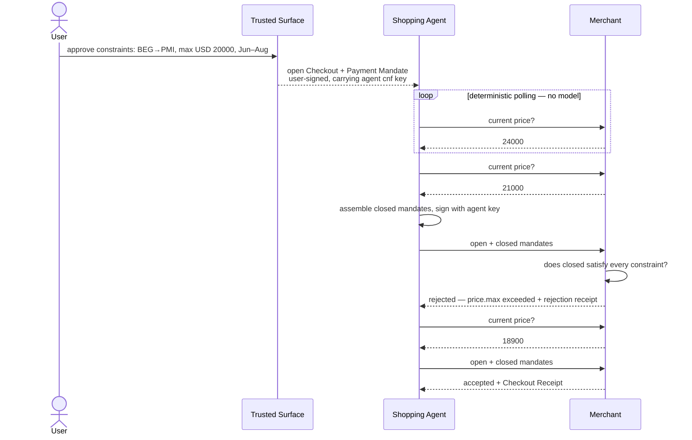
````

Caption: the rejection at 21000 is refused by the **merchant**, not by the
agent. An agent that skipped its own check would fail here just the same — that
is the property that makes a hallucinating model harmless.

- [ ] **Step 5: Add the binding section and diagram D7**

````markdown
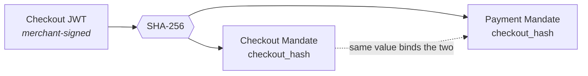
````

State the trap: verification must **recompute** the hash of the Checkout JWT
and compare, never trust the `checkout_hash` claim as presented.

- [ ] **Step 6: Add constraint evaluation, diagram D8**

````markdown
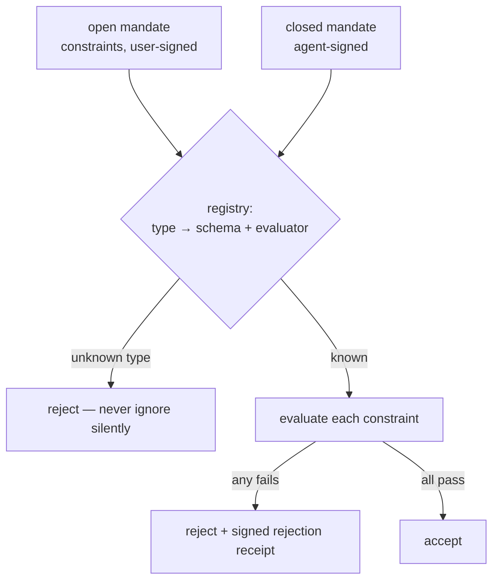
````

State that constraints live in `core/authz/constraint/`, not in the AP2
adapter — they are our concept and AP2 merely transports them — and that
evaluation is performed by the **verifier**, never the agent.

Record the known open problem as article material: because every implementer
defines its own constraint vocabulary and the verifier must understand it to
evaluate it, two AP2 implementations with different constraint types cannot
interoperate. Fragmentation reappears one layer inside the protocol meant to
solve it.

- [ ] **Step 7: Add selective disclosure, diagram D9**

````markdown
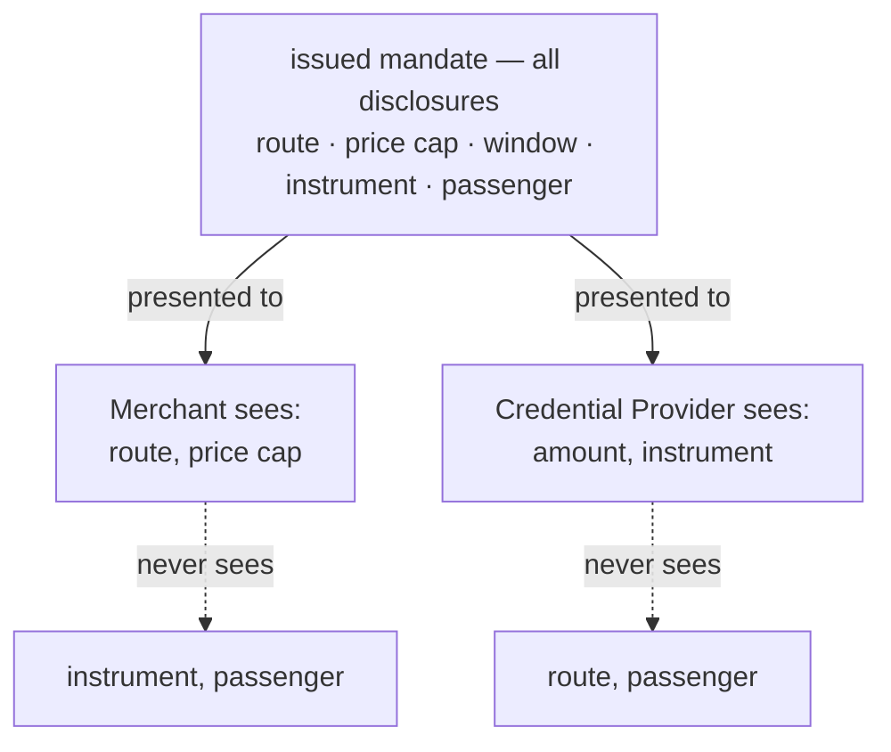
````

State the trap from #14: the naive implementation sends every disclosure. It
works, passes tests, and silently defeats the entire point of SD-JWT.

- [ ] **Step 8: Verify all six diagrams render**

Run: `make diagrams`
Expected: `docs/diagrams/ap2-1.svg` through `ap2-6.svg`, all non-empty.

- [ ] **Step 9: Commit**

```bash
git add docs/protocols/ap2.md
git commit -m "docs(protocols): AP2 — mandate model, roles, flows, binding, disclosure"
```

---

### Task 9: `docs/protocols/tap.md`

**Files:**
- Create: `docs/protocols/tap.md`

- [ ] **Step 1: Write the positioning and handshake, diagram D10**

State first, because it is widely misunderstood: **TAP is not a Visa-rails
protocol.** Verification happens at the *merchant edge* — Visa's own reference
architecture puts a CDN proxy in front of the merchant, because the problem TAP
solves is merchants and their bot mitigation blocking legitimate agents. Visa
operates the production key directory, but that is the directory, not the
rails.

````markdown
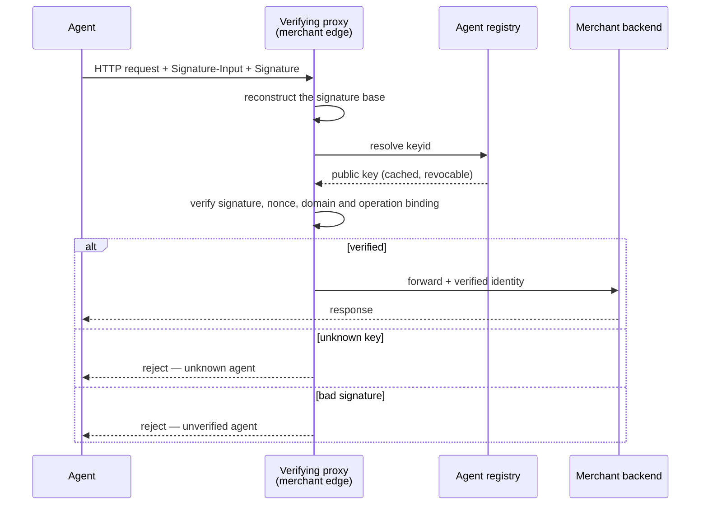
````

Note the rejection distinction: "unknown agent" and "unverified agent" are
different answers and the proxy must not collapse them.

- [ ] **Step 2: Add registry resolution, diagram D11**

State why this unblocks the milestone: being listed in Visa's production
directory requires a commercial relationship, but TAP's reference
implementation ships a local registry, so the POC runs with no Visa account and
no cost.

````markdown
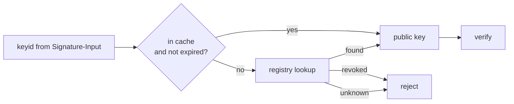
````

State the trap: a cached public key must still be revocable — never cache
indefinitely.

- [ ] **Step 3: Add signature base construction, diagram D12**

````markdown
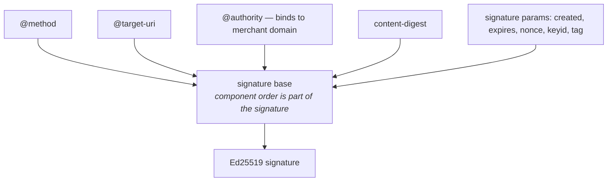
````

State two things. The trap: signature base reconstruction must match the
signer's component ordering exactly — most interop failures live there. And the
contrast with AP2: TAP uses **Ed25519**, while AP2 forbids deterministic
schemes for the Checkout JWT because a deterministic signature enables rainbow
table attacks against `checkout_hash`. Different threat models, opposite
requirements; do not carry a habit from one to the other.

- [ ] **Step 4: Add the domain and operation binding section**

The signature binds to the merchant's domain *and* to the exact operation,
distinguishing browsing from payment. A signature valid for browsing one
merchant is not valid for payment, nor for a different merchant. Trap: easy to
implement one and forget the other — test the cross products.

- [ ] **Step 5: Verify diagrams render**

Run: `make diagrams`
Expected: `docs/diagrams/tap-1.svg` through `tap-3.svg`.

- [ ] **Step 6: Commit**

```bash
git add docs/protocols/tap.md
git commit -m "docs(protocols): TAP — merchant-edge verification, registry, signature base"
```

---

### Task 10: `docs/business/where-skyline-sits.md`

**Files:**
- Create: `docs/business/where-skyline-sits.md`

- [ ] **Step 1: Write one section and diagram D15**

Deliberately short. This repository is the protocol-understanding piece, not
Skyline. The full product story belongs to the article series and duplicating
it here would create a second source of truth that drifts.

````markdown
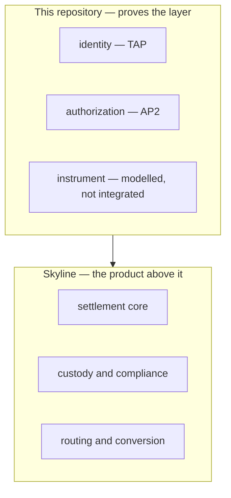
````

State the boundary explicitly: the POC proves the protocols interoperate; the
product question — settlement, custody, routing — is out of scope here and is
where the mocked Credential Provider sits later.

- [ ] **Step 2: Verify and commit**

Run: `make diagrams`
Expected: `docs/diagrams/where-skyline-sits-1.svg` exists.

```bash
git add docs/business/where-skyline-sits.md
git commit -m "docs(business): where Skyline sits relative to this POC"
```

---

### Task 11: Diagram catalogue and `AGENTS.md` cross-link

**Files:**
- Create: `docs/diagrams/INDEX.md`
- Modify: `AGENTS.md`

- [ ] **Step 1: Write the catalogue**

A table with three columns — diagram, owning document, exported file — listing
all eighteen. Open with the rule: every diagram has exactly one home, which is
the document that explains it; this file is an index, not a store. Explain that
`make diagrams` produces the exported column and that those files are
gitignored.

- [ ] **Step 2: Link AGENTS.md to the protocol documentation**

In the "Protocol facts your training data probably gets wrong" section, after
the primary-sources list, add:

```markdown
The warnings above are the short form, kept here because an agent must read
them before writing code. The full treatment — the mandate model, the five
roles, both flows, the binding and the disclosure rules — is in
[docs/protocols/ap2.md](docs/protocols/ap2.md) and
[docs/protocols/tap.md](docs/protocols/tap.md). One source of truth, two levels
of detail.
```

- [ ] **Step 3: Verify every link resolves**

Run:
```bash
grep -oE '\[[^]]+\]\(([^)]+\.md)\)' AGENTS.md docs/diagrams/INDEX.md \
  | sed -E 's/.*\((.*)\)/\1/' | sort -u | while read -r p; do
    test -f "$p" || echo "BROKEN: $p"
  done
```
Expected: no output.

- [ ] **Step 4: Confirm the full diagram set exports**

Run: `make diagrams`
Expected: eighteen SVGs across `docs/diagrams/`. Count with
`ls docs/diagrams/*.svg | wc -l` — expect `18`.

- [ ] **Step 5: Commit**

```bash
git add docs/diagrams/INDEX.md AGENTS.md
git commit -m "docs: diagram catalogue and AGENTS.md cross-link to protocol docs"
```

---

### Task 12: Restructure the GitHub issue set

No files. Uses `gh`. Do this last, so the issues can reference documents that
exist.

**Interfaces:**
- Consumes: every document written above.

- [ ] **Step 1: Create the Foundations milestone**

```bash
gh api repos/SkylinePlatform/agentic-payments/milestones \
  -f title="Foundations" \
  -f description="Cross-cutting decisions every role shares: transport, idempotency, correlation and the event log. Slice 0."
```

- [ ] **Step 2: Rewrite #23 and #33**

Both currently schedule documentation after everything is built. Retitle and
rewrite each to "keep the documentation current with the code", remove the
`Depends on: #15` / `#31` lines, and point at the documents this plan created.

```bash
gh issue edit 23 --repo SkylinePlatform/agentic-payments \
  --title "Keep AP2 architecture documentation current"
gh issue edit 33 --repo SkylinePlatform/agentic-payments \
  --title "Keep TAP architecture documentation current"
```

Then replace each body so it states: the documentation now exists at
`docs/architecture/` and `docs/protocols/`; this issue tracks keeping it true
as the code lands; a pull request that changes a flow or a verification rule
updates the corresponding document in the same PR.

- [ ] **Step 3: Open the foundation issues the ADRs decide**

One issue per ADR, each in the Foundations milestone, each linking to its ADR:

- "Transport layer and error taxonomy" → ADR 0001. Scope: HTTP conventions, RFC 9457 problem responses, error codes added to `contracts/` and rendered by both the HTTP and receipt layers.
- "Idempotency store and middleware" → ADR 0002. Scope: generalise the `crypto.Store` pattern into `platform/store`, `Idempotency-Key` header, fingerprint, `409` on conflict.
- "Correlation IDs, event log and cmd/collector" → ADR 0003. Scope: `X-Correlation-ID` propagation, structured events, SSE collector. State that the collector is not an AP2 role.

- [ ] **Step 4: Open the remaining gap issues**

- "Demo runner: `make demo` and `deploy/`" — brings up the roles, the collector and the frontend together. Without it there are no screenshots.
- "Frontend scaffolding: Vite app shell" — #20 assumes it exists; today `frontend/` holds only a `package.json` and a type generator.
- "Seed data: merchant inventory with a moving price" — `$240 → $210 → $189`, without which beats 4, 5 and 6 of the scenario cannot be demonstrated.
- "Decide the fate of `specs/`" — `AGENTS.md` declares it as written specifications driving implementation; nothing produces any. Give it an owner or remove the directory.
- "Decide whether Mastercard Agentic Tokens are in scope" — `AGENTS.md` forbids an `adapters/agentpay/` package because there is no self-serve developer path, while the article milestone list schedules an "Agentic Tokens POC" for 29 August. The two cannot both stand. Label `blocked`; it needs a decision outside this repository, and an issue is where it stays visible rather than buried in a spec.

- [ ] **Step 5: Record the slice sequence**

Add a comment to #15 (the milestone's primary deliverable) setting out the
slice order from the spec, so the sequence is visible where the work is
tracked:

```
Slice 0  Foundations       docs + transport + idempotency + event log
Slice 1  A mandate is seen #5, #6 + frontend shell + thin Inspector
Slice 2  Boundaries        #11, #12, #14
Slice 3  Roles and HP      #7, #8, #9, #10 + demo runner
Slice 4  Autonomy          #13, #16, #15, #17
Slice 5  Proof             #18, #19
Slice 6  Frontend complete #20, #21, #22
Slice 7  TAP               #24–#33
```

- [ ] **Step 6: Verify**

Run: `gh issue list --repo SkylinePlatform/agentic-payments --milestone Foundations`
Expected: eight issues — three ADR implementations and five gap issues.

---

## Definition of done for the whole plan

- Ten documents exist, each opening with the question it answers and the rule about what it does not contain.
- Eighteen diagrams render on GitHub inside their owning document, and `make diagrams` exports eighteen SVGs.
- `make check` still passes and still needs only Go.
- No generated SVG is tracked by git.
- Every gap named in the spec has an issue, and the Foundations milestone holds eight.
- A reader who has not seen the code can follow the flight scenario from beat 1 to beat 10.
